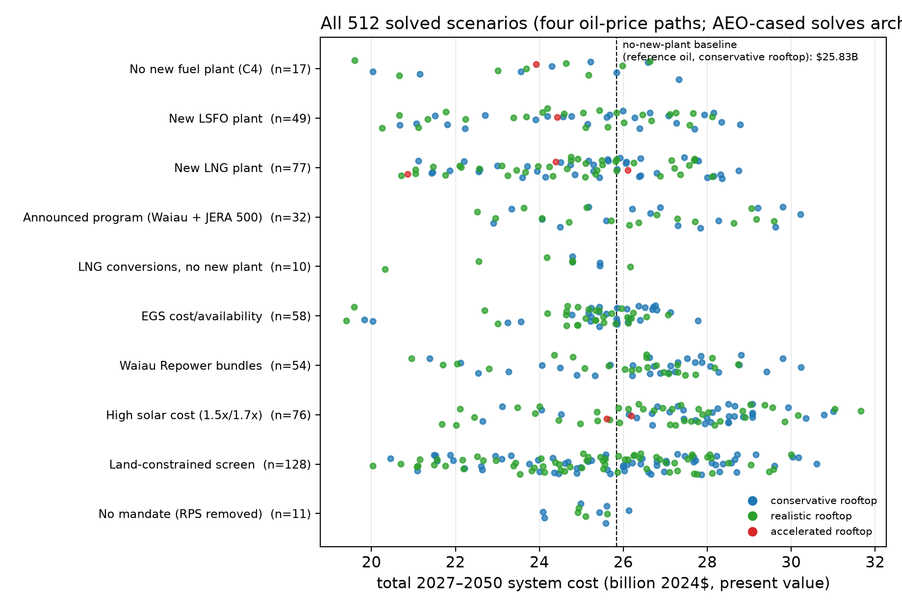

# Oʻahu's Electricity Future

An open, reproducible analysis of what Hawaiian Electric and Hawaiʻi should
build to keep Oʻahu's lights on through 2050 — solar-procurement reform,
Enhanced Geothermal, the Waiau Repower, and the JERA LNG proposal — using the
same class of capacity-expansion model utilities and regulators use to plan
decades of investment.

> ⚠️ **Pre-release.** This analysis is published for public scrutiny and
> comment before being finalized. Numbers may be refined during the comment
> period (see [`COMMENT_POLICY.md`](COMMENT_POLICY.md)); cite by release tag.

## What the analysis finds

1. **The biggest lever is the price Hawaiʻi pays to build solar and
   batteries.** The premium over mainland benchmarks sits mainly in soft
   costs — procurement cycles, permitting, interconnection queues. Closing
   part of it is worth more than any fuel decision in this report, and it
   is within the State's control.
2. **The second lever is rooftop solar and storage.** Each installed
   megawatt removes about 0.61 MW of midday grid demand, home batteries
   move about 45 percent of their capacity into the evening peak, and
   rooftop growth lowers system cost on every pathway. Most of this value
   arrives with today's technology and behavior.
3. **No new fuel plant pays for itself.** JERA's 500 MW LNG plant costs
   $0.5–1.6 billion more than building no plant, at every oil price
   tested. LNG's value comes from the fuel, burned in plants the island
   already has.
4. **Enhanced Geothermal belongs in the cheapest build** under current
   law: the full ~100 MW Oʻahu resource, saving about $0.56 billion, with
   the downside bounded.
5. **The feared constraints mostly do not bind.** Every pathway builds
   nearly the same solar on nearly the same acres, within the eligible
   inventory. Every scenario keeps the lights on at every modeled hour, on
   the existing fleet plus the planned Puʻuloa plant.
6. **Pathways that meet the clean-energy mandate cost billions less than
   the plans Hawaiian Electric and the State Energy Office have recently
   published, holding every cost assumption the same** (Section 4.5).
   Streamlining procurement to limit Hawaiʻi's premium over the mainland
   makes them cleaner as well.

The full case, with sensitivities and limits: the
[Executive Summary](report/DRAFT_v7_full.md).

## Versions

> **Changed relative to the withdrawn 2026 working paper:** the oil-price
> cases are now four: the EIA-anchored reference (kept, and documented as
> likely high), the **Brent futures strip** as a market central case
> (`futbrent`), and the **market 10th/90th percentiles**
> (`lowbrent`/`highbrent`) from futures and option-implied volatility,
> deflated on TIPS breakevens (quote date 2026-07-27; full method and data
> in `sources/market/`, report Appendix A.14). The former EIA AEO case
> spread is archived (`*_aeo.csv`, `aeo_archive/`).

- **pre-v1.02 (current)** — this release: adds the published-plan pricing
  of Section 4.5 (Hawaiian Electric's IGP portfolios and HSEO's oil and LNG
  cases, priced against least cost on identical assumptions) and refines
  the full scenario matrix to 0.1 percent tolerance.
- **pre-v1.01** — the first pre-release: the single-node model with
  corrected distributed solar and storage (report Appendices A.11–A.13),
  three rooftop trajectories, four oil-price paths. **Open for
  comment: we ask that comments and suggestions arrive by September 1,
  2026** (tentative; this line is the authoritative date). Pre-release
  updates increment as pre-v1.03, …
- **v1 (planned)** — the locked version of record, after the comment
  period, our responses, and revisions. Post-lock changes will be limited
  to documented errata; new suggestions will be directed to v2.
- **v2 (planned)** — the regional (zonal) grid model described in `V2.md`.
- An earlier working paper, since withdrawn, preceded this series
  (corrections in `docs/CORRECTIONS.md`).

## The scenario set

**513 solved configurations** on a **current-law base case** — the federal
storage and geothermal credits (48E) that survive the 2025 budget act, with
a no-credit sensitivity alongside. The space has six axes:

| Axis | Options |
|---|---|
| New thermal plant | none / LSFO 250–375–500 MW / LNG 375 / JERA LNG 500 (bare-EPC and +20% capital) / Waiau Repower bundles / both projects together (Waiau + JERA 500) |
| LNG use | none / new plant / conversions of existing plants (Kalaeloa alone, or + Kahe 5–6 + CIP) |
| Oil price | four paths: market 10th percentile / Brent futures / EIA-anchored reference / market 90th percentile (Appendix A.14) |
| Solar & battery cost | premium over mainland ATB Moderate: +20% (base) / +80% / +104% stress cases; plus an ATB Advanced basis |
| Land screen | reference (graduated slope to 30%) / Class-C-constrained |
| Rooftop trajectory | conservative (~1,000 MW by 2050) / trend (~1,560) / accelerated (~2,120, core subset) |

Alongside the matrix sit **14 published-plan cells** (Section 4.5): rather
than letting the model choose, these hold generation to a plan somebody else
published — Hawaiian Electric's IGP base and land-constrained portfolios and
the HSEO study's oil and LNG cases — so the plan can be priced against the
cheapest build on identical assumptions. They are counted separately from the
513.

Plus Enhanced Geothermal cost/availability variants, no-mandate (RPS
removed) counterfactuals, and a core subset re-solved with rooftop resources
dispatched by the optimizer instead of netted from demand. The full menu
solves under both the conservative and trend rooftop trajectories at each oil
path. Every cell is solved to 0.25 percent optimality and then refined to 0.1
percent; 512 of the 513 currently sit at 0.1 percent, and a handful of the
hardest cells stopped on a 24-hour limit at the tolerance they had reached
(`solve/README.md` gives the distribution). The published-plan cells of
Section 4.5 are reported at 0.25 percent.

One figure summarizes the space — every comparable solve, by family and
rooftop trajectory:



Three readings from the map: the conversion configurations sit left of the
no-new-plant baseline (the only LNG configurations that do); every
new-plant family sits right of it; and within each family the trend
rooftop trajectory (green) sits left of the conservative one (blue) —
rooftop growth lowers system cost across the board.

## Pre-lock corrections

Known items queued for correction before the v1 lock (planned after the
comment window closes) are tracked as GitHub issues labeled
**`pre-v1-lock`** on this repository — that issue list is the
authoritative punch list. Post-lock changes will be limited to documented
errata.

## Explore the results interactively

Every solved scenario — system costs, generation mixes, emissions, and
sample-day hourly dispatch — can be browsed at
**https://mikejrob.github.io/oahu-electricity-future/** (runs entirely in
the browser; first load takes a moment). The app and its data extracts live
in [`explorer/`](explorer/); `build/build_explorer_data.py` regenerates the
extracts from the solve fleet.

## Check the work

```bash
python verify_claims.py   # re-derives every headline input from the vendored,
                          # hashed sources on a bare clone; exit 0 = verified
```

`verify_claims.py` re-derives the analysis's load-bearing inputs from the
vendored primary sources and asserts each one: the solar and battery
capital path (NREL ATB 2024 × the documented CPI rebase × the Hawaiʻi
premium, with the battery co-location factor taken from ATB's own
PV-plus-battery hybrid and the 48E credit applied), the JERA plant-only
capital, Waiau's stated cost, the EGS cost trio, the LSFO heat content,
and the original 64-scenario set — plus SHA-256 hashes of the key source
files. It needs nothing but a clone and Python.

Its limits are worth stating. It verifies **inputs, not results**: it does
not re-run the optimization, which takes a solver license and days of
cluster time (`sanity_check_results.py` plays that role for solved
outputs, testing monotonicity and dominance relations that must hold
across cells). It covers the headline cost inputs, not every derived
series — demand, weather, fuel-price paths, and land screens are rebuilt
by the scripts in `build/` rather than asserted here. Numbers that are
author assumptions (the 1.20 premium) are checked against their
documentation, since no source exists. And a hash match confirms a
vendored file is the one we used, not that we read it correctly — the
point of vendoring is that you can open the same page and check the
reading yourself.

- **15 minutes to half a day**: [`REVIEWER_GUIDE.md`](REVIEWER_GUIDE.md)
  gives tiered paths to scrutinize every load-bearing choice.
- **Questions**: [`FAQ.md`](FAQ.md). **Comments**:
  [`COMMENT_POLICY.md`](COMMENT_POLICY.md) — public issues or private email,
  both answered.
- **Assumptions**: [`docs/CONVENTIONS.md`](docs/CONVENTIONS.md), one page per
  choice, with sources.
- **Re-solving**: any single scenario solves on an ordinary machine in well
  under 6 GB of memory, using one core. Most cells at the 0.25% tolerance
  finish inside an hour (median 0.68 h), but the distribution has a long
  tail in both passes: eight cells needed more than 24 hours even at 0.25%,
  and refining to 0.1% took over 6 hours for 74 of 510 cells and over 24 for
  13. The plan-pricing cells (Section 4.5), whose generation mix is
  constrained to a published plan, are slower still — a median of 2.2 hours
  at 0.25%, some beyond 12. Solving the published fleet at both tolerances
  is roughly 2,600 core-hours — a batch-computing task;
  [`solve/README.md`](solve/README.md) details requirements, timings and
  scripts. Use one core: extra cores do little for solve time and waste
  allocation on a shared cluster. We used CPLEX; open-source solvers will
  need more time.

## Layout

```
report/          the report and figures
base_model/      the underlying Oʻahu grid model (Ethan Hartley), vendored
build/           scripts that regenerate all inputs from base_model/ + sources/
inputs*/         the generated model inputs (byte-reproducible)
sources/         vendored primary documents, hashed and verified
scenarios/       every scenario's complete definition (one line each)
solve/           SLURM solve scripts (Switch 2.0.9 + CPLEX)
results/         solved results
docs/            conventions, corrections, analyses
```

## Relationship to earlier work

This analysis supersedes a 2026 working paper by the same authors — a
withdrawn report we regret having released too early. Errors in
that paper were corrected here, and the analysis was substantially extended;
[`docs/CORRECTIONS.md`](docs/CORRECTIONS.md) documents both, item by item,
with direction of effect. The base grid model was developed by Ethan Hartley,
building on Matthias Fripp's open-source Switch platform and [Switch-Hawaiʻi
work](https://github.com/switch-hawaii/ulupono_scenario_2.1). It also connects 
to a paper published by Imelda, Matthias Fripp, and Michael Roberts in AEJ-Policy 
in 2024, "Real Time Pricing and the Cost of Clean Power". 
[https://www.aeaweb.org/articles?id=10.1257/pol.20220506](https://www.aeaweb.org/articles?id=10.1257/pol.20220506)

## License and attribution

Code in this repository is licensed under the **Apache License, Version
2.0** ([`LICENSE`](LICENSE)), matching the license of the Switch model it
builds on; see [`NOTICE`](NOTICE) for attribution and for the files
derived from Switch. The report text and figures are offered under
**CC BY 4.0** — quote, adapt, and republish them with attribution.
Vendored third-party data under `sources/` remains subject to its
publishers' terms ([`SOURCES.md`](SOURCES.md)).

## What comes next

[`V2.md`](V2.md): the planned second edition, centered on a **regional
(nodal) model of the Oʻahu grid** — transmission, distributed-resource
locational value, and renewable-energy zones — plus the refinements queued
from this edition. Suggestions welcome via issues.
