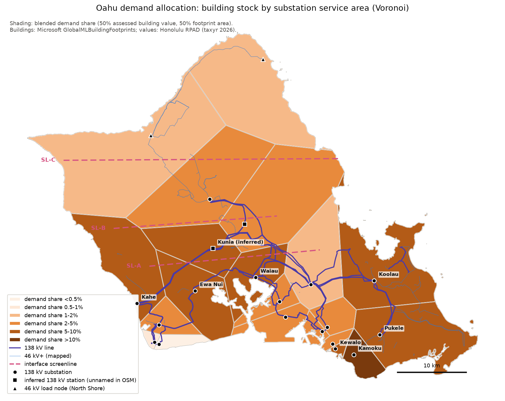
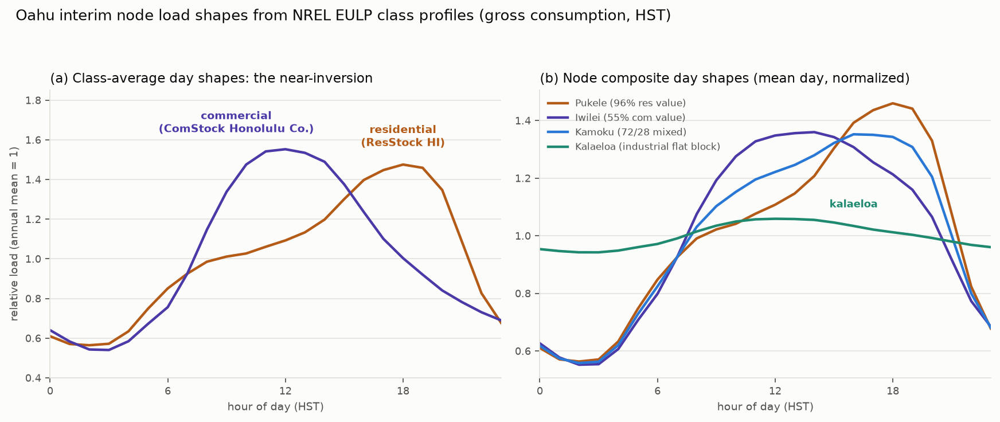

# Planned second edition (v2): from a single-node to a regional model

The current analysis models Oʻahu as a single zone: one bus, no transmission
constraints, no locational value. That is the standard first approximation
in capacity-expansion work, and its main results are robust to it — but the
next round of questions is locational, and v2 is being built to answer them.

## The centerpiece: a nodal model of the Oʻahu grid

A multi-zone representation of the island's transmission system, designed
to answer:

- **What transmission does the utility-scale buildout actually require?**
  Solar concentrated in a few regions must move to load centers; the wires
  cost of every pathway is currently unmodeled, for all pathways alike.
- **What is distributed generation and storage really worth?** Rooftop and
  canopy solar, and batteries at the point of consumption, can defer
  transmission and distribution upgrades. The single-node model credits
  none of that — its distributed-solar results are a floor. The nodal model
  prices the offset directly.
- **Where should renewable-energy zones be?** Siting, hosting capacity, and
  interconnection queues become analyzable when the grid has geography.

## Foundations already built

Two companion efforts feed the nodal model: the public land study
([solar-wind-landuse](https://github.com/mikejrob/solar-wind-landuse) —
cap counterfactuals, ownership × grid-proximity joins, corridor candidates,
and the legislative record of the land-use rules) and the grid-modeling
repository (`oahu-grid`, private during development — interface graph,
zonal loads, DER geography, recovered solar-cluster coordinates). Early
scoping: about 70 percent of the screened utility-solar resource lies north
of the island's transmission necks, and the corridor upgrades to move it
south are bounded at roughly $10–200 million — the central quantity the
nodal model will price properly.

The interim zonal map below allocates Oʻahu's demand to substation service
areas — the candidate zones — over the island's 138 kV network, with the
transmission-neck screenline that separates the resource-rich north from
the southern load centers.

*Figure V2.1 — Interim zonal geography for the nodal model. Demand is
allocated to substation service areas (Voronoi cells over building stock;
Microsoft building footprints × Honolulu real-property assessment), shown
with the 138 kV lines and the interface screenline.*

Each zone carries its own load shape rather than the island average. The
interim per-zone shapes below are built from NREL's End-Use Load Profiles:
class-average daily curves — commercial and residential are near-inversions
of each other — composited to the node level, so an industrial-flat zone
like Kalaeloa reads differently from the evening-peaking residential nodes.
Locational load shape is what makes transmission and distributed-resource
value analyzable; the single-node model averages it all away.

*Figure V2.2 — Interim per-zone load shapes. Left: class-average day shapes
(commercial vs residential). Right: node composite day shapes, normalized.
Early scoping artifacts, shown to indicate the model's direction.*

## Also queued for v2

- **Land screening at finer resolution** — the slope tiers extended to the
  land-constrained inventory; the gradient refined to 5-percentage-point
  bins; the agrivoltaic-eligible pool characterized; an excluded-lands
  inventory built out in the companion land repo.
- **Onshore wind re-screened under current Honolulu rules** — the model
  caps onshore wind at 150 MW, a blunt stand-in for the county's setback
  restrictions, and every solved scenario builds to the cap. v2 replaces it
  with a parcel-level screen under the current ordinance.
- **Multi-day and climate-stress reliability** — chronological
  production-cost simulation beyond the single historical worst day.
- **Real-time pricing and inter-day storage** — both currently excluded,
  both favoring the renewable-heavy paths.
- **Measuring the rooftop fleet directly** — the single largest measurement
  ambiguity left in v1. Three public series count Oʻahu's rooftop fleet and
  none states its rating basis; the capacity gaps between them match a
  typical DC-to-AC inverter loading ratio (~1.14) while system counts agree
  to within half a percent, so the likely reading is that the utility and
  permit series are DC nameplate and EIA is AC — but no source says so
  (Appendix A.11). v1's estimates are internally consistent by
  construction, because every coefficient is estimated per reported
  megawatt on the same series used to project net load; the residual
  exposures are comparisons with outside figures, and a basis mismatch in
  the netting chain's capacity factors, worth roughly 10 percent of
  distributed energy. v2 settles it empirically: installed panel area
  measured from aerial and street-level imagery, converted to capacity by
  panel-efficiency vintage — an independent estimate of the fleet on a
  stated basis, which also re-derives the rooftop *potential* and
  re-anchors all three adoption trajectories. It waits for v2 because the
  trajectories' 2027 anchor already sits within one percent of the observed
  stock, the growth-rate uncertainty is bracketed by three trajectories
  whose system costs span about $1.9 billion, and the direction of effect
  is known and stated; resolving it needs fieldwork-grade data, not a
  re-solve.
- **Completed vendoring** — the EGS resource screen, rooftop-potential
  derivation, PSIP-era conversion capital, contract-structure
  documentation.
- **Conversion cases with restored conversion capital.**

## Have a suggestion?

This page is an invitation. If there is a scenario, a constraint, or a data
source v2 should include, open an issue (see `COMMENT_POLICY.md`). Requests
that name a specific input, source, or question are the fastest to act on.
