## Executive Summary

This report asks what Hawaiian Electric and Hawaiʻi should build to keep
Oʻahu's lights on through 2050 as the grid moves to 100 percent clean power —
and what it will cost. We solve a capacity-expansion model — the tool
utilities and regulators use to plan decades of construction — several
hundred times. Each run varies oil prices, solar and battery costs, land-use
rules, the Waiau Repower, and the JERA LNG proposal. Every input traces to a
public source or a labelled author assumption, and the full model, data, and
code are public. The base case follows current federal law, including the
storage and geothermal tax credits (48E) that survive the 2025 budget
reconciliation act; we report a no-credit sensitivity for the case those
credits are denied or repealed. Five findings organize the results. The
two largest levers are both about how Hawaiʻi builds solar — on open land
and on rooftops. The choices that dominate public debate matter less.

**Finding 1. The largest lever is the price Hawaiʻi pays to build solar and
batteries.** Solar delivered here costs far more than on the mainland. The
evidence points mainly to soft costs — long procurement cycles, permitting,
interconnection queues, customer acquisition — though the size of the gap is
hard to measure precisely. If solar and battery costs stay 50 percent above
our baseline for the whole period, total system cost rises by about $2.1
billion; at 70 percent above, by about $2.8 billion. Our baseline already
includes a 20 percent Hawaiʻi premium, so these cases correspond to roughly
1.8 and 2.0 times the mainland benchmark, near what recent procurement
awards imply (Section 2.3). The lever is large because a big solar buildout
happens on every pathway — with or without new fuel plants, and largely even
without the clean-energy mandate — so the price per installed watt
multiplies across gigawatts built regardless. Reforms that close even part
of the gap are worth more than any fuel decision in this report, and they
are within the State's own control (Section 2).

**Finding 2. The second-largest lever is rooftop solar and storage, and most
of its value is available with today's technology and behavior.** Oʻahu's
rooftops carry about 793 MW of solar today, added at about 42 MW per year
over 2020–2024 — a pace that in 2024 reached what Hawaiian Electric's 2016
plan projected for 2034 (Appendix A.13). We measure what this fleet does to
the grid directly from utility demand records: each installed megawatt
removes about 0.61 MW of midday grid demand, and home batteries shift about
45 percent of their storage capacity into the evening hours each day
(Appendix A.11). Because rooftop supply substitutes almost one-for-one for
utility-scale solar, its growth determines how much open land is needed for
grid-scale solar. Limited further growth of rooftop solar leads to about
4,100 MW of utility-scale solar on about 20,400 acres by 2050; continuing
the current trend requires only about 3,600 MW on about 18,000 acres. Unleashing the resource
could grow rooftop capacity much faster: pay households and businesses the
full value of the power they export, for all they export — even when it
exceeds the value of what they draw from the grid — instead of today's
limited credits. If this doubled the installation pace, rooftop capacity
would reach about 2,100 MW by 2050 and cut the utility-scale land
requirement toward 15,000 acres (Section 2.7). That trajectory is an
illustration. No one knows how much capacity would follow a tariff no one
has yet offered, and even this path uses only about half of the mapped
rooftop potential. It shows the direction and the scale: rooftop growth
substitutes for open land.

The grid does not need sophisticated coordination to capture this value at
today's scale. We tested this directly: we solved the same system twice —
once with rooftop batteries following today's simple pattern, charging at
midday and discharging in the evening, and once with the identical
batteries dispatched optimally. At the base adoption path the difference is
$0.03 billion over 2027–2050, about a hundredth of a cent per
kilowatt-hour: predictable behavior is nearly as good as perfect
coordination. But the value of coordination grows steeply with adoption.
With 2.1 GW of distributed solar (the accelerated trajectory the sellback
reform of Section 2.8 is designed to unlock), optimal dispatch of the
rooftop batteries is worth about $0.23 billion (0.10 cents per
kilowatt-hour) — a reason to build real-time price exposure into that
reform from the start.

**Finding 3. No new fuel plant pays for itself. If LNG comes to Oʻahu, its
value is in the power plants the island already has.** JERA proposes a new
500 MW plant fed by imported liquefied natural gas. We solve the proposal
at both ends of JERA's own cost range and focus mainly on the middle. The
low end is their construction
estimate, which excludes items such as insurance, customs, design
allowance, and contingency; the high end is their own +20 percent
sensitivity, which restores them. At that midpoint the bundle costs $0.75
billion more than building no new fuel plant at reference oil prices —
roughly half a cent per kilowatt-hour (Appendix A.1) — within a range of
$0.54 to $0.96 billion at that oil price. The gap is positive at every oil
price tested: it widens to $1.63 billion on the market's low oil path and
$1.21 billion on its high path (Table ES.1). The more useful comparison is
between the plant and the fuel: whatever advantage LNG offers comes from
the fuel, not the plant. The same modern plant burning today's fuel oil
costs even more, while LNG burned in existing plants saves money. JERA's
new plant, even in its best case — its lowest capital estimate, with solar
at twice mainland cost — roughly breaks even. Converting the independent
Kalaeloa plant alone saves $0.39 billion, and converting Hawaiian
Electric's Kahe 5 and 6 and CIP turbine as well saves nearly three times as
much, with no new construction. The
savings hold up under conservative accounting: charging Hawaiian Electric's
entire 2016 multi-island conversion budget ($450 million in today's
dollars) against just the three Oʻahu units still leaves about $0.60
billion; adding a further $260 million of 2016 pipeline plans on top still
leaves at least $0.34 billion (Sections 4.3, 4.7). Rooftop growth widens
the gap against new plants: more rooftop supply leaves less demand for a
new plant to serve.

The two LNG questions turn out to depend on oil prices in opposite ways,
and separating them clarifies the choice. Converting existing plants is a
fuel-switching decision: its value is the price gap between fuel oil and
gas, multiplied by the volume burned. Because the proposed LNG contract is
indexed to oil at a rate that nearly matches how fuel oil itself tracks
crude, that gap stays near $6.60 per million Btu whether oil is cheap or
expensive. What varies across oil worlds is how much fuel is left to switch
and how much clean investment cheap gas defers, so conversion savings peak
on the central oil paths and fade at both extremes (Section 4.1) — but they
never depend on the per-unit gap being right. Building a new plant is an efficiency decision: its value
is the fuel saved by a more efficient machine, which is worth more when
fuel costs more. That value falls short at both ends of the range. When
oil is cheap the plant runs hard but saves little, because the fuel it
displaces is cheap. When oil is expensive solar and storage are a better
option, and the plant runs at just 19 percent of capacity in 2035. So the LNG case, to
the extent there is one, rests on switching fuel in plants Oʻahu already
owns, and that case does not need an oil-price forecast to be right. 
Considerations outside the cost model point the same way: a decades-long
commitment to a single supplier — the proposal specifies twenty years of
FSRU operation, and the supply contract's term and volume provisions, not
yet public, are likely written to protect the supplier, so its quoted price
is best read as a floor; a decade's delay in clean-energy deployment; a
likely increase in greenhouse gas emissions; and the stranding of Hawaiian
Electric's generation assets, which would compromise the utility's already
fragile financial position if capital recovery were disallowed, or burden
its customers with higher rates to pay for obsolete capital (Sections 4
and 8).

**Finding 4. Under current law, Enhanced Geothermal is in the least-cost
build.** Enhanced Geothermal, a newer form of geothermal power that creates
its own underground reservoir rather than relying on natural steam, enters
the cheapest build under the federal geothermal tax credit: the model
develops the full ~100 MW of identified Oʻahu resource in the base case,
lowering system cost by about $0.56 billion. At the optimistic cost
projection the saving roughly doubles; at the pessimistic projection the
model builds nothing and loses nothing, so the downside is bounded.
Enhanced Geothermal is therefore part of the cheapest way to run the
island, provided a first demonstration project proves the resource works
here (Section 3) and development proceeds in partnership with Native
Hawaiian communities (Section 3.5).

**Finding 5. The constraints many people worry about mostly do not bind.** Start
with land. Every pathway that meets the 2045 mandate, including JERA's,
builds nearly the same solar on nearly the same 20,400 acres, differing
mainly in timing. The assumed eligible inventory exceeds what gets built, and
flat-land reserves stand behind it — cropland that current law allows under a special
use permit, military parcels, closed golf courses and quarries, and the built
environment itself. The LNG question is essentially divorced from the land-use
question: Hawaiian Electric's and the State Energy Office's own studies,
like ours, find that LNG does little or nothing to change the ultimate
solar buildout (Sections 2.5 and 2.6). Next, reliability.
Every scenario keeps the lights on at every modeled hour, across weather
drawn from the 2007–2008 record — including its single hardest day of low
sun, weak winds, and an evening peak — plus a required reserve margin. We
don't need new thermal generation to ensure reliability; what we have (plus
the planned Puʻuloa plant) will suffice. Some claim we need backup firm power
to meet peak load, even in high-renewable environments. That's not true.
Storage moves energy within the day, so firm resources need to cover only
demand net of solar and wind averaged over the day, which is far below the
momentary peak. It also helps that demand is generally lower
on low-sun days (Section 5). Last, the mandate itself. Keeping the
2045 clean-energy requirement costs about $0.25 billion, roughly two-tenths of
a cent per kilowatt-hour, because the cheapest path runs ahead of the requirement
through 2040 anyway and builds 92 percent of the solar even if the
requirement is removed. Abandoning it saves about $0.41 billion (about 0.3 cents per
kilowatt-hour) if the replacement is a new gas plant and import terminal,
and up to about $0.7 billion if existing plants are converted to LNG instead,
the cheaper route Finding 3 identifies. We tested whether a new, more efficient
plant earns its keep in that no-mandate world when the model may choose freely: it
declines the 2030 plant entirely and adds at most about 250 MW around 2045,
as the converted units age out, for a saving within the solve tolerance
(Section 4.8). Either way, capturing this modest saving requires abandoning
the clean-energy mandate, committing to a long-term contract, hoping
(awkwardly) that rooftop and grid-scale solar don't overperform, and hoping
the contract price, or better, holds throughout. That last hope looks
dubious: today's spot price (JKM, July 2026) hovers around $21–22/MMBtu,
nearly double the reference contract price we assume (Section 4.8).

**Also decisive.** The Waiau Repower, Hawaiian Electric's proposal to
rebuild its old Waiau oil units, raises system cost by $1.38 to $1.49
billion at every oil price tested, and every bundle that contains it
inherits that penalty (Section 6). (This exceeds the literal cost of the plant
because the cost of capital is higher than our discount rate.) If a new plant
is built at all, 500 MW is larger than the system wants: a 375 MW version
does modestly better in every configuration tested, and converting existing
units beats both at JERA's quoted costs (Sections 4.1, 4.3, 4.7). One
caution: JERA attributes its attractive quote partly to scale,
so a smaller plant might not get the same price per megawatt.

**Table ES.1 — Total 2027–2050 system cost by trajectory and oil price
(present value, billions of 2024$; difference vs. no new fuel plant in
parentheses; current-law base case, 0.1% solve tolerance).** JERA rows show
the midpoint of the bare-EPC and +20% capital cases; the band spans the two
(Figure ES.1). The conversion row is shown at reference oil, the only oil
path solved on this base-rooftop trajectory; Figure 4.3 solves the
conversions across all four oil paths and three solar-cost levels on the
trend-rooftop trajectory, where the saving peaks on the central paths and
fades at both extremes (Section 4.1). The conversion row nets out the full 2016
conversion-program estimate ($450M in 2024$) as conversion capital; its
bracketed value also adds the entire 2016 onshore-pipeline package ($260M),
a deliberately extreme charge (Section 4.7).

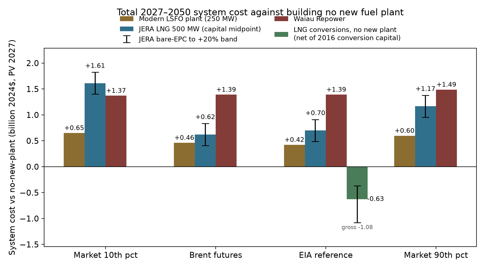

*Figure ES.1 — Total 2027–2050 system cost of each proposed investment,
measured against building no new fuel plant.* Each bar is the present value
of total system cost (billion 2024$, discounted to 2027) for a pathway
including the named investment, minus the no-new-plant path solved under the
same oil-price case. Oil cases: the market's 10th percentile, the Brent
futures strip, the EIA-anchored reference, and the market's 90th percentile
(Appendix A.14). Whiskers on the JERA bars span the
plant's bare-EPC capital to +20 percent; the bar sits at the midpoint. The
conversions bar (shown at reference oil; Figure 4.3 spans all four oil
paths) is LNG conversion of existing
plants with no new plant, net of a $0.45 billion conversion-capital charge
benchmarked to HECO's 2016 program; its whiskers run from the gross fuel
saving to a stricter bound that adds the 2016 onshore pipeline package. Bars
above zero cost more than building no new plant.

| Trajectory | Market 10th pct | Brent futures | EIA reference | Market 90th pct |
|---|---:|---:|---:|---:|
| No new fuel plant | 21.16 | 24.30 | 25.83 | 27.32 |
| LNG conversions, no new plant — net of conversion capital | — | — | 25.24 (−0.60) *[−0.34]* | — |
| Modern LSFO plant (250 MW) | 21.81 (+0.65) | 24.77 (+0.47) | 26.27 (+0.43) | 27.93 (+0.60) |
| JERA LNG 500 MW — midpoint | 22.79 (+1.63) | 24.95 (+0.65) | 26.58 (+0.75) | 28.53 (+1.21) |
| *…JERA band [bare-EPC, +20%]* | *[+1.42, +1.84]* | *[+0.44, +0.87]* | *[+0.54, +0.96]* | *[+1.00, +1.42]* |
| Waiau Repower only | 22.54 (+1.38) | 25.69 (+1.39) | 27.23 (+1.40) | 28.81 (+1.49) |
| Waiau + LSFO plant | 23.27 (+2.12) | 26.23 (+1.93) | 27.71 (+1.88) | 29.41 (+2.09) |
| Waiau + JERA LNG — midpoint | 24.28 (+3.12) | 26.43 (+2.13) | 28.06 (+2.23) | 30.02 (+2.69) |

**Limits of inference.** These findings are conditional on the cost
trajectories, fuel-price regressions, sample-day reliability design, and
institutional assumptions documented in the appendices, and on the menu of
options tested. The model is a single-zone representation of Oʻahu: it does not
price transmission upgrades or the locational value of distributed resources —
a tradeoff the zonal grid model now under development will address (Section 8).

---

## 1. Why this report now

### 1.1 The policy moment

Three electricity decisions are before the Hawaiʻi Public Utilities Commission
and the State. They are treated as separate proceedings, but each shapes the
costs the others will determine.

The first is the **Waiau Repower**, Hawaiian Electric's plan to replace six
retiring oil-fired steam units at Waiau with six new fuel-flexible
**simple-cycle combustion turbines** totaling about 253 MW, running on at least
51 percent renewable fuel at commissioning, 75 percent by 2040, and 100 percent
by 2045 under the PUC order (Docket 2025-0211, Decision and Order 42411, March
2026). Hawaiian Electric's amended cost estimate was $1.155 billion; the
Commission capped recoverable cost near the original $847 million bid (an
absolute ceiling of $931.7 million), leaving roughly $220–310 million of the
stated cost exposed to shareholders, depending on where allowed recovery
lands within the cap. Section 6 develops both the system-cost and the
cost-recovery questions.

The second is **JERA's proposal** to build a 500 MW combined-cycle power plant
in Kapolei fueled by imported liquefied natural gas, delivered through a
floating storage and regasification unit (FSRU) moored offshore Barbers
Point, adjacent to Campbell Industrial Park. The proposal specifies twenty
years of FSRU operation; the supply contract's term and volume provisions
have not been made public. The publicly reported investment is about $2 billion
in total, roughly 75 percent for the plant and 25 percent for the import
infrastructure [ENR 2026; JERA proposal, March 17 2026]. Governor Green's
office has cited the proposal's potential to reduce residential bills by about
20 percent; Section 1.2 examines that claim, and Section 4 the full system
comparison. The Pacific market context matters for a commitment of this length:
Japan's LNG demand has been declining and JERA is among the world's largest
LNG resellers. In March 2026 JERA terminated a 20-year supply contract with
Commonwealth LNG — a pre-construction exit of a kind the industry treats as
routine, which is the instructive point: that flexibility exists before
infrastructure is built, not after (Section 4.6).

The third is **retail wheeling** under 2025 Act 266, now in late-stage PUC
implementation, a market-design reform that bears directly on the delivered
cost of new solar, which Section 2 identifies as the largest lever in this
report.

### 1.2 The "20 percent bill cut" claim

Roughly half of a residential bill pays for generation. The other half pays for
wires, meters, and programs that cost the same under any fuel. In the near term
the 2026 conflict in Iran and the Persian Gulf has raised oil prices, so fuel can
temporarily run above half of generation cost. Over the planning horizon, fuel is 
about 37 percent of cost in the early
years at reference oil prices, declining toward 8–10 percent by 2050 as renewables
displace combustion (Appendix A.4). Even if every dollar of fuel spending captured
LNG's actual price advantage over low-sulfur fuel oil — roughly $5 per
million Btu, on a base of about $17 at reference oil prices (Table 1.1) — the realistic ceiling is a few
percent of the bill, declining toward one percent. The 20 percent figure is
unreachable under any reading of the same data. Section 4 tests the more
generous "bundled" interpretation directly, with the same conclusion.

*Table 1.1 — LSFO and LNG delivered cost at three Brent paths, 2030 (2024$).*
LSFO uses the post-2024 R3 contract regression (slope 0.7388, intercept
$37.30/bbl, 6.22 MMBtu/bbl); LNG is the HSEO/FGE-style contract price plus the
regasification charge ($1.31/MMBtu at modeled utilization). Both fuels are
priced off the same crude, so the gap between them barely moves across a
Brent range of $23 to $145: the saving is about $5.2/MMBtu whatever oil
does. Section 4.5 draws out what follows.

| Long-run oil path | Brent ($/bbl, 2030) | LSFO ($/MMBtu) | LNG delivered ($/MMBtu) | Δ (LNG − LSFO) |
|---|---:|---:|---:|---:|
| Market 10th percentile | 23 | 8.77 | 3.57 | −5.20 |
| Brent futures | 58 | 12.87 | 7.64 | −5.23 |
| EIA reference | 90 | 16.69 | 11.43 | −5.26 |
| Market 90th percentile | 145 | 23.26 | 17.96 | −5.30 |

A five-dollar-per-MMBtu saving on the fuel is real. Whether it justifies the
terminal, the contract, and the plant, against an alternative that burns
steadily less fuel of any kind, is the system question Section 4 answers.

*Table 1.1 and the fuel-price regressions use the R3 LSFO contract regression
(Roberts 2026 brief) applied to the four Brent paths of Appendix A.14; values
in 2024$.*

---

## 2. Solar and storage: the largest lever

### 2.1 What the model finds

At the baseline cost basis — NREL ATB 2024 Moderate for solar and battery,
plus a 20 percent Hawaiʻi premium, with the battery's co-location saving taken
from NREL's own PV-plus-battery hybrid — total 2027–2050 system cost is $25.83
billion at reference oil prices. Holding solar and battery costs 50 percent
above that baseline for the full horizon raises system cost to $27.94 billion
(+$2.1B); 70 percent above raises it to $28.65 billion (+$2.8B). The
baseline already includes the 20 percent Hawaiʻi premium, so these cases
correspond to roughly 1.8× and 2.0× the mainland ATB benchmark; the 1.5×
case approximates the effective cost level implied by recently approved
contracts (Section 2.3). We present evidence that the premium Hawaiʻi
actually pays for grid-scale solar stems mainly from exceptionally high
soft costs — categories that respond to policy reform.

For scale: the Waiau Repower decision moves system cost by about $1.4
billion; the LNG-versus-no-new-plant decision moves it by about $0.8
billion at its reference-oil midpoint. Solar-and-storage procurement reform is
worth several times any fuel decision in this report. 

### 2.2 Where the premium sits: soft costs

Hawaiʻi solar carries a documented premium over mainland deployments. The
premium is concentrated in soft costs — the length of the procurement cycle, 
permit fees and timing, interconnection-queue position, customer-acquisition cost, 
and the risk premia developers attach to an RFP-and-PPA process with a history of
post-award cancellations and delays. These are cost categories that
respond to regulatory and market-design reform. Hardware follows global
manufacturing trends Hawaiʻi cannot influence.

Two clarifications set the limits of this claim. First, the mainland benchmark
is not hardware alone. NREL's utility-scale PV cost model, which underlies the
ATB figures used here, builds capital cost from the ground up and already
includes soft costs, among them permitting, inspection and interconnection,
customer acquisition, developer overhead, and profit (NREL PV System Cost
Benchmark, Ramasamy et al., Q1 2023, NREL/TP-87303, CAPEX component table). Bringing
Oʻahu near mainland cost therefore means narrowing Hawaiʻi's excess soft cost,
not removing a category every market carries. Second, the size of that excess
is difficult to measure directly, because Hawaiʻi procurement records do not
report these categories separately. The evidence below is correspondingly
indirect. It shows that the fundamentals that could justify a large
premium — hardware, labor, and land — do not appear to do so, leaving the
process as the residual explanation. And the details of that process make
it easy to see why it inflates costs. The
retail-wheeling reform mandated by 2025 Act 266, now in late-stage implementation, 
could address the soft-cost gap directly by replacing the procurement gauntlet 
with transparent market access to avoided-cost pricing. The pricing and
interconnection details underlying the wheeling tariff will be essential. 
The evidence:

### 2.3 The cost-fundamentals evidence, in detail

The evidence in this section supports two claims: Hawaiʻi's residential
solar costs look ordinary once system size is accounted for, and the large
premium sits in utility-scale procurement, where it grew sharply through the
recent inflation. One table summarizes it; the blocks that follow carry the
sources and adjustments.

| Evidence | Hawaiʻi | Mainland | Reading |
|---|---|---|---|
| Residential installed $/W (2026) | $3.14 Honolulu | $2.11–2.39 Phoenix/Houston/LA | lower edge of the national band; gap within normal state variation |
| Utility PPA, 2018–20 vintage (levelized 2024$) | ~$77/MWh | ~$31/MWh | a premium, but both markets near lows |
| Utility PPA, 2024–26 vintage | ~$195/MWh (Mahi reprice) | ~$65/MWh | escalation mostly Hawaiʻi-specific |
| Common global shock | ~+12 ¢/kWh | ~+2.5–3.5 ¢/kWh | the excess is the procurement channel |
| Ground rent | a few $/MWh | — | no scarcity rents; land is not the binding cost |

**Residential installed cost.** EnergySage Marketplace (February–May 2026)
puts the Honolulu average at $3.14 per watt installed ($29,233 before
incentives on a typical 9.3 kW system), against $2.11 in Phoenix, $2.19 in
Houston, and $2.39 in Los Angeles. Tesla's published all-in residential
pricing — designed to be comparable across U.S. markets — runs about
$2.27–2.82 per watt nationally; on that pricing Hawaiʻi runs slightly
above California and below New York and Massachusetts. SolarReviews reports
the Hawaiʻi residential average at $2.82 with a $2.14–3.20 range. LBNL's 
*Tracking the Sun* (2024) reports a national 20th–80th percentile band of roughly 
$3.20–5.50 per watt (2023$; ≈$3.3–5.7 in 2024$) and state fixed-effect spreads of 
roughly $2 per watt: Honolulu sits at the lower edge of the national band, and 
its ~$1/watt gap to Phoenix is within normal state-to-state variation. Hawaiʻi
households also install smaller systems for the same annual load, so the
total cost of a typical Honolulu system is comparable to one in Phoenix or
Houston in absolute dollars.

**Utility-scale procurement.** Hawaiian Electric's Stage 1 awards (approved
2018–19) delivered four-hour solar-plus-storage on Oʻahu at $0.08–0.12 per
kilowatt-hour (nominal award prices; ≈$0.10–0.14 in 2024$): Hoʻohana, Mililani
I, Waiawa Phase 1, AES West Oʻahu. The contracts approved since 2024 price the
same service at $0.21–0.23: Mahi, a 2020-vintage project whose amended contract
(Docket 2025-0414) roughly tripled its originally executed price, and Puʻuloa
Solar, a new selection under review. Mainland prices also rose substantially
over this period, roughly doubling from their 2019/20 lows:
matched-configuration medians moved from about $31 to $65 per MWh (LBNL
*Utility-Scale Solar*, 2025 data file; levelized PPA prices in constant 2024
dollars; Box 2.1). On the same levelized 2024-dollar basis, Hawaiʻi's
matched-configuration executions of 2018–2020 carried a median near $77 per
MWh, and the amended Mahi contract is roughly $195. Because modules,
batteries, and capital are priced in global markets, the common shock added
roughly the same number of cents everywhere: about 2.5 to 3.5 cents per
kilowatt-hour on the mainland at matched configuration, against roughly 12
cents for the Mahi repricing of an identical project. The additional
escalation is specific to Hawaiʻi's procurement channel.

The clearest mechanism is the interaction of fixed nominal prices with slow
interconnection. A Hawaiʻi PPA fixes its price in nominal dollars at award,
with no adjustment between award and interconnection (Section 2.8).
Award-to-operation has run four to seven years on Oʻahu: Mililani I about
four, AES West Oʻahu about five, Hoʻohana seven, and two Stage 2 projects
were still under construction six years after award. When inflation spiked in
2022 and stayed high and uncertain, each year of delay eroded the real value
of an award. Developers respond by bidding high enough to absorb the risk,
renegotiating, or walking away: of the 2020 Stage 2 round, Kupehau, Mehana,
and Barbers Point were cancelled, and Mahi survived by repricing.

The technology itself continued to get cheaper. IRENA's Renewable Cost
Database records a 90 percent decline in the global weighted-average
levelized cost of utility-scale solar between 2010 and 2024, to about
USD 44 per megawatt-hour, and a 93 percent decline in battery storage costs
over the same period. Its 2026 study of firm renewable power finds that
solar sized with storage to deliver continuous supply fell about 30 percent
in cost between 2020 and 2025 at high-quality sites, in real 2025 dollars,
and projects further declines through 2035 (IRENA, *24/7 Renewables: The
economics of firm solar and wind*, 2026, vendored in sources/).

The rise in United States prices over the same years was not a rise in the
cost of the equipment. IRENA gives four reasons U.S. solar costs sit above
China's: financing costs three to five percentage points higher,
"reflecting higher perceived investment risk and more limited access to
long-term, low-cost capital"; balance-of-system and infrastructure costs
raised by "higher labour costs, more complex permitting regimes, and
grid-connection requirements"; a pace of grid expansion and interconnection
that "constrains deployment and adds project-level cost"; and added risk
premiums. It notes that in many U.S. markets "interconnection charges are
borne directly by project developers rather than socialised across the
broader system." The interconnection backlog on the mainland reached about
2.6 terawatts at the end of 2023, 95 percent of it solar, wind, and
storage, and the typical project now takes about five years to connect,
against under two a decade earlier (LBNL, *Queued Up*, 2024). Rising real
interest rates added to all of it, and they raise the cost of solar and
storage by more than they raise the cost of a fuel-burning plant: a plant
with no fuel recovers almost all of its cost as capital, and capital cost
rises with the interest rate.

Hawaiʻi has the highest utility-scale solar prices in the country. Its grid
is small, and it does not have a large interconnection backlog. Its
interconnection and procurement process is slow and costly, and it applies
to a system that already carries an unusually large amount of distributed
solar. The procurement and interconnection costs that raised prices across
the United States are larger in Hawaiʻi, and that is the reason its prices
are highest.

> **Box 2.1 — How large is Hawaiʻi's utility-solar premium today?** Careful
> measurements give answers from about 1.8 to 2.2 times mainland cost, and
> the spread comes mostly from how the comparison is set up, not from
> disagreement about Hawaiʻi. Three choices drive it.
>
> *What is compared.* The model needs the unsubsidized cost of installed
> capital, benchmarked to NREL's ATB — that basis is what our multipliers
> mean. Most public discussion instead compares contract (PPA) prices,
> which fold in financing, configuration, and, most importantly, federal
> subsidies.
>
> *How subsidies enter.* PPA prices are bid net of federal tax credits, and
> the credits differ across the two markets in a way that inflates the
> apparent gap. Recent mainland utility solar typically elects the
> production tax credit — a flat 2.75 to 3 cents per kilowatt-hour (§45Y),
> which covers a large share of a cheap mainland contract. Hawaiʻi's
> battery-heavy hybrids plausibly claim the 30 percent investment credit on
> both components instead (storage has no production-credit option, and the
> production credit favors low-cost, high-output projects — the opposite of
> Hawaiʻi's configurations), and because Hawaiʻi's prices are much higher,
> federal support covers a far smaller share of them. Comparing subsidized
> prices therefore overstates the underlying premium; adding the credits
> back to both sides shrinks the gap materially. Configuration compounds
> this: Hawaiʻi hybrids pair four-to-five-hour batteries sized near 100
> percent of PV capacity, far larger than the typical mainland hybrid, so
> comparisons that skip battery matching overstate the gap again. The
> mainland figures in this section are configuration-matched (battery at
> least 90 percent of PV capacity, four hours or longer) for that reason.
>
> *When.* The nominal premium roughly doubled after 2020 (the table
> above), so any estimate mixing contract vintages picks its own answer.
>
> On a consistent basis — unsubsidized, configuration-matched, and
> vintage-matched — the procurement record implies roughly 1.4 to more
> than 2.2 times mainland cost. Our 1.5× sensitivity (about 1.8× mainland)
> sits well above what the Phase 1 and Kauaʻi contracts imply; the State
> Energy Office's 2.154 multiplier sits near the top. The differences
> across these points are within the measurement noise of a handful of
> contracts. No conclusion in this report depends on the point estimate:
> results are solved at 1.2, 1.8, and 2.04 times the 2024 ATB baseline for
> unsubsidized solar and batteries, and stated across that span. Since
> 2024, battery costs — a disproportionately large share of a Hawaiʻi
> installation's cost — have fallen about 30 percent, making these
> multiples somewhat conservative.
>
> One asymmetry deserves note: we apply no Hawaiʻi premium to any
> other resource — including offshore wind — which appears consistent with
> the assumptions of HSEO and Hawaiian Electric. The assumption is untested
> in both directions: there is no local procurement record to estimate an
> offshore premium from, and none of the process factors behind the solar
> premium — procurement cycles, permitting, interconnection — is specific
> to solar. If those factors persist, a resource with no construction
> record here and floating-platform engineering would be at least as
> exposed to them (Section 4.5). Where a single number is needed, Hawaiʻi
> currently pays roughly double the mainland price to deploy utility-scale
> solar — and the evidence of Section 2 is that this figure reflects
> process rather than geography.

**Land and ground rent.** Recent University of Hawaiʻi solar RFPs and
contemporary utility-scale leases price ground rent at a few dollars per
megawatt-hour delivered — a trivial share of project cost. If developable land
were the binding constraint, lease rates would show scarcity rents. We see
none.

**Federal incentives.** The analysis credits no solar ITC (assumed phased
out) and no state credits. Storage and geothermal credits were not phased
out like the solar and wind credits, so the base case retains the 30 percent 
federal storage credit (48E) for construction beginning through 2033, phasing to 
zero for starts after 2035. This schedule — battery capital ×0.70 for 2027–2035 
vintages, full price after — is in the base case; a no-credit sensitivity, 
which removes it, raises the no-new-plant system cost by about $0.6 billion at 
reference oil (the cost of losing the credit to the foreign-entity rules or repeal). 
The expiring credit also reshapes the buildout the way an expiring credit should:
the model pulls roughly 2,600 MWh of storage from the 2040s into 2035 and
moves about 430 MW of co-located solar into 2030–2035, capturing the
credit before it lapses. 

The solar and wind tax credits are nearly expired, so it is worth asking
what the State of Hawaiʻi has already lost by not streamlining
interconnection of solar and batteries sooner. Even the most pessimistic
land-availability estimates from the Hawaiʻi State Energy Office put
grid-scale solar potential on Oʻahu at roughly 2 GW. At a 25 percent
capacity factor, that capacity would deliver about 4.4 TWh per year.¹ That
is roughly two-thirds of Hawaiian Electric's current sales, and more than
all of its current oil-fired generation. More would still be needed over
the long run, to displace the independent Kalaeloa plant and to meet demand
growth.

Suppose that capacity had been built at 10 cents per kilowatt-hour, the
price of the 2019 awards. The avoided fuel cost at reference Brent is about
17 cents per kilowatt-hour (Table 1.1 prices at the fleet's heat rates).
The savings would have been roughly $0.3 billion per year. At 5–6 cents,
the price implied by mainland soft costs, the savings exceed $0.5 billion
per year. Both figures are conservative. The utility's filed blended energy
cost in July 2026 is 27 cents (Hawaiian Electric monthly energy cost
adjustment filings, July 2026), and displaced energy
avoids more than fuel alone. Countries with streamlined interconnection
and similar labor costs have seen lower solar prices than the U.S.
mainland, even before subsidies.

The lost savings are an incentive for reform, and a warning of what failing
to reform will keep costing (Section 2.8). There is also a small chance of
reviving recently cancelled solar projects in time to use the federal
credits. Under the 2025 federal tax law, a revived project qualifies if it
was under construction before July 2026 or in service by the end of 2027.
The window is tight but not closed. A "connect and manage" interconnection
rule, described below, is the kind of reform that could open it.

¹ *Footnote: the 25 percent capacity factor is conservative for this
counterfactual. Hourly profiles for the model's 54 land tranches come from
Matthias Fripp's Switch-Hawaiʻi data pipeline, which runs NSRDB satellite
irradiance through NREL's PVWatts single-axis-tracking model
(github.com/switch-hawaii/data). Tranche capacity factors range from about
15 to 28 percent AC. The best 2 GW of tranches average about 27 percent,
and a 2 GW program would use the best land first. The model's solved builds
average 23–24 percent only because they are much larger — 3,600 to
4,100 MW of utility solar by 2050, depending on the rooftop trajectory —
and reach into poorer tranches. These figures are themselves
conservative for less-restricted siting: leeward Class B/C cropland enters
only through the capped 10 percent draw, and other high-irradiance land to
the west is excluded as military or discretionary. The roughly 21 percent
in national fleet data reflects the existing, largely fixed-tilt vintage.*

### 2.4 Interconnection

The 2024 Integrated Grid Planning filing reports average study-completion
times of 24–30 months for utility-scale projects. For a grid of Oʻahu's size
and topology, studies of that length are difficult to justify technically. Yet,
in practice, interconnection has taken twice as long or more (four to seven years). 
And unlike the mainland, the State does not have a huge interconnection queue to 
help rationalize the delay. A connect-and-manage approach — construction proceeding on 
a preliminary feasibility determination, with dispatch managed against actual conditions —
is standard practice in ERCOT and Great Britain and would shorten the queue
without weakening reliability review. Soft-cost reform lowers the price of
each project. Queue reform raises the rate at which projects arrive. The two
are complements (Section 2.8).

Texas is the clearest illustration of how far this can go. Generators there
interconnect under connect-and-manage at a fraction of the cost and time of the
invest-and-connect regions, without the network-upgrade charges that dominate
elsewhere, which places its interconnection soft costs at or below the
mainland average (Utility Dive, "Can ERCOT show the way to faster and cheaper grid
interconnection?", 2023; ERCOT led all U.S. operators in interconnection
volume in 2024, with Berkeley Lab attributing the lead in part to
connect-and-manage). Texas also carries a very large interconnection queue, but
for reasons unrelated to the cost of the process itself: a surge of speculative
generation and large-load data-center requests, much of which has not submitted
enough information to be studied. A long queue under cheap, open access is a
different situation from the slow, costly one Oʻahu faces. The comparison
suggests Hawaiʻi's soft costs are higher than the interconnection task itself
requires, though only Texas has pushed them this low, and doing so depends on
dispatch rules that are clear, fair, and audited (Section 2.8).

The Hawaiʻi premium, in short, sits in process. Hardware arrives at world prices 
plus a slight transport premium and tariff, if not produced domestically; what 
Hawaiʻi adds is time, queues, and risk premia — all of which policy can reduce 
(Section 2.8).

### 2.5 Does Oʻahu have enough land?

**How much land the build needs.** The model's least-cost build reaches
about 4,100 MW of utility-scale solar by 2050, with rooftop systems on the
conservative trajectory of Section 2.7 (about 1,000 MW by 2050); faster
rooftop growth cuts the utility build to about 3,600 MW on the trend
trajectory. How much land a megawatt needs has fallen steadily as panels
have grown more efficient. The conventional figure is about six acres per
megawatt for tracking solar, counting the full site — roads, setbacks, and
buffers. On direct array area alone (row spacing included, the rest of the
site not), the 2019 U.S. medians were 4.2 acres per MW-DC (5.6 per MW-AC)
for tracking plants and 2.9 (3.6) for fixed-tilt, which packs about half
again more capacity per acre (Bolinger and Bolinger, *Land Requirements
for Utility-Scale PV*, Lawrence Berkeley National Laboratory, 2022;
vendored in sources/). Those medians are seven years old, and the same
study measured tracking power density rising 43 percent over 2011–2019,
mostly from module efficiency; even at half that pace, today's tracking
plants sit near five acres per MW-AC — and the trend runs through the
2030s and 2040s, when most of the buildout modeled here occurs. We use
five acres per megawatt-AC throughout — the same basis as the model's
capacity variables — and state the judgment plainly: probably optimistic
for a project built in the next few years, plausibly pessimistic for one
built around 2045; one number for a quarter-century of construction splits
that difference. The density choice shapes the solution. The model selects parcels
in merit order, and 41 of the 54 land tranches are built to their caps in
the least-cost 2050 build, so a worse acreage requirement shrinks every
tranche's cap and pushes construction outward into steeper, costlier,
lower-capacity-factor land. At five acres per megawatt, the 2050 build
needs about 20,400 acres (about 18,000 on the trend rooftop
trajectory). The model assumes tracking solar throughout, because that is
what the optimization selects. If land constraints were ever to bite, the
next step is parcel-level characterization and a wider technology menu —
fixed-tilt and agrivoltaic configurations (for instance double-sided
vertical panels that capture early and late sun) use land differently and
would open more potential than assumed here; both require changes to model
structure and are planned for v2 ("What we will do next").

**What the screen admits.** The screen's rule is fully documented. It
admits agricultural- and country-zoned land only; subtracts Class A soils,
golf courses, road buffers, and (via the zoning filter) military
installations; caps prime Class B/C land at 10 percent per cluster — the
as-of-right limit quantified below — and admits all Class D/E and
non-agricultural land. Terrain enters through a graduated screen:
land to 15 percent slope builds at reference cost,
15–20 percent at a 5 percent premium, 20–30 percent at a 10 percent
premium, and slopes above 30 percent are excluded. Screening and
clustering yield 5,451 MW of buildable capacity — 27,256 acres at five
acres per megawatt — across 54 tranches (18 areas in three slope bands),
91 percent of it on marginal or non-agricultural soils. The selected B/C
parcels are not physical site choices; they are a quasi-random draw
representing the acreage current law allows, and any similarly sized set
would serve the analysis equally well. The slope premiums matter in
practice: about a third of the least-cost build lands above 15 percent
slope, so a flat-land-only reading of the inventory would misstate both
the acreage and where it sits.

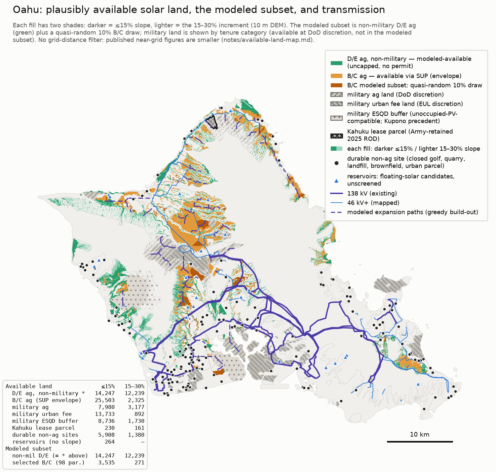

*Figure 2.3 — Plausibly available solar land, the modeled subset, and the
transmission network.* Land plausibly available for utility-scale solar,
colored by tenure and legal pathway: uncapped Class D/E agricultural land
(modeled as available), the Class B/C envelope reachable by special use
permit together with the quasi-random 10 percent draw the model uses,
military lands by discretion category, durable non-agricultural sites
(closed golf courses, quarries, landfills, brownfields), and reservoir
surfaces (floating-solar candidates). Within each category, darker fill
marks slopes of 15 percent or less and lighter fill 15–30 percent. Purple
lines are the existing 138 kV and mapped 46 kV-plus network; dashed lines
are modeled expansion paths. The inset table gives acreage by category and
slope band; the modeled subset totals about 30,300 acres.

**The inventory beyond the screen.** The map and the model describe the
same inventory at two levels of detail. The map's modeled subset totals
about 30,300 acres — roughly 26,500 acres of Class D/E agricultural land,
which carries no statutory cap, plus a 3,800-acre draw of Class B/C
parcels. Around it, the map documents what the screen excludes by
construction, each category with its own institutional path and none
assumed in the base inventory: about 25,500 acres of Class B/C cropland
under 15 percent slope that current law admits only through special use
permits (the modeled draw takes just 3,500 of those acres); roughly 30,000
acres of military-controlled land, in categories from plausible
(explosive-safety buffers compatible with unoccupied solar, following the
Kupono precedent) to discretionary; about 5,900 acres of durable
non-agricultural sites — closed golf courses, quarries, landfills,
brownfields; and reservoir surfaces suited to floating solar. Beyond the
mapped categories sit industrial, brownfield, and other disturbed lands
inside the urban district, which the screen never examines, and two
categories under parcel-by-parcel investigation: federal landholdings
(tenure, mission constraints, and the 2029 state-land lease questions
require careful treatment) and closed golf acreage (which the screen
subtracts regardless of operating status).

**Steep slopes.** Building at scale on 15–30 percent grades is less
settled practice than the cost premiums alone suggest: tracker
foundations, grading, and stormwater management on those grades carry
engineering and permitting questions a capacity-expansion model does not
resolve, and some of that terrain may prove harder to develop than a 5–10
percent adder implies. Two observations bound the concern. First, the
hardware tolerance is real but finite: standard single-axis trackers
handle grades to roughly 15 percent with modest cost increases (companion
study slope-cost review), and 92 percent of the mapped B/C envelope —
25,503 of 27,828 acres — lies at or below that grade, though terrain binds
unevenly (about 65 percent of Class C acreage exceeds a 5 percent grade,
against about 40 percent for Classes A and B). Second, flatter land the
screen excludes — the categories above — stands in reserve.
If steep-slope construction disappoints, the substitution runs toward
those flatter categories rather than toward more total land; the question
the map settles is physical availability, not siting certainty for any
particular parcel.

**What the land records show.** The claim that suitable land is
unavailable sits uneasily with the documented structure of the rules. The
companion land study quantifies the statutory cap on prime Class B/C
soils — as-of-right development limited to the lesser of 10 percent of a
parcel or 20 acres (2014 Act 55) — directly at the parcel level (its
notes/cap-quantification.md, run July 2026). Under current law,
as-of-right B/C eligibility on Oʻahu is about 3,600 acres, and the binding
element is the hard 20-acre cap, not the 10 percent share. Raising the
share to 20 percent while keeping the 20-acre cap adds only about 1,100
acres; dropping the hard cap at the existing 10 percent nearly triples
eligibility, to about 9,400 acres; both changes together yield about
15,700 acres, a 4.3-times increase. That figure can look surprising
against the island's roughly 34,400 acres of agricultural-district B/C
soil, but the cap is a share of each parcel's *total* acreage, not of its
B/C acreage, and B/C soil concentrates in very large parcels — the largest
tenth hold 91 percent of it — so a 20 percent parcel share reaches nearly
half the B/C total. The same concentration means relaxing the cap mostly
transfers development option value to large landowners, a point the
companion study develops.

Above the cap, B/C development is *unlimited* through a Special Use
Permit, conditional on an agricultural lease at 50 percent or more below
fair-market rent plus decommissioning security. The record shows the route
workable when the economics support it: of the eight applications to come
before the Land Use Commission, seven were approved unanimously without
intervenors; the eighth, on Maui, is under review. And the economics
generally do support it: for much of this land the solar value far exceeds
the agricultural value, so even a minimal second income stream makes dual
use attractive — while advancing the state's goals of keeping agricultural
land productive and growing local food supply. The exception is land whose
agricultural value exceeds its solar value, notably high-value seed crops;
but seed crops require large buffers against cross-fertilization, and
those buffers might themselves be profitably planted in panels. Our
10 percent baseline is therefore likely conservative: much of the B/C
deployment it represents would
proceed as agrivoltaic projects under the special-use pathway, and some
large parcels could build to the as-of-right cap with no permit at all —
though at five acres per megawatt a 20-acre site is about 4 MW, below the
5 MW minimum today's PPA terms require, a procurement conflict Section 2.8
(reform 2) addresses. Setback rules severely constrain onshore wind on
Oʻahu; we have found no case of a blocked solar project on the island.

**Ownership, terrain, and the grid.** Ownership of the eligible land is
unconcentrated — HHI ≈ 560, 44 percent government-held, no pivotal private
owner — so land market power does not rescue the scarcity argument either.
An agrivoltaic standard giving solar the same as-of-right dual-use pathway
wind enjoys under HRS §205-4.5 would streamline the process while keeping,
and possibly growing, the land in farming (Section 2.8, reform 4). The
constraint the companion study finds actually binding is not acreage but
transfer capacity: roughly 70 percent of the screened utility-solar
resource sits north of the island's transmission necks, and moving a
multi-gigawatt northern build south requires bounded corridor upgrades on
the order of $10–200 million — small against the plant decisions in view
and unpriced in this single-zone model; the nodal model of v2 will
quantify them.

**The screen errs in both directions, and the errors partially offset.**
Some acreage inside the screen will prove undeliverable in practice —
owners who decline to lease, sites behind transmission corridors not yet
built, projects communities decline to accept, and parcels the available
data mischaracterize. But the screen also excludes the plausibly viable
reserves cataloged above — the roughly 30,800 acres of
agricultural-district B/C soil beyond the as-of-right cap, the military
categories, the durable non-agricultural sites, the reservoir surfaces,
and the urban-district lands it never examines. None of these is counted
in the 27,256 eligible acres, which itself exceeds the roughly 20,400
acres the least-cost build actually uses.

Physical acreage is sufficient; the binding questions are pace, process,
and terms. The companion study of Oʻahu land availability and the
political economy of the land-use rules — the legislative record of HRS
§205-2/§205-4.5, cap counterfactuals, ownership, terrain, and grid
proximity — is public at github.com/mikejrob/solar-wind-landuse and
carries the full detail behind this section and the next. It is a living
inventory: fixes, parcels, and local knowledge are welcome there.

### 2.6 What the fuel choices change about land, and when

Section 2.5 shows the acreage exists. This section asks a different
question: how the fuel and generator choices on the table change the land
the island actually uses, and when.

**Every mandate-compliant pathway builds nearly the same solar with and 
without LNG.** The JERA LNG path reaches essentially the same 2050 level as
the no-new-plant path — a difference under one percent,
and in this solution the LNG path ends slightly *higher*. What changes is
timing and what fills the gap: by 2035 the JERA path has built about 860 MW
less solar (roughly 4,300 acres less land then in use), with gas-fired
generation supplying the difference until the mandate closes the gap by
2045 (Figure 2.1). 

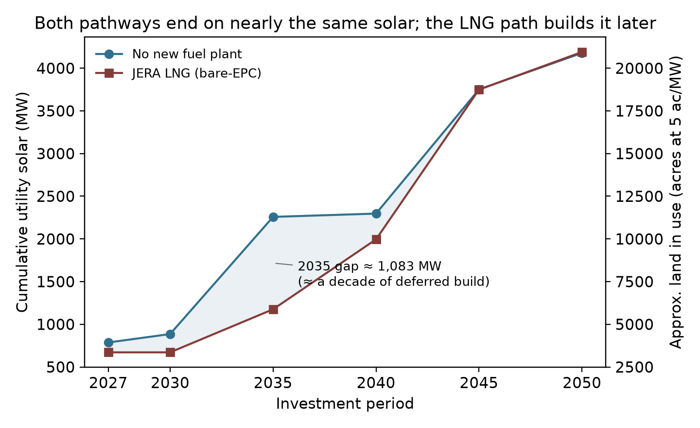

*Figure 2.1 — Cumulative utility-scale solar on the no-new-plant and JERA
LNG pathways.* Cumulative installed utility-scale solar (MW, left axis;
approximate land in use at five acres per megawatt, right axis) by
investment period, at reference oil prices. The pathways end near the same
total; the shaded area marks the build the LNG path defers, roughly a
decade's worth centered on 2035.

Figure 2.2 shows the generation mix over time for four pathways. On the
least-cost path (panel a), oil declines through the 2030s and is largely
gone by 2045, with utility-scale solar the dominant source; the path's
renewable share runs ahead of the RPS milestones through 2040, a point
Section 2.7 returns to in pricing the mandate. The JERA path (panel b) shows
what the plant actually does: LNG displaces most oil from 2030 to 2044, and
it also displaces solar — utility-scale capacity grows visibly later than in
panel a, converging only as the mandate closes. Blocking Enhanced Geothermal
(panel c) removes the geothermal band and backfills with oil and solar.
Accelerated rooftop growth (panel d) roughly doubles the distributed band by
2050 and shrinks the utility-scale build. One timing caveat: the model
builds its 100 MW of EGS in the first period and runs it at 0.93 capacity
factor from 2027, because nothing in the model constrains geothermal
development time; a realistic demonstration-and-permitting timeline shifts
that band's start into the 2030s without changing the 2050 mix (Appendix
A.7).

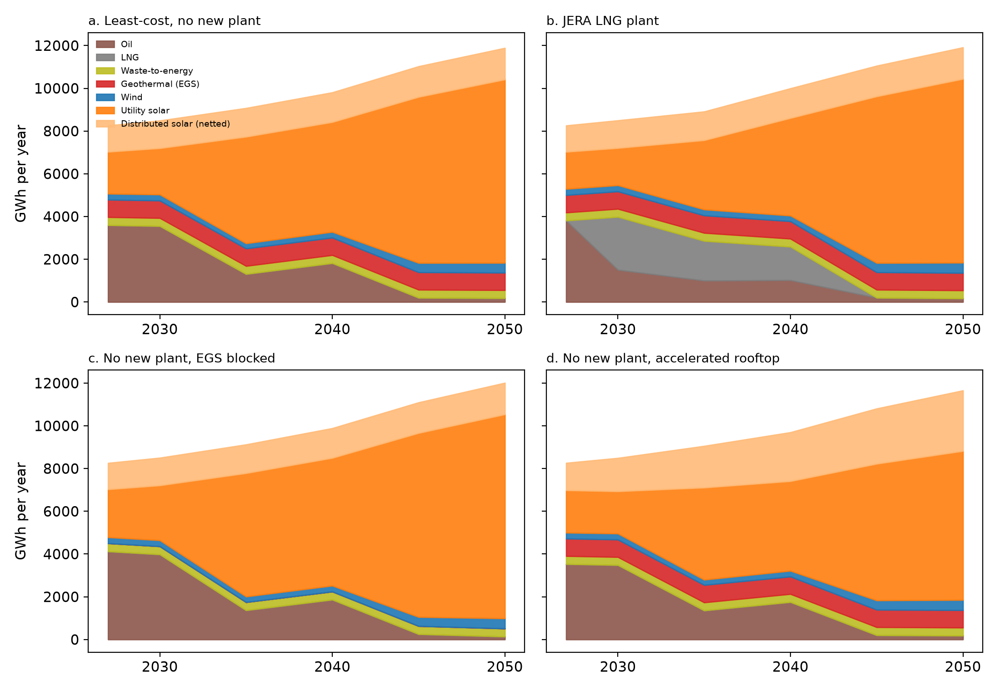

*Figure 2.2 — Generation mix over time on four solved pathways.* Annual
generation (GWh in a model-weighted typical year) by source, at reference
oil prices: (a) least-cost with no new fuel plant, (b) the JERA LNG plant,
(c) no new plant with geothermal unavailable, (d) no new plant with
accelerated rooftop adoption. Thermal output is split between oil and LNG in
proportion to each period's fuel use. "Distributed solar (netted)" is the
grid-visible rooftop contribution of the pathway's adoption trajectory:
about 1,000 MW by 2050 in panels a–c, about 2,120 MW in panel d. The model
can build geothermal earlier than permitting likely allows, so the timing of
the early EGS band is optimistic.

**The State's own study shows the same pattern within its scenarios.** In
HSEO's generation tables, adding LNG changes its solar hardly at all — the
LNG case carries 93–100 percent of the no-LNG case's solar in every year
(95 percent cumulatively). LNG substitutes for oil and, later, for imported
renewable fuels in HSEO's analysis; there is little substitution for solar 
there either. HSEO assumes much less grid-scale solar, in part because it inherits
the same restrictive land cap from the utility's planning: about 
22,000 acres, described as "approximately 90% of the technically feasible land" 
(study pp. 6–7), and in part because its scenarios
use only about a quarter of the land available under that cap. That cap is one choice from a menu. NREL's study for Hawaiian 
Electric (Grue et al. 2020, updated 2021, archived in this repository) reports 
twelve Oʻahu land screens spanning 561 to 13,965 MW, and the utility's pick, PV-Alt-1
(3,810 MW on about 24,800 acres), is a middle case. Our Section 2.5 screen
is architecturally the same case — Class A soils out, B/C cropland at 10
percent, graduated slopes to 30 percent, military lands out — and finds a
footprint within 10 percent of NREL's; most of the difference between our
5,451 MW and NREL's 3,810 MW potential is packing density — five acres per
megawatt against NREL's 6.5 — rather than a different land judgment. The official
plans and this report largely agree about the land. 

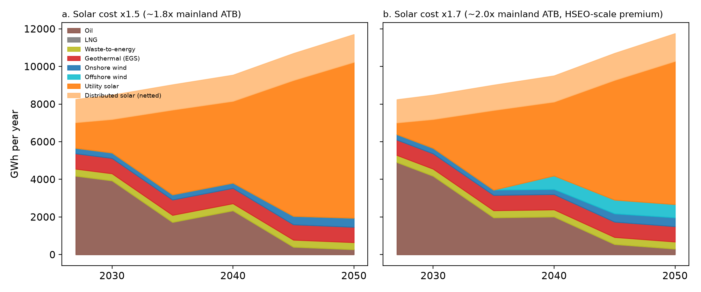

*Figure 2.4 — Least-cost generation pathways when utility solar carries
HSEO-scale cost premiums.* Annual generation (GWh in a typical year) by
source on the no-new-plant path at reference oil prices, with utility-solar
capital at 1.5 times our baseline (about 1.8 times the mainland ATB
benchmark, left) and 1.7 times (about 2.0 times mainland, close to HSEO's
2.154 Hawaiʻi multiplier, right). Offshore wind enters only in the right
panel — about 200 MW, the model's minimum block, from 2040. Utility-scale
solar remains the largest source in both panels.

**Where official plans project less utility solar than we do, the difference
is made up with more expensive options.** HSEO applies a larger Hawaiʻi
cost penalty to solar and none to offshore wind; at those prices its model uses only about a quarter of the
land its own screen allows. Its Oʻahu results tables (Reference low-cost case, study 
p. 218; the tables run to 2045) carry about 915 MW of
utility-scale solar, about a quarter of the 3,700 MW our least-cost path
builds by the same year and of what their own land screen says is
available. Its distributed-solar
assumption — 1,514 MW when offshore wind is available, 1,902 MW when it is
not — is consistent with the current trend; the pair brackets our trend
rooftop trajectory and approaches our accelerated one. The remaining gap is filled
by 400 MW of offshore wind and, from 2045, roughly 650 MW of combustion
turbines burning imported hydrogen. Our own model pivots similarly to offshore
wind when solar costs more than twice the ATB baseline while offshore wind
carries no Hawaiʻi premium (Section 4.5 examines the HSEO study's methodology
directly).
Hawaiian Electric's Integrated Grid Plan similarly presents a base scenario
"integrating nearly 3,000 MW of solar and storage by 2050" and a
land-constrained scenario that shifts part of that toward offshore wind,
rooftop solar, and firm renewables. The land-constrained scenario is the
utility's plan of record (IGP Supplemental Response, Docket 2018-0088,
Nov 14 2023 — quote p. 10; plan composition pp. 13, 21, 62; public filing). 

Two facts bear on those substitutions: offshore wind does not appear as a 
near-term resource in HSEO's current planning materials (HSEO Ocean Energy Fact Sheet, Oct 2025, 
energy.hawaii.gov/wp-content/uploads/2025/10/HSEO-Ocean-Energy-Fact-Sheet.pdf), 
and our model selects it only when solar is made very expensive, near HSEO's
assumed premium. The crux, therefore, is whether the Hawaiʻi premium is
solar-specific or reflects soft costs of procurement, which would afflict
offshore wind just as much. If the problem with solar is soft costs, and
reform can hold the premium near 20 percent over mainland costs (solar
remains the least-cost path well above that), the solar still gets built and
most of the land is still used, even if the clean-energy mandate is
abandoned; Section 4.8 prices that case directly.

### 2.7 Rooftop solar and storage

Distributed solar is Oʻahu's other large solar resource, and how fast it
grows changes how much utility-scale land the island needs. The island's
rooftops carry about 793 MW today, installed at about 42 MW per year over
2020–2024 despite the 2015 end of retail net metering and shrinking export
credits. Section A.11 describes how we estimate what this fleet does to
demand from the metered record: each installed MW removes about 0.61 MW of
midday grid load, batteries move about 0.45 MWh per installed MWh into the
19:00–22:00 window each day, and about a quarter of rooftop generation now
serves demand that never crosses the meter.

We run three installed-capacity trajectories (A.12, A.13). The conservative
one, about 1,000 MW by 2050, roughly continues the recent installation rate
in gross terms; the trend one reaches about 1,560 MW; the accelerated
one, about 2,120 MW, is an illustrative projection of what unleashing the
resource — unlimited sellback at avoided cost, the recommendation this
report develops in Section 2.8 — could look like, with new installs pairing two megawatt-hours
of storage per megawatt (a 6.5 kW system with one 13.5 kWh battery, already
a typical configuration). Each step of rooftop growth displaces
utility-scale build: 2050 utility solar falls from about 4,100 MW
(conservative) to 3,600 (trend) to about 3,000 (accelerated), or from
about 20,400 acres of land to roughly 15,000.

**The built environment is a reserve currently closed by policy.** If
utility-scale land binds, this is where much of the substitution could go,
alongside the flatter-land reserves of Section 2.5 (offshore wind is
another possibility). The model carries 4,062 MW of rooftop potential 
(canopies over parking would add more; we do not yet count them here, but will in the 
next zonal grid model). Even our accelerated scenario, at about 2,100 MW by 2050,
uses just over half of that potential — and the accelerated trajectory
itself is an illustration. We do not know how much capacity would be added
if sellback rules were relaxed; it could be less than we have penciled in,
or a great deal more. Its purpose is perspective: to show how far rooftop
growth can substitute for open land. Hawaiian Electric reports that 49
percent of Oʻahu single-family homes now carry rooftop systems, with
customer-sited capacity across its territory approaching 1.2 GW (Hawaiian
Electric, 2025–26 releases),³ growth achieved under restrictive tariffs.
That share should be read as an upper bound on household penetration: it is
a count of systems; many customers added a second system under successive
export tariffs rather than expanding a grandfathered one, and some systems
sit on multi-family or non-residential roofs. The share of single-family
households with any solar is therefore somewhat lower — and many roofs that
already have solar can expand their capacity.

Current tariffs let distributed systems offset their own bills but
compensate exports well below avoided cost and prohibit surplus credits for
providing energy to others, which suppresses the investment that would fill
these surfaces. Rooftop and canopy solar is also a partial escape from the
soft-cost problem itself: Honolulu rooftop pricing is near mainland levels
(Section 2.3), and larger commercial-scale installations would improve its
economies further. Among the levers in this report, liberalizing
distributed-solar tariffs is arguably the easiest. A reader worried that
Oʻahu's open land cannot host the buildout should be, by the same logic,
the strongest advocate for unlocking the rooftops.

³ *Footnote: distributed-capacity totals differ across sources in ways
consistent with rating conventions. Hawaiian Electric's quarterly data
(June 30, 2026) reports 79,347 Oʻahu PV systems without stating a rating
basis; EIA's monthly utility data (May 2026), which is AC, shows about
645 MW of Oʻahu customer-sited PV across net-metered and later tariffs,
while the permit-record series behind this report reaches 793 MW by
mid-2025. System counts agree across the sources to within half a
percent, and the capacity gaps match a typical DC-to-AC inverter loading
ratio (about 1.14 on residential systems at matched dates), so the likely
explanation is that the utility and permit series are DC nameplate while
EIA reports AC — but neither Hawaiian Electric nor the permit records
state the basis. The 1.2 GW figure here is on that probable DC basis;
EIA's AC-basis statewide small-scale estimate is about 1.0 GW. Appendix
A.11 explains why the report's estimates and projections are unaffected
by this ambiguity.*

One caveat points to future work. The present model represents Oʻahu as a
single zone, so it credits distributed resources with none of their locational
value: generation and storage at the point of consumption can defer
transmission and distribution upgrades that a remote utility-scale buildout
requires. That saving — potentially a meaningful offset to distributed solar's
higher installed cost — is invisible here. The zonal grid model under
development for the next edition is designed to assess exactly this tradeoff.

**What better scheduling of rooftop batteries is worth.** We measure this
with a paired experiment. Both runs carry the identical rooftop fleet —
same panels, same batteries, same capital, same load — and differ in
exactly one thing: whether the batteries follow today's observed pattern
(charging from midday output, discharging through the evening) or are
dispatched by the optimizer alongside the rest of the system. The cost
difference is therefore the value of coordination itself, free of the
accounting choices that otherwise separate the demand-side and supply-side
representations of rooftop solar. On the conservative path the difference
is $0.03 billion over 2027–2050 (about 0.01 cents per kilowatt-hour); on
the trend path $0.01 billion; on the accelerated path — 2.1 GW of
distributed solar with roughly 2,800 MWh of customer batteries by 2050 —
$0.23 billion, or 0.10 cents per kilowatt-hour. All six cells are solved at
the 0.1 percent tolerance, so the paired differences are not tolerance
artifacts. The investment plan is similarly robust: solved
either way, 2050 utility solar moves by 25 to 200 MW across the three
trajectories.

Two readings follow. At current adoption, predictable evening-shifted
behavior is nearly as good as perfect dispatch; the grid can plan around
it, and nothing in the near-term case for rooftop solar depends on smarter
coordination. But the value of coordination rises steeply with adoption:
with 2.1 GW of distributed solar — the scale the Section 2.8 tariff reform
could create — it is worth roughly eight times its value at today's
adoption, and approaches the entire cost of the 2045 mandate (below). One caveat bounds these figures: they price battery
scheduling only. Letting household consumption itself respond to prices —
demand response proper — is not modeled anywhere in this report, and prior
work finds such response is worth several times more on a grid like this
one, so the full value of real-time pricing likely exceeds the battery
figure.⁴

⁴ *Footnote: responding to prices costs households effort, and that cost
does not appear in our present-value accounting. But rooftop customers
already spend that effort. They manage their demand to get the most from
their panels and batteries under today's tariffs: buying from the grid costs much
more than selling to it; some customers (NEM-plus, self-supply) are
curtailed if they backfeed, and so face use-it-or-lose-it timing; many
charge their vehicles strategically. That management is costly, and it is
in large part what produces the load shapes we model. Real-time pricing
would redirect the same effort toward system value — arguably a lighter
burden than the tariff rules it would replace.*

**The cost of the mandate.** With the 100 percent RPS constraint removed
and the model choosing freely, the no-new-plant least-cost
path still reaches about 3,740 MW of utility solar by 2050 — 92 percent of
the mandated build — and oil's share of grid supply falls under 5 percent
by 2050 on economics alone. What the mandate buys is pace at the end: without
it the model keeps about 22 percent oil in 2040 and 10 percent in 2045,
retiring it over the following decade as solar and storage costs decline.
The system-cost difference is about $0.25 billion in present value, roughly
0.2 cents per kilowatt-hour (both cells at the 0.1 percent solve
tolerance). Achieved efficiently, the mandate is cheap insurance on pace;
the paths converge to nearly the same place either way. Figure 4.4 sets
the no-mandate path beside HECO's and HSEO's published plans.

### 2.8 Implications for procurement reform

Five reforms are within the Commission's and Legislature's authority and bear
directly on the solar-cost lever.

1. **Pricing reform.** Retail wheeling under 2025 Act 266 replaces the
   embedded risk premia of the RFP-and-PPA process with transparent market
   access to avoided-cost pricing. It reduces per-watt delivered cost
   directly, and it is the largest single lever in this report. What's
   critical with wheeling is to get pricing right. The price is favorable
   for a reason peculiar to Hawaiʻi: because the marginal generator is oil,
   the utility's own short-run avoided cost — set by the fuel burned in
   existing plants — already runs well above the cost of new solar, so
   paying avoided cost is enough to attract large projects without any
   subsidy. On the mainland, where the marginal fuel is cheap gas, an
   avoided-cost offer sits below solar's cost and draws nothing; here it
   sits far above it. Wheeling under Act 266 is one route to that price.
   A second needs no legislation at all: the Commission could require the
   utility to purchase independent renewable output at avoided cost
   directly — a standing offer that, on an isolated grid with no
   competitive wholesale market, federal law (PURPA) arguably already
   compels, and that today reaches only installations of 100 kW or less.
2. **Procurement reform.** Several standard PPA terms add cost or delay and
   could be changed. Contracts fix the Unit Price in nominal terms for the
   contract term; through Stage 2 (2019) price escalation was expressly
   prohibited. The Stage 3 RFP (2022) added a one-time inflation adjustment —
   capped at 10 percent, indexed to the GDP deflator, and refined in the later
   IGP RFP to a 15 percent combined cap with a tariff-cost adjustment — made
   after the 2021–23 cost spikes stranded earlier fixed-price awards. But the
   adjustment window closes at PUC approval, so delay through the interconnection
   queue afterward still erodes the real price the utility pays, weakening its
   incentive to move projects quickly. Because the utility controls the
   interconnection queue yet bears no cost from delay, aligning its incentive
   with speed would help — for instance, a performance-based penalty for
   interconnection times beyond a defined standard, tied to the metrics
   Hawaiʻi's PBR framework already tracks, so the party that sets the pace also
   bears a cost when the pace is slow. Transparent selection of
   winning bids by an independent third party retained by the Commission,
   rather than by the counterparty that also owns the grid, might reduce
   the risk premia developers attach to the process; the change sits within
   the Commission's own competitive-bidding framework and requires no
   legislation. Alternatively, the legislature could
   force Hawaiian Electric to divest its generation assets and refocus its
   business on grid balancing and delivery services, reducing conflicts of
   interest with independent generators (Senate Bill 3326). Zero-degradation
   clauses, which require developers to guarantee no output decline, could be relaxed
   to a realistic allowance of 0.3–0.5 percent per year. Where feasible, a simplified
   take-or-pay for capacity would lower financing cost. And a streamlined track
   for small installations of 5 MW or less would open Class B and C agricultural
   land that current terms foreclose: at the five-acre-per-megawatt density of
   Section 2.5, the as-of-right cap on that land — the lesser of 10 percent of
   a parcel or 20 acres — tops out near 4 MW, so PPA terms requiring more than
   5 MW are a de facto prohibition on exactly the projects the cap permits.
   Denser fixed-tilt layouts or continued panel-efficiency gains could lift a
   20-acre site past the threshold; a lower minimum would help, but a
   streamlined, fast-connect exception for small installations removes the
   conflict directly. Small installations could be offered avoided-cost pricing
   with one-to-two-hour storage rather than the usual four-hour standard.
3. **Interconnection reform.** Queue reform, ideally built around
   connect-and-manage (Section 2.4): a project interconnects on a preliminary
   feasibility determination and is dispatched against actual grid conditions,
   rather than waiting years for the network-upgrade studies that dominate
   interconnection cost and time elsewhere. It lowers soft costs, shortens the
   timeline over which any cost reduction is captured, and reduces risk for
   developers. Making it work in a single-utility setting where no market
   arbitrates curtailment requires dispatch rules that are clear, fair, and
   independently audited, so that a project accepting managed curtailment
   knows in advance how and when it will be curtailed. 
4. **Land-use reform, built to complement agriculture.**
   One precedented, community-forward option: develop a **menu of
   pre-characterized agrivoltaic systems** for Class B and C land — specific,
   named configurations pairing solar with compatible crops, grazing, or
   managed groundcover — that, if adhered to, could proceed without a
   discretionary Special Use Permit, paralleling the as-of-right dual-use
   pathway wind already enjoys under HRS §205-4.5. The qualifying standards
   could be *stricter* than today's special-use permit conditions where
   it matters — verified agricultural production, coverage and height limits,
   decommissioning security, viewshed and cultural-site protections — so the
   pathway streamlines procurement without weakening protections. The Hawaiʻi
   Department of Agriculture is the natural body to develop and certify the
   qualifying systems, in partnership with farmers, ranchers, and the
   communities where projects would sit. Standards designed with those
   communities from the outset, rather than presented to them, are the
   difference between social license and a litany of siting fights. 

   The same reform carries a public-safety co-benefit. **Unused, unmanaged former
   agricultural land is a serious fire hazard.** Fallow agricultural land now
   comprises roughly 40 percent of all agricultural land in Hawaiʻi, about a quarter
   of the state's land area, much of it carrying tall, unmanaged nonnative grasses
   and trees on former sugar and pineapple plantations. Total area burned
   statewide has increased more than fourfold since the early twentieth century,
   rising "in direct correlation with the decline of plantation agriculture"
   (Trauernicht et al. 2015; Bond-Smith, Bremer, Burnett, Trauernicht, and
   Wada, UHERO, 2023). Plantations also once supplied the on-the-ground
   presence for fire detection and response that these lands have since
   lost. Returning them to managed, productive use, including agrivoltaics with
   maintained groundcover and grazing, reduces fuel loads and the fragmentation
   of firebreaks while producing energy and food.
5. **Distributed-solar tariff reform.** Allow unlimited sellback at real-time
   avoided-cost pricing. Current tariffs permit only own-bill offsets and
   below-avoided-cost export compensation, which idles the rooftop and canopy
   potential documented in Section 2.7. Reform does three things at once: it
   grows clean generation on roofs and canopies that need no new land, it
   gives rooftop owners a reason to dispatch their batteries when the grid
   most needs the power, and it lets household demand respond to prices. It
   remains the easiest reform on this list — it requires building nothing
   and rezoning nothing — and it would unambiguously reduce system costs and
   pollution. The gains compound with scale: at today's adoption, battery
   timing is worth little, but with 2.1 GW of distributed solar — the
   trajectory this tariff could put Oʻahu on — it is worth about $0.23
   billion (Section 2.7), and the demand-response benefit, which our
   modeling does not count, comes on top.

---

## 3. Enhanced Geothermal is in the least-cost build

Enhanced geothermal (EGS) cost cases are 6.2 / 10 / 14.7 $M/MW at 2030, before the 
federal credit. These assumptions represent the optimistic DOE GeoVision trajectory, 
a compromise reference, and the ATB 2024 Conservative profile.² Under current law, the 
geothermal tax credit applies, lowering the effective cost of a 2027–2035 build by 30
percent, and at that credited reference cost the model builds the full identified 
resource in the base case.

| EGS cost case (credited) | System cost, no LNG ($B) | EGS built | Saving vs no-EGS |
|---|---:|---|---:|
| Option off / none | 26.40 | 0 MW | — |
| High ($14.7M/MW gross) | ~26.40 | 0 MW | ~$0 |
| Reference ($10M/MW gross) | 25.83 | 100 MW | $0.56B |
| Low ($6.2M/MW gross) | ~25.4 | 100 MW | ~$1.0B |

At reference cost — the base-case assumption — Enhanced Geothermal is part of
the cheapest build: the no-new-plant baseline of $25.83 billion already contains 
100 MW of it, and blocking it would raise that baseline by $0.56 billion. At the 
optimistic cost, the saving roughly doubles. At the pessimistic cost, the model builds 
nothing and loses nothing, so the downside is bounded. Because Enhanced Geothermal 
builds all-or-nothing at its resource cap and its dispatch does not change with its 
capital cost, the sensitivity is a capital reprice off the reference and blocked
cases; see docs/SOLVER_NOTES.md in the repository. 

Enhanced Geothermal also saves land. Against its no-EGS counterpart, the
solved base case's 100 MW block displaces 394 MW of utility solar — about
2,000 acres at five acres per MW — along with 145 MW (1,250 MWh) of
storage. And if the developable resource on Oʻahu proves larger than the
roughly 100 MW modeled here, both cost and land requirements fall further.

² *Footnote: the reference case is a documented judgment call sitting
between a DOE-referenced ~$9M/MW and ATB 2024 Moderate ~$12M/MW; sources and
reasoning are in the repository conventions file. The cost-case labels
(6.2/10/14.7 $M/MW) are gross of the federal tax credit; the model itself
applies the 30 percent credit to 2027–2035 builds under current law, so the
reference case solves at an effective $7.0M/MW for those vintages.*

### 3.0 Background

Hawaiʻi Island operates a 38 MW conventional geothermal plant, Puna Geothermal 
Venture, in the Puna district on Kīlauea's Lower East Rift Zone, in service since 
1993, drawing on a naturally permeable reservoir fed by the active volcanic 
system. Oʻahu has no such reservoir, because its volcanic system
is older and quiescent, but it has hot dry rock at depth. Enhanced Geothermal
Systems (EGS) extract that heat: drill two wells to commercially hot rock
(typically 2–5 km), fracture the rock between them, circulate water, and run
the heat through a generator. The technique is proven at pilot scale. DOE's
FORGE site demonstrated commercial-scale stimulation and circulation in 2024,
and Fervo Energy's Cape Station in Utah is expected to deliver the first
commercial-scale EGS power to a U.S. grid in late 2026. At multi-plant scale it
remains pre-commercial. NREL's reV framework applied at 2.5 km
depth with standard accessibility filters identifies on the order of 100 MW of
potentially developable EGS resource on Oʻahu across roughly a dozen
indicative sites; this report models it as a single 100 MW block.

### 3.1 Cultural context and community engagement

Hawaiʻi has a long and controversial relationship with geothermal power.
The Puna plant on the Big Island has been a source of concern for the
surrounding community and Native Hawaiian cultural practitioners across
three decades — the spiritual relationship to Pele, hydrogen-sulfide
emissions, siting, and the 2018 Kīlauea eruption, when lava reached the
plant site and forced a shutdown of more than two years. EGS differs
technically in ways that matter for that conversation: it does not tap the
volcanically fed reservoirs that carry hydrogen sulfide, mercury, and radon; it 
operates as a closed loop; and the candidate Oʻahu sites sit on the old, quiescent
system far from any active rift. Those differences address the specific health
concerns; the questions of consent and relationship to ʻāina remain. Any Oʻahu 
EGS pathway should be developed in partnership with Native
Hawaiian community members, cultural practitioners, and lineal descendants of
the affected ahupuaʻa from the earliest planning stages — covering siting,
water, monitoring protocols, and benefit-sharing. The cost asymmetry justifies
the demonstration economically; community partnership is a prerequisite.

### 3.2 The conditional structure: when it pencils, when it does not

The cost cases and results are in the table above (Section 3 opening). The
value also depends on solar's trajectory: EGS is worth the most in exactly the
scenarios where solar deployment underperforms. If procurement reform stalls
and the effective premium runs at 50–80 percent, EGS savings grow and even
higher-cost EGS enters the build. EGS functions as insurance against a failure
of solar-procurement reform. It is inexpensive when reform succeeds and
valuable when it stalls.

### 3.3 What EGS does for the system

When built, the ~100 MW of flat zero-carbon baseload displaces 394 MW of
utility solar and 145 MW (1,250 MWh) of storage in the solved base case and, in
LNG-forced scenarios, displaces the most expensive LNG dispatch hours.
Reliability is preserved at every modeled hour in either case; what changes is
the build mix and its cost.

### 3.4 The downside if the technology disappoints

A demonstration plant generates baseload power for decades regardless of which 
cost trajectory materializes. For a 10 MW first-of-a-kind demonstration at 50 percent 
federal cost share
(FORGE-successor programs plus the geothermal provisions that remain in force):
gross capital ≈ $100M at the reference trajectory and $147M at the high;
Hawaiʻi's net exposure ≈ $50M / $74M; and the present value of 30 years of
delivered energy at a conservative $70/MWh covers most or all of that
exposure: at an 85 percent capacity factor a 10 MW plant delivers about 75
GWh per year, worth $5.2M annually, with a 30-year present value of $102M at
the 3 percent social discount rate or $72M at 6 percent (Appendix A.7). The
downside is bounded and modest. The upside is the $0.56–1.0 billion above.
Project-development risks include drilling-induced seismicity — managed
under standard traffic-light protocols that scale back or halt injection as
monitored seismicity crosses preset magnitude thresholds (Majer et al. 2012,
*Protocol for Addressing Induced Seismicity Associated with Enhanced
Geothermal Systems*, U.S. DOE Geothermal Technologies Office; Fervo applies
such a protocol at Cape Station) — along with
water handling, permitting, and community acceptance.

### 3.5 What a demonstration requires

Four prerequisites: a federal demonstration pathway (FORGE
successor plus tax provisions still in force); deeper site characterization than
the public record provides (itself federally fundable); a PPA framework that
can accommodate EGS lead times and drilling risk; and drilling workforce
partnerships. A 2034–36 first-of-a-kind window is plausible if initiated in
2027–28, the same window in which the JERA and late-2030s resource decisions
will be made. Federal support exists today and may not persist, which argues
for moving early.

## 4. The thermal question and the JERA proposal

Oʻahu's steam fleet is old and inefficient: full-load heat rates run
10,000–11,000 Btu per kilowatt-hour, and average operating heat rates run
higher still, since units cycle and spend hours part-loaded. A modern
combined-cycle plant runs near 6,900. Stated either way — roughly a third
to 40 percent less fuel per kilowatt-hour, or half again to two-thirds more
electricity per unit of fuel — the efficiency gain is what makes any
new-plant proposal attractive at first glance. This section tests whether that gain justifies new construction, on
which fuel, at what size, and whether the cheapest use of LNG involves a new
plant at all.

### 4.1 The trajectory comparison

Table ES.1 carries the headline matrix. Three results:

**The Waiau Repower is uneconomic in every case.** It adds +$1.38 to +$1.49
billion on its own, and every bundle containing it inherits the penalty. This
result is robust to every sensitivity in the report.

**A right-sized plant costs less than the proposal.** At the midpoint of
JERA's cost range, a 375 MW version comes in $0.38 billion above no-new-plant
against $0.75 billion for the 500 MW version — smaller, but still a cost
increase. One caution attaches. We price the smaller plant at the same
dollars-per-kilowatt as the 500 MW proposal, while JERA attributes its
attractive unit cost partly to scale (proposal p. 17), so the 375 MW figure
may understate what a smaller plant would actually cost.

**The JERA-500 versus no-new-plant comparison favors no new plant, and the
margin moves with solar costs.** At the midpoint of JERA's capital range the
bundle is $0.75 billion more expensive at reference oil (band +0.54 to +0.96),
$0.65 billion on the futures path, $1.63 billion at the market's low oil path,
and $1.21 billion at its high path — a U-shape explained in Section 4.7. Where the fuel-price
mapping has to extrapolate, at the low end of the market band, it flatters
new gas capacity rather than penalizing it (Appendix A.14); the bundle
costs more in every case regardless. The margin is sensitive to the solar premium in the direction one
would expect: firm gas capacity substitutes for solar-plus-storage, so the
more Hawaiʻi pays for solar and storage, the better LNG looks. At our baseline
premium (20 percent over mainland ATB) the result is the modest LNG penalty
above; if deployment costs stay near today's procurement-implied levels
(effective premiums of roughly 80–104 percent, the 1.5× and 1.7×
sensitivities), the margin closes to roughly a tie, with lower or higher oil
prices or the ATB Advanced solar cost path breaking the tie slightly in favor
of solar. If the storage tax credits are denied and oil prices remain moderate,
the comparison slightly favors the JERA proposal.

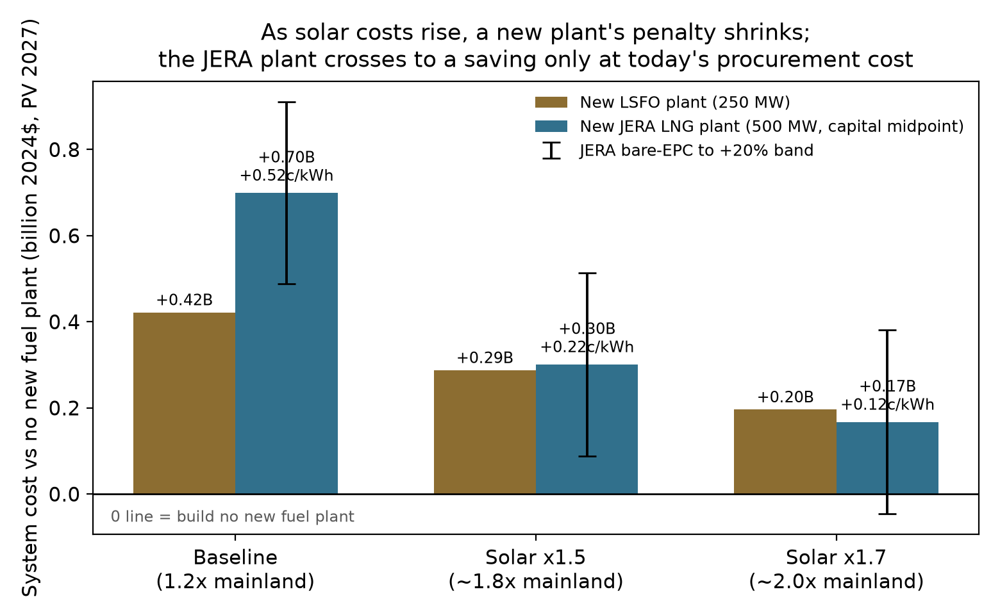

*Figure 4.2 — New-plant options against no new plant as solar costs rise.*
Present-value system cost (billion 2024$, discounted to 2027) of a new
250 MW LSFO plant and the 500 MW JERA LNG plant, each minus the
no-new-plant path, at reference oil prices, with utility solar and battery
capital at our baseline (1.2 times mainland ATB), 1.5 times (about 1.8 times
mainland), and 1.7 times (about 2.0 times mainland). JERA whiskers span
bare-EPC to +20 percent capital. The cents-per-kWh labels divide the dollar
difference by 135.6 TWh of discounted delivered energy. Bars above zero cost
more than building no new plant.

Figure 4.2 puts numbers on this for the reader who expects solar to stay
expensive. If solar deployment stays at today's procurement cost (the 1.5×
case, about 1.8× the mainland benchmark), the JERA plant's midpoint penalty
narrows to +$0.35 billion; at the 1.7× case (about 2.0× mainland) it
narrows to +$0.21 billion, reaching break-even only at the bare-EPC capital
cost. A new LSFO plant stays more expensive
than no new plant at every solar cost, from +$0.43 billion at the baseline
to +$0.21 billion at 1.7×. Two things bound how much weight this deserves.
The near-break-even appears only under solar costs we argue are a policy
choice, not a
fixed condition (Section 2); and a new plant is in any case the costliest way
to use LNG, since converting existing plants captures the same fuel saving
more cheaply (Section 4.7), so even the 1.7× figure understates how favorable
LNG becomes through conversion if high solar costs persist.

**The whole picture, over both uncertainties at once.** Figure 4.3 sets the
three thermal commitments against building no new plant over the two
dimensions that actually move the answer: what oil does, and what Oʻahu pays
for utility solar. Reading it takes one rule — red costs more than building
no new plant (or converting existing to LNG), blue saves.

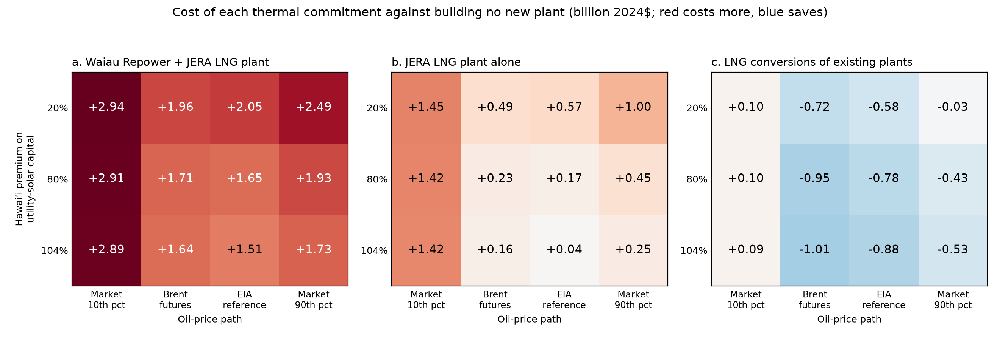

*Figure 4.3 — Cost of each thermal commitment against building no new plant,
across oil prices and solar costs.* Each cell is the present value of total
2027–2050 system cost (billion 2024$, discounted to 2027) for the named
commitment, minus the no-new-plant path solved on the same oil path and the
same solar cost. Columns are the four Brent paths of Appendix A.14; rows are
the Hawaiʻi premium on utility-solar capital, from the 20 percent premium
used throughout the report to the 104 percent premium implied by the State
Energy Office's cost multiplier. All cells use the trend rooftop trajectory
and leave enhanced geothermal available. Conversion cells carry the $0.45
billion conversion-capital charge of Section 4.7. Red cells cost more than
building no new plant (or converting existing to LNG), blue cells save; blank
cells are not yet solved. Differences smaller than about $0.13 billion are
within the solver tolerance of the cells they are drawn from.

**Conversions across the oil paths.** The conversions panel is the only one
of the three with any blue cells, and the multi-oil solves give its saving a
definite shape: largest on the two central oil paths, fading toward both
extremes. Net of the $0.45 billion conversion-capital charge, converting
existing plants saves $0.54 to $0.68 billion on the central paths at the
baseline solar premium, and $0.74 to $0.99 billion at the higher premiums.
At the market's high path the saving nearly vanishes at the baseline premium
(−$0.01 billion) but persists at $0.40 to $0.49 billion under the higher
premiums, and at the market's low path the conversions become a small net
cost of about $0.11 billion at every solar premium (both cells behind that
figure are 0.1 percent solves, so it carries roughly ±$0.04 billion of
solver tolerance).

The shape follows from the cost accounting. Committing to conversions means
paying two charges that do not depend on where oil goes: about $0.52 billion
of LNG import-infrastructure fixed costs over the 2030–2044 terminal window,
plus the conversion capital. The price gap between oil and gas is also
nearly flat across the oil paths — both fuels track Brent at almost the same
per-unit rate (Section 4.7) — so what varies is how the rest of the system
responds. At the low path nothing else changes: cheap oil had already
suppressed the clean buildout, so the only benefit is the fuel bill, which
falls about $0.83 billion — not quite enough to cover both charges. On the
central paths cheap gas does double duty: it cuts the fuel bill by a similar
amount and lets the model defer $0.8 to $0.9 billion of solar and storage
capital that sits right on the margin of being built. At the high path the
roles reverse. Expensive oil pushes the no-conversion system to build its
way out of fuel — by 2040 it carries about 450 MW more solar and more
storage than the converted system — so its costs are contained by
substitution toward solar rather than by fuel switching. Conversions skip
that extra clean capital but keep burning fuel at high prices, and the
larger fuel bill gives back most of what the avoided capital saved, leaving
the net saving near zero at the baseline solar premium. The higher premiums
make that substitution dearer, which is why conversions hold more of their
value in the bottom rows. The conversion case is therefore strongest exactly
where the market puts the middle of the oil distribution.

### 4.2 The JERA capital cost

The proposal (17 March 2026, p. 30) prices the plant at $1,510M for 500 MW
($3,020/kW, ~2026$) and the import infrastructure at $460M ($200M FSRU,
$10M onshore pipeline, $250M fixed infrastructure; proposal p. 30). The plant figure's footnote reads: "Including
EPC, Procurement, Construction, Installation, Capital Spares and Freight;
Excluding Customs and duties, Insurance, design allowance and contingency";
page 35 adds imported equipment to the exclusions. The publicly reported ~$2
billion total (about 75 percent plant) matches these figures [ENR 2026]. The
proposal's own downside case (p. 29) tests capital 20 percent higher. We solve
every JERA scenario at both costs and present the midpoint with the band. We
consider this fair and still conservative: across 401 electricity projects
studied, three in four exceeded their cost estimates, with thermal plants
averaging about 13 percent overruns (Sovacool, Gilbert & Nugent 2014). The
band's +20 percent top therefore sits above the thermal-plant average, on an
estimate that itself excludes contingency.

The quoted price deserves comment in the current market. Gas-turbine supply
chains are strained: Lazard's June 2025 review reports the cost of a new
combined cycle at a ten-year high, with recently observed market quotes of
$2,400–2,600/kW for mainland projects entering service after 2028 and
turbine shortages driving long lead times (Lazard LCOE+ June 2025, pp. 4, 8,
vendored in `sources/`). Hawaiʻi construction carries its own premium on
top. Against that backdrop, $3,020/kW for a Hawaiʻi CCGT is an attractive
price, if JERA can deliver it. For reference, HECO's 2016 planning assumptions priced a
small (152 MW) unit at $4,050/kW (nominal; ≈$3,900/kW in 2024$), roughly a
third above the proposal's figure before any post-2020 escalation; JERA attributes the
difference to scale and its own procurement. The delivered-cost question (what
is actually built, at what price, under what contract) is among the most
decision-relevant unknowns in the proposal, and it is why our headline treats
JERA's own +20 percent case as the top of the band rather than an extreme. The
commercial structure is similarly open. The proposal describes an
independent-power-producer arrangement seeking "offtake certainty" (pp. 25,
31) with a 40-year revenue-requirement framing (p. 29), but does not specify
the offtake contract's terms, including who bears completion and performance
risk or how fuel-price risk passes through. The fuel price we carry
($11.4/MMBtu delivered, about $10.1 before the regasification charge) is itself
well below current Pacific spot and Qatar-linked term markets, and Section 4.6
discusses why a contract floor at that level should not be read as a ceiling.

An asymmetry in the fuel modeling formerly favored the JERA plant, and
has been removed. Every existing unit on the system, and our own LSFO-plant
comparator, carries a part-load fuel curve: average heat rates rise when a
unit runs below full output (Kalaeloa averages about 9.5 MMBtu/MWh at its
minimum load against a 5.7 incremental rate; the modeled LSFO plant about
8.5 against 6.6). The JERA plant's fuel use was instead modeled as strictly
proportional to output — 6.92 MMBtu/MWh at every load — so it paid no
part-load penalty even though it runs well below full output for much of
its life. The plant now carries a curve derived from the operating record
of 408 comparable combined-cycle units on the mainland, and a minimum load
raised from 30 to 62.5 MW per block (Appendix A.8; `sources/epa_cems/`).⁵

⁵ *Footnote: this refinement was prompted by JERA, whose July 2026 memo
on the withdrawn paper pressed the distinction between a plant's
full-load heat rate and the average rate it achieves in operation. The point
was well taken and applies to the modeling as well as the presentation,
and we thank them for it. The revised curve barely moves cost: the
JERA premium over no-new-plant changes by less than $0.01 billion in
every configuration tested (for example +$0.535 to +$0.538 billion at
500 MW bare-EPC, +$0.958 to +$0.959 billion at the +20 percent capital
case). What it moves is dispatch. Facing a real part-load penalty and a
higher minimum load, the optimizer runs the plant less and buys the
displaced energy from solar and storage instead, so LNG imports over the
horizon fall about 16 percent (293 to 246 million MMBtu) and the plant's
combustion-CO₂ advantage over the no-new-plant path widens from about
0.5 to 1.3 Mt. Because the methane threshold scales with imports and
with that advantage, the leak rate at which LNG's greenhouse edge
disappears roughly triples (Appendix A.10).*

### 4.3 Plant or fuel? Where the LNG advantage comes from

The proposal combines two things that need not go together: a modern, efficient
plant and a cheaper fuel. Their effects can be separated. If the advantage lies
in the fuel, it can be captured by burning LNG in the plants Oʻahu already has.
If it lies in the plant, the same plant can be built to burn the low-sulfur fuel
oil Oʻahu already imports. Our scenarios span both choices at once — LSFO
against LNG, and the existing fleet against a new combined-cycle plant — so
each can be read directly. The table shows total-system-cost differences
against building no new fuel plant, in billions of 2024$ at reference oil:

| | Burns LSFO (today's fuel) | Burns LNG (terminal built) |
|---|---:|---:|
| **Existing plants only** | baseline (0) | −0.39 (Kalaeloa converted) to −1.05 (also Kahe 5 & 6, CIP CT); −0.60 net of the full 2016 conversion-program charge |
| **New 500 MW combined cycle** | +1.24 | +0.54 bare-EPC; +0.75 at the capital midpoint |

*Conversion capital is set to zero in the solved conversion cells; the −0.60
net figure charges the entire 2016 conversion-program estimate ($450M in
2024$) against the converted units as a capital adjustment, the same
treatment as the EGS cost sensitivity. Details and caveats in Section 4.7.*

**Reading down the left column isolates the plant.** Capital is effectively
a wash between the LSFO and LNG versions of the plant (our LSFO combined cycle
carries $2,900/kW against JERA's $2,863/kW in 2024$), so the LSFO plant is
JERA's plant on today's fuel. It raises system cost, and raises it more the larger it is:
+$0.43 billion at 250 MW, +$0.80 billion at 375, +$1.24 billion at 500. The
new plant is more efficient, with a full-load heat rate near
6.9 MMBtu/MWh against roughly 8.6 for Kalaeloa's combined-cycle units and
9.7 for Kahe's newest steam units. The saving is one minus the ratio of
heat rates: about 20 percent against Kalaeloa, 29 percent against Kahe's
newest units, and 35–40 percent against the oldest steam units, whose
rates in average operation run near 11. Whether a saving of that size
repays $2,900/kW of capital depends on how much the plant runs, so the
answer has to come from the solved scenarios rather than the heat rates
alone. The answer is no: in every case we ran — four oil paths, three rooftop
trajectories, solar premiums up to 104 percent, both land screens — the
system is cheaper without the new LSFO plant than with it, by margins from
+$0.43 billion at the baseline premium down to +$0.21 billion at the 104
percent case (250 MW, reference oil). The efficient plant does beat some
alternatives: it undercuts the JERA bundle outright when oil is cheap, and
every Waiau-bundled option throughout. But in no solved scenario is
building it optimal against the options that build no plant at all, because
the system's cheapest response to expensive fuel on this grid is to
displace it with solar and storage, and only secondarily to burn it more
efficiently.

**Reading across the top row isolates the fuel.** Contract-priced LNG lands
at about $11.4/MMBtu delivered, regasification included, against LSFO's
$16.7 at reference Brent (Table 1.1): roughly a third cheaper per unit of
heat, an edge as large as the new plant's heat-rate advantage and available
(up to conversion feasibility and cost) without building anything but the
terminal. Burned in the existing fleet
alone it saves $0.39 billion through Kalaeloa and $1.05 billion when Kahe 5
and 6 and the CIP combustion turbine convert as well. The model even routes
gas through the CIP turbine at 11.7 MMBtu/MWh: at these prices, cheap fuel is
worth burning even in the least efficient unit on the island, while expensive
fuel is not worth burning even in the most efficient plant proposed for it.

**The fuel carries the advantage.** On its own the plant raises system cost;
the fuel is what lowers it. Given the fuel, adding JERA's plant to a
Kalaeloa conversion still costs more than converting alone. Converting the
rest of the existing fleet instead roughly triples the saving (−1.05
total) for almost no new capital, because converted capacity supplies the same
service at a higher heat rate with near-zero capital cost. This also explains the divergence
from HSEO's decomposition, in which the new plant's efficiency is about half
the benefit (Section 4.5): HSEO's counterfactual keeps burning oil in old
steam units through 2044, so efficiency has a large margin to harvest; in a
model free to substitute solar and storage, that margin is competed away and
only the fuel-price channel survives.

The reverse question, whether to prefer an LSFO plant available at the LNG
plant's price, has the same answer with the sign reversed. On fuel cost alone
the LSFO plant loses by $0.47 billion at matched 500 MW size and the capital
midpoint ($0.68 billion at bare-EPC). What the LSFO version buys instead is
structure: no import terminal, no decades-long take-or-pay commitment, fuel from the
existing in-state supply chain with its established biofuel transition path, and
no single-supplier exposure. Whether that structure is worth the fuel premium
at reference oil (less at low oil, more at high) is a judgment the Commission
can now make with the tradeoff stated in dollars.

### 4.4 LNG was tried a decade ago and abandoned. What changed?

Hawaiʻi has been here before. In 2016 Hawaiian Electric held a signed
20-year agreement with FortisBC to import 800,000 tonnes of LNG per year
from the Tilbury facility in British Columbia beginning in 2021. The program
was expressly contingent on the NextEra Energy merger, and it was itself a
take-or-pay: HECO was "obligated to take and pay for, or pay for, if not
taken," 43.5 million MMBtu annually. Alongside it sat PUC applications for
about $341 million of unit conversions ($450 million in 2024$) and an $859
million combined-cycle plant at Kahe ($1.1 billion in 2024$). When the
Commission rejected the merger in July 2016, the utility terminated the
fuel agreement and withdrew the conversion and plant applications within
days (HEI Forms 8-K, May 18 and July 19, 2016), and its December 2016 plan
update dropped LNG entirely; no one has revived the case since. That venture had 29 years of runway
to the 2045 mandate. A venture starting today has 19, and faces the full 100
percent requirement rather than the interim milestones. On timing alone, the
case should be weaker now than it was then. That the numbers are
nonetheless close (Section 4.1) traces to two price shifts, both visible
directly in this report's fuel inputs.

**Long-term LNG is priced lower against crude than it used to be.**
Oil-indexed LNG contracts of the 2010s carried slopes of 13–14 percent of
Brent; Qatari contracts signed since 2020 average 10–11 percent, with a
2020 minimum of 10.1 percent and a weighted average of 11.79 percent across
disclosed contracts (Yusuf, Govindan, and Al-Ansari, *Heliyon*, 2024). The indicative contract in this
analysis — 11.8 percent of Brent plus a small fixed charge (Section 1.2) —
sits exactly at that modern average: JERA's pricing is the market's current
term sheet. Sellers concede those
slopes because the market has turned toward buyers. A record ~300 bcm/yr of
new export capacity — nearly a 50 percent expansion — arrives by 2030,
70 percent of it from the United States and Qatar, more than the IEA's base
case expects demand to absorb (IEA, *Gas 2025*). Meanwhile the markets that
anchored the industry are leaving it: Japan, South Korea, and Europe —
together more than half of world LNG demand — saw combined imports fall in
2023 with declines expected through 2030; Japan's imports are down 20
percent since 2018 to their lowest level since 2009, and its utilities'
resales of surplus contracted cargoes to other countries have nearly
tripled (IEEFA, *Global LNG Outlook 2024–2028*: "lackluster demand growth
combined with a massive wave of new export capacity is poised to send
global liquefied natural gas markets into oversupply within two years").
Suppliers facing that outlook compete hard for the creditworthy 20-year
buyers who remain. (The 2026 war has sharpened rather than reversed this
picture — demand fell under the supply shock and the U.S. export wave kept
arriving; Section 8's closing observation carries the wartime evidence.)

**The import infrastructure was already cheap a decade ago.**
Hawaiʻi Gas ran a global competitive bid in 2014 and published the results
in January 2016: a chartered, third-party FSRU moored off Barbers Point,
with the entire onshore package — buoy, subsea pipeline, and pipeline
extensions to Kalaeloa, Kahe, and Waiau — estimated at $200 million ($260
million in 2024$), an all-in infrastructure adder of $1.20/MMBtu (about
$1.60 in 2024$), and the FSRU departing at the
end of a 15-year term ("no stranded assets"). JERA's proposed
infrastructure today ($460 million; a $1.31/MMBtu regasification adder at
larger scale) is the same order of magnitude in real terms. The floating
model solved the terminal problem a decade ago.

What moved is the commodity term. The binding bid Hawaiʻi Gas held in
mid-2015 implied a delivered formula of about 13.3 percent of Brent
(Table 2 of its report, vendored in `sources/`); JERA's indicative formula
is 11.8 percent. Run both at reference oil and the all-in delivered price
falls from $13.65/MMBtu in 2016 dollars — roughly $17.8 in today's — to
$11.43 (Table 1.1): about a third cheaper in real terms, nearly all of
it the slope and the general deflation of LNG relative to oil.

**LSFO has, meanwhile, become more expensive relative to crude, especially
when crude is cheap.** The current supply formula carries a slope of about 0.74 on
Brent with a large fixed component (Box 4.1), so the fixed component becomes a larger share of the
delivered price as crude falls: on the market's low path LSFO still costs
about $8.8/MMBtu in 2030 with Brent near $23 (Table 1.1). The absolute
saving from LNG holds near $5.2/MMBtu across the whole band, so in
proportional terms the gap between the fuels is widest exactly where the
earlier LNG case was weakest — in cheap-oil worlds.

What changed is the global market — Hawaiʻi's own runway, a decade
shorter, moved the other way. Sellers of a fuel facing lasting decline
in their core markets now offer terms attractive enough to make even a
late, small, and remote buyer's arithmetic close. Both readings
of that fact belong in the record. The terms are better than the
ones Hawaiʻi walked away from. And the terms are better *because* the
commodity's future is weaker — the same weakness that makes a 20-year
take-or-pay commitment, and the offtake certainty it hands the seller
(Section 4.6), worth pricing carefully.

### 4.5 Methodological comparison with HSEO's study

HSEO's May 2026 "Alternative Fuel, Repowering, and Energy Transition Study"
(revised) is the most detailed public analysis of the fuel question, and
within its frame its conclusion is correct: if a new thermal plant is built,
LNG is the cheaper fuel to burn in it. Four features of the study limit what
it can say about the broader decision:

**The hydrogen/biodiesel asymmetry.** HSEO's dispatch tables assign hydrogen
($40.66/MMBtu in 2050) exclusively to the LNG scenario and biodiesel
($63.84/MMBtu) exclusively to the no-LNG scenario, from 2045 onward. The
asymmetry enters the headline through a $514M "avoided hydrogen capital"
credit — which is most of Alternative 1A's $651M NPV; remove it (Alternative
2A) and the headline falls to $137M. Re-pricing the no-LNG biodiesel at the
hydrogen price the LNG side enjoys flips the post-2044 comparison from
roughly +$5.8B in LNG's favor to −$0.4B against.

**Efficiency versus fuel price.** Decomposing HSEO's $1.32B fuel-saving
line: about 56 percent is the efficiency gain of a new combined cycle over
old steam — available on any fuel — and 44 percent is the LNG price
advantage.

**Fuel-price tracks.** Run through the Brent–LSFO and Brent–LNG
relationships derived in the earlier brief (Roberts, 2026), HSEO's LSFO
track implies roughly $50–65/bbl Brent while its LNG track implies $70–80 —
two different oil worlds in one comparison; their analysis states no
explicit Brent linkage. Their fuel-price assumptions lean moderately
against LNG relative to ours.

**The land cap.** The study's solar ceiling is inherited from the
utility's planning workbooks — NREL's PV-Alt-1 screen, one of twelve NREL
defined (Section 2.6), whose criteria appear only in NREL's tables — and
the study
neither states those criteria nor tests the cap's sensitivity, though on
NREL's own numbers the neighboring screen that admits military lands
roughly doubles the ceiling. Their land
screen is nonetheless very similar to ours, and their scenarios use only
about a quarter of it for utility-scale solar under their pricing
assumptions.

**The menu.** Puʻuloa is absent from HSEO's inventory; the no-LNG
counterfactual burns oil at scale through 2044 rather than substituting solar
and storage. That is the comparison a lifecycle framework can run; it is
answering the narrower question. (Full detail and workbook citations:
Appendix A.6.)

> **Box 4.1 — the 2024 LSFO contract restructuring.** The August 2024
> Second Amendment to Hawaiian Electric's 2022 fuel supply agreement with Par
> Hawaii (effective June 2025 on final PUC approval) cut the LSFO price slope
> on Brent to about 0.74 with higher intercept — better price protection for
> Par when crude is low, and a capped premium when it is high, worth roughly
> $70–75M/yr against the prior structure since it was signed. It narrows but
> does not close the LNG fuel gap (Table 1.1). And the LSFO contract has no
> take-or-pay structure. An LNG contract's take-or-pay keeps the FSRU
> amortized (preserving the per-unit advantage, but reducing it), and it
> forces the dispatch volumes that dilute the system-level
> benefit. See the earlier UHERO brief [Roberts, 2026](https://uhero.hawaii.edu/hawaiis-fuel-cost-problem-what-the-lsfo-lng-price-comparison-really-shows/).

**Offshore wind**
HSEO's scenarios lean on 400 MW of offshore wind, which the study reports 
the model "preferred over other resources." Its cost basis is a 2023 ATB PPA 
figure carried over from the state's Decarbonization Report, which itself 
described its offshore wind cost and potential data as "preliminary and 
simplified assumptions" in need of refinement. Neither document explicitly 
addresses the features that dominate offshore economics at Oʻahu: water deep enough 
to require floating platforms rather than the fixed-bottom foundations behind 
most existing cost experience, and interconnection across that same deep water. 
Our model prices offshore wind at capital costs in the range of NREL's
floating-platform classes, with no Hawaiʻi cost multiple, and it selects the
resource only when utility solar is assumed to cost about twice mainland
levels (our 1.7× sensitivity, close to HSEO's 2.154 multiplier); at that
point it builds 200–270 MW, near what HSEO's model selects. At 1.8 times
the mainland baseline (the 1.5× sensitivity) offshore wind enters only at
the margin, about 200 MW in a few of the gas-heavy cells, and the least-cost
paths still decline it. So the two models agree on the mechanics: offshore
wind is what a planner buys once solar has been made roughly twice as
expensive as its mainland baseline while offshore wind carries no Hawaiʻi
penalty at all.

The essential question is whether high solar costs stem from flawed
procurement, and whether the same flaws would afflict offshore wind
purchases. Nothing pins down a Hawaiʻi multiple for offshore wind (there is
no local procurement record to estimate one from, for us or for HSEO), and
the mainland baselines both models use rest on shakier ground than
solar's: floating offshore wind has far less construction experience behind
its cost estimates than utility-scale PV does. If procurement is the
essential problem, offshore wind is unlikely to escape it.

**The plans, side by side.** Figure 4.4 sets our solved generation mixes
beside the plans the institutions have published: both scenarios of
Hawaiian Electric's Integrated Grid Plan and both cases of HSEO's study,
the latter taken from the study's own results worksheets. Every bar is
normalized to that plan's own annual generation and includes customer-sited
solar, so the mixes compare cleanly even though the underlying demand
forecasts differ.

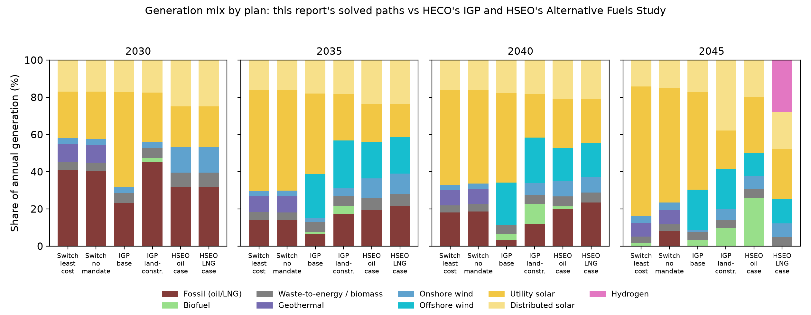

*Figure 4.4 — Generation mix at anchor years: this report's least-cost and
no-mandate paths (labeled "Switch" after the model; base rooftop
trajectory, reference oil) against Hawaiian
Electric's Integrated Grid Plan (Figure 2-3 of the May 2023 final report).
The IGP plans are named here by scenario — base and land-constrained —
because the utility reversed which one it called "preferred": the May 2023
report gave that label to the base scenario, and the November 2023
Supplemental Response moved it to the land-constrained scenario, which is
now the plan of record. The HSEO study's oil and LNG cases are drawn from the study's own
results worksheets (vendored in `sources/plan_mix/`). Shares
include customer-sited solar; the oil shares quoted in Section 2.7 are of
grid supply alone and run a few points higher. In our solves, thermal
generation with zero dispatch emissions is counted as biodiesel.*

Three contrasts carry most of the information. First, everyone agrees on
the destination: every plan reaches essentially zero fossil generation by
2045. The paths differ in pace. The IGP's base scenario — the one the
utility did *not* adopt — de-fossilizes fastest early, 23 percent fossil by
2030, against 45 percent in the land-constrained plan of record; our
least-cost path holds
about 40 percent in 2030 and then moves fast (14 percent by 2035), because
the optimizer waits for the solar and storage it buys to get cheap and for
the credit window rather than building early at higher cost; HSEO sits
between, at about 32 percent in 2030. The pace question matters for LNG:
the slower the early clean build, the more fuel there is for a conversion
to save (Sections 4.1, 4.7). Second, the instruments differ. The IGP and
HSEO plans both lean heavily on offshore wind — 18 to 26 percent of their
2040 generation — which, per the discussion above, is what a planner
selects once solar is priced at roughly twice its mainland baseline. Our
least-cost build takes none at baseline costs, substituting more solar and
the 100 MW of enhanced geothermal (8 to 9 percent of generation) that
neither institution's plan considers. Third, the HSEO LNG case shows the
same bridge-shape our conversion scenarios do — LNG peaks near 2,400 GWh a
year around 2040, about a fifth of supply, and is gone by 2045 — but it
then fills the gap with hydrogen at 28 percent of 2045 generation, an
implied endgame far costlier than the solar-and-storage path every other
column lands on.

The figure also puts the mandate's role in one picture. Our least-cost and
no-mandate paths are indistinguishable through 2040 — the cheapest build
runs ahead of the requirement on its own — and split only at the end:
without the mandate the model keeps about 9 percent fossil generation in
2045 (10 percent of grid supply) and retires it over the following decade
on economics alone. That last step is what the mandate buys, and it costs
about $0.25 billion in present value, roughly 0.2 cents per kilowatt-hour
(Sections 2.7 and 4.8).

**Pricing the plans.** The mixes in Figure 4.4 can be priced. For each
published plan we solve a scenario whose generation is constrained to that
plan's mix: the plan's shares of its own grid supply, rescaled to the grid
demand our matching rooftop trajectory leaves the utility to serve, and
imposed each planning period as a band on utility solar and on total wind,
a band on fossil generation through 2040, and a floor under the plan's
firm clean energy from 2045. Dispatch, storage, and everything the plan
does not specify stay optimized. The difference between that cell's cost
and the least-cost build on identical settings is the plan's price tag:
what following the plan costs over building the cheapest system that meets
the same requirements, with both sides priced by the same model, the same
fuel forecasts, and the same capital costs. Note that the least-cost builds
import no LNG, neither a new plant nor the conversions of existing plants
that Section 4.7 finds save money (but also impose unquantified risks), so
the tags are, if anything, understated. The comparison each plan
should be read against is the least-cost column at the same solar premium,
because a planner who believes Hawaiʻi utility solar carries a 104
percent premium over mainland costs faces both columns at that price.

Two features of the construction need stating. First, wind is pinned as a
total, not by type: the plans carry 257–287 MW of onshore wind, but the
county setback ordinance caps onshore at about 150 MW in our framework
(Section 2.6), so offshore stands in for onshore the ordinance forbids, and
only the plans' combined wind is reproduced. Second, from 2045 the plans
lean on firm clean energy — a quarter to a third of grid supply for the
HSEO cases — which HSEO's study carries as biodiesel in its oil case and
as imported hydrogen in its LNG case. We hold each plan to its firm
*quantity* and let the model choose the fuel, for a reason given below;
the model chooses biodiesel every time. Appendix A.15 documents the
quotas, the contract carve-outs (Kalaeloa's minimum-take PPA sits outside
the fossil band), and the tolerance basis.

| Plan (vs least cost, same settings) | 20% Hawaiʻi premium | 104% Hawaiʻi premium |
|---|---|---|
| IGP land-constrained (plan of record) | +$2.55B | +$1.73B |
| IGP base | +$2.17B | +$2.27B |
| HSEO oil | +$3.60B | +$2.50B |
| HSEO LNG | +$2.86B | +$1.70B |

*Table 4.1 — Plan price tags: NPV system cost above the least-cost build
at the same utility-solar premium over mainland ATB costs (2024$,
EIA-reference oil; the 20 percent premium is the study baseline,
Section 2.6).*

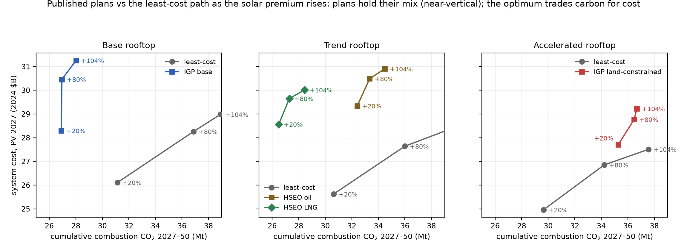

The tags are large — roughly $1.7 to $3.6 billion, on a least-cost base
of about 24 to 29 — and they are not purchasing emissions cuts. At
baseline solar costs the HSEO oil plan is the starkest case: it costs $3.6
billion more than least cost and emits *more* — 31.5 against 30.1 Mt of
cumulative combustion CO₂ through 2050 — because its early years keep more
oil on the grid than the cheapest build would. The land-constrained plan
of record shares the pattern at baseline costs: $2.6 billion above least
cost and 5.6 Mt more emitted. Where a plan does cut cumulative emissions,
the implied abatement price runs $170 to $670 per tonne of CO₂ (the one
exception is the land-constrained plan at the high premium, whose cut is
only 1.0 Mt and prices near $1,700). The one comparison that narrows with expensive solar is
HSEO-LNG against least cost: at the 104 percent premium its tag falls to
$1.7 billion, because the plan's offshore wind and firm fuel look better
when the alternative's solar is dear.

The oil-versus-LNG pair is the comparison HSEO's study was built to make,
and our framework agrees with its direction: the LNG case lands $0.7–0.8
billion cheaper than the oil case at every solar premium, and 5.7 Mt
lower. About $0.14 billion of that gap — a fifth — is a fuel-price
assumption rather than a physical difference: our forecasts hold LSFO at
roughly 1.4 times the delivered price of LNG across the horizon, while
HSEO's tracks converge to 1.2 by 2050, so the same plans priced on
HSEO's fuel assumptions would sit about $0.14 billion closer (our LNG
price includes the import infrastructure charge; the fuel-track
discussion above).

**The firm-fuel choice, and why we take it away from the plans.** HSEO's
post-2044 supply rests on a fuel its two cases do not share: biodiesel at
$63.84 per MMBtu in the oil case, hydrogen at $40.66 in the LNG case,
both externally supplied at assumed prices. Hydrogen at that price
presupposes an import supply chain — liquefaction, shipping, storage —
that does not exist at scale today, serving an island that would be among
its first buyers; we regard that as somewhere between very uncertain and
unlikely, and our framework does not assume it. Here hydrogen must be
made: electrolyzers, tanks, and fuel cells are available to the model at
reference costs, charged as capital, powered by whatever electricity the
build can spare (Section 3's hydrogen scenarios build exactly this way,
and remain feasible). Offered that choice, the plan cells never make
hydrogen: with utility solar and wind pinned to the plans' own levels
there is no surplus generation to electrolyze, and hydrogen made from
biodiesel-fired electricity returns about a third of the fuel burned, so
biodiesel burned directly is always cheaper. Both HSEO plans, priced
here, therefore meet their post-2044 firm requirement with the same fuel
— which has the useful side effect of making the oil and LNG cases
directly comparable, freed of the hydrogen-price assumption that would
otherwise do much of the work (the same asymmetry noted in this
section's first bullet). Readers who expect cheap imported hydrogen to
materialize should read both tags as upper bounds on that world.

> **Box 4.2 — What the plans' own price tags say.** Hawaiian Electric's
> IGP prices its plans directly (Table 9-1 of the May 2023 report): a
> revenue requirement of $29.40 billion NPV for the base plan, $30.36
> billion for the land-constrained plan of record (+3%), and $33.89
> billion for the status quo (+15%). Those totals are not comparable to
> ours — different demand, different discounting, different scope — but
> their internal structure is instructive in three ways.
>
> First, the two plans are not directly comparable *with each other* in
> the IGP's own accounting: the land-constrained plan's utility serves
> about 26 percent less energy in 2045 (customer DER supplies 4,082 GWh
> against the base plan's 1,878 on near-equal totals, Tables 2-3/2-4),
> and the rooftop capital that substitution requires is customer-paid
> and appears in no revenue requirement. A plan can look cheap by moving
> spending off the utility's books. Our cross-family cells put both
> plans on a common rooftop trajectory before comparing, and on common
> demand the ordering reverses the IGP's: the land-constrained plan of
> record costs $0.4–0.8 billion more than the base plan and emits 8 to
> 11 Mt more (both ranges span which trajectory the plans share) — the
> fossil and firm energy it substitutes for the utility solar it forgoes,
> priced and emitted.
>
> Second, the transmission line. The base plan carries $9.77 billion
> (nominal) of transmission capital against the land-constrained plan's
> $2.35 billion and the status quo's $0.82 billion — roughly $6.0
> billion in 2024 dollars, most of it in 2045–2050. Set against each
> plan's total capital program (Tables 9-2 through 9-4), transmission is
> 63 percent of the base plan's capital, 29 percent of the
> land-constrained plan's, and 12 percent of the status quo's. That last
> figure is the ordinary one — transmission is the smallest component
> of what U.S. electricity customers pay, about 13 percent of the
> delivered price against 58 for generation and 28 for distribution
> (EIA, AEO 2023 Table 8, 2022 values; those are shares of price, not
> of capital, so the comparison is loose). The cleaner benchmark is
> internal to the same tables: continuing as-is puts 12 percent of
> capital into wires, the land-constrained plan 29 percent, and the
> base plan 63 percent — five times the status quo's share. Even the
> land-constrained plan, which builds the least of the three, roughly
> doubles the wires share of a continue-as-is program. (The IGP labels
> both Tables 9-2 and 9-4 a "Preferred Plan": the term designates the
> chosen plan *within* each scenario, not a choice between scenarios,
> and the utility's plan of record is now the land-constrained one.) The IGP's own text
> prices renewable-zone enablement at $950–1,100 per kW; our solved
> builds carry solar at $1,511 per kW *including* the generation. Its
> own non-wires analysis identifies avoidable segments: the Archer cable
> replacement avoidable with 37 MW of storage or demand response, Ewa
> Nui reducible from 324 to 175 MW, Wahiawa by 220 MW, and a $3,980M
> 2040–2045 network expansion whose stability contribution is listed as
> "Not studied." For scale: Hawaiian Electric's entire Oʻahu net utility
> plant — every wire, pole, and plant it operates today — stands at
> $5.96 billion ($9.29 billion gross of depreciation, at historical
> cost; HEI 2024 10-K, utility-only balance sheet). A regulated utility
> earns its allowed return on the capital it deploys, so it profits more
> from building infrastructure than from avoiding the need for it — the
> incentive economists call the Averch–Johnson effect. A plan that
> spends a new grid's worth of capital on transmission at least raises
> the question, though performance-based regulation mutes the incentive,
> and settling it requires modeling the alternatives — storage, demand
> response, generation sited to need less wire — priced against the
> line. At national scale that comparison has been made, in the same
> model family used here: an optimal U.S. transmission buildout would
> more than triple interregional capacity yet lowers the cost of a
> zero-emissions system by only about 7 percent, because storage and
> generation siting substitute closely for wires (Zheng, Schivley,
> Fripp, and Roberts, *Applied Energy* 421(15), 2026). Oʻahu is one
> small zone rather than a continent, so the number does not transfer —
> but the mechanism is what v2 will test here.
>
> Third, the status quo. HECO prices continuing as-is at 15 percent
> above its base plan. Our equivalent — solar and wind frozen at
> contracted projects, conservative rooftop growth, no clean-energy
> requirement — lands 19 percent above least cost with more than triple
> the emissions (108 against 30 Mt), or 4 percent above when LNG is
> allowed in. The direction agrees; the magnitude says the cost of
> standing still is, if anything, larger in our framework than in the
> utility's.
>
> A fourth comparison no accounting here captures: the rooftop capital
> itself. The accelerated trajectory adds about 1,120 MW of customer
> solar over the base one by 2050 — $2.1–2.4 billion of present-value
> capital at Hawaiʻi residential prices (Section 2.3) that appears in
> no plan's revenue requirement and no cell of Table 4.1. Version 2 of
> this model is being built to close both gaps: transmission expansion
> optimized jointly with storage, demand response, and generation
> siting — rather than inherited from the plan being priced — and a
> full both-sides-of-the-meter accounting of customer capital.

### 4.6 Considerations the analysis does not capture

**Contract structure.** Whatever formula the LNG contract carries —
indexed to world oil or mainland gas — it is likely written to insure the 
supplier's return. The proposal does not disclose the contract's term or volume
provisions, so the model gives the contract the most favorable treatment
that still recovers the supplier's capital: import volumes are re-optimized
every period against every alternative (2035 imports range from 5.9 to
23.4 million MMBtu across the oil paths), the delivered price stays at the
contract floor no matter how far volumes fall, and the $460 million of
import infrastructure is recovered in full over 2030–2044. Any actual
contract that recovers that capital — with minimum-take floors, diversion
fees, or volume penalties — can only cost the system weakly more than
these solutions. A contract more favorable than this would require the
supplier to absorb unrecovered capital without pricing that risk. The delivered
price this analysis carries ($11.4/MMBtu incl.
regasification, roughly half the wartime Pacific spot — JKM $21/MMBtu,
July 17, 2026) is the contract-indexed floor; the downside
protection in such contracts accrues to the seller. The asymmetry is
structural, not a matter of any party's conduct: before financing closes,
either side can exit an LNG contract at modest cost — JERA's March 2026
termination of its Commonwealth LNG agreement, routine as pre-construction
exits are, shows how ordinary that flexibility is at that stage — while a
buyer that has built the terminal and unwound its oil logistics has no
comparable exit. 

Hawaiʻi's position after building the terminal would be different in kind
from its position today. The current LSFO supply arrangement with Par
Hawaii is a requirements-style contract: Hawaiian Electric buys what it
requires; Par carries a supply obligation of 13,500 barrels per day of LSFO
at the formula price (a ceiling on Par's Tier 1 supply obligation —
Hawaiian Electric's purchases follow its actual requirements); self-supply
is permitted above it; and no take-or-pay or minimum-purchase obligation
appears in the public contract text or in HEI's disclosed purchase
commitments (Second Amendment, August 14, 2024,
SEC Exhibit 10.1; some pricing clauses remain redacted). The system can
therefore reduce oil purchases as renewables grow; a take-or-pay LNG
contract removes exactly that freedom. The contrast extends to term: the
Par agreement runs through January 2029 with one-year extensions, while the
LNG proposal is built around twenty years of FSRU operation.

**Execution and supply chains.** The renewable-heavy paths assume the
buildout can be executed: by 2035 the no-new-plant path carries roughly
6,200 MWh of bulk storage and about 2,200 MW of utility solar, and by 2050
roughly four to five times the battery capacity of the largest completed
solar-plus-storage project in the United States (Edwards & Sanborn,
3,287 MWh). Nothing in the model prices construction logistics, port
throughput, specialized labor, or global battery supply chains. But the
constraint these numbers point to is process, not physics. Solar with
storage is as fast to build as anything on the grid: in the
engineering estimates behind EIA's own outlook, utility PV and batteries
take about twelve months to construct — only onshore wind is comparable —
against 22–30 for gas turbines and
combined cycles, five years for coal, and seven for nuclear (EIA, Capital
Cost and Performance Characteristics, 2024; vendored in sources/), and
solar and storage have supplied the majority of all new U.S. generating
capacity in each of the last two years (EIA, Today in Energy, Feb. 2025).
Texas, which runs interconnection on connect-and-manage rules (Section
2.4), grew its utility-scale solar fleet from 1.9 to more than 20
gigawatts in five years — its additions in 2024 alone were more than
double what this report's least-cost path builds by 2050. Oʻahu's slower
pace is not a property of the technology. It is the procurement and
interconnection process this report documents (Sections 2.2, 2.4, 2.8): a
multi-year RFP cycle in which the incumbent utility runs the competition
and manages the queue while being the party whose generation the entrants
displace — a process in which speed serves almost no participant with
influence over it. The reforms of Section 2.8 exist precisely because the
current process was not built to go fast. The residual risks that reform
cannot reach — battery supply chains, port capacity, labor — cut against
every pathway that builds at scale (the JERA path builds most of the same
solar, a decade later), and the 1.5×/1.7× solar-cost cases price the world
in which they persist.

**Employment.** The clean-energy path is by far the more labor-intensive;
the job-year arithmetic is in Section 8 and Appendix A.9.

**The utility's finances.** JERA's 500 MW would join a grid already served by
independent generators (Puʻuloa, Kalaeloa, H-Power, and smaller producers),
leaving Hawaiian Electric's own generation — old units carrying substantial
rate base from decades of capitalized upgrades — with little to do. Whether
the Commission would continue to allow capital recovery on plants that no
longer run is an open question with two uncomfortable answers: continued
recovery has customers paying for JERA's contract and idle HECO plant at
once; disallowance imposes a write-off on shareholders already exposed at
Waiau. Section 8 weighs whose loss that would be and what follows from it;
the immediate point is that the question should be resolved openly and in
advance, before any contract is signed.

**The refinery.** The LNG path displaces Hawaiian Electric's LSFO purchases
nearly completely and quickly; the clean-energy path displaces them
gradually. What rides on that difference — Par's slate economics, direct
jobs, in-state fuel supply, and the biofuel joint venture — is set out in
Section 8.

### 4.7 If LNG comes: the cheapest configurations use existing plants

The proposal bundles three separable decisions — import LNG, build a new
plant, and size it at 500 MW. Separating them changes the picture, and the
three decisions respond to oil prices in different ways.

Switching fuel and buying efficiency are distinct economic propositions.
The value of switching an existing plant from fuel oil to gas is the price
gap between the two fuels, times the volume burned. In the contract
structure the proposal assumes, gas is priced at about 11.8 percent of
Brent, and the fuel oil Hawaiʻi buys tracks Brent at almost exactly the
same rate once both are expressed per unit of energy. The gap between them
is therefore close to $6.60 per million Btu across the whole range of oil
prices we test, moving by only a few cents between the market's tenth and
ninetieth percentile paths (Appendix A.14). Conversion savings depend on
how much the converted units run, not on where oil prices land. The value
of a new and more efficient plant works differently. It is the fuel saved
by a better heat rate, and that saving is worth more when fuel is
expensive. Cheap oil makes efficiency investments hard to justify, because
the fuel being saved is not worth much. Expensive oil makes them hard to
justify for a different reason, since solar and storage displace the plant
before it can earn its capital back. That is why the new-plant premium is
smallest in the middle of the oil range and larger at both ends, while the
conversion saving moves with the volumes burned and the clean build cheap
gas defers rather than with the fuel-price gap itself (Section 4.1).

One condition attaches to the first half of that statement. The near-constant
fuel gap follows from oil-indexed pricing. A contract indexed to a gas hub
instead, such as Henry Hub plus liquefaction, would let the gap move with the
oil-to-gas price ratio, and conversion economics would then depend on oil
prices after all. HECO's own LNG program a decade ago planned exactly this. 
The 2014 Power Supply Improvement Plan assumed Kahe 1–6 and Waiau 5–10 "converted 
to use LNG beginning in 2017," with the independent Kalaeloa plant converted at
Hawaiian Electric's expense; in May 2016 Hawaiian Electric asked the PUC to 
approve about $341 million for unit conversions (four sites across three islands) and
$117 million for LNG shipping containers, withdrawing both requests that
July when the NextEra merger collapsed (PSIP 2014; HEI Forms 8-K, May 18
and July 19, 2016). The Kalaeloa combined cycle
sits adjacent to the proposed FSRU landing at Campbell Industrial Park. We
test these configurations directly: the import terminal is built, existing
units are permitted to burn gas (at zero conversion cost — an upper bound;
actual conversion capital would reduce the saving), and no new plant of any
kind is built. One case converts Kalaeloa alone; a second extends conversion
to the units closest to HECO's own former program — Kahe 5 and 6 and the CIP
combustion turbine.

| Configuration (reference oil) | System cost ($B) | vs no-new-plant |
|---|---:|---:|
| No new fuel plant, no LNG | 25.83 | — |
| FSRU + Kalaeloa conversion, no new plant | 25.45 | −0.39 |
| FSRU + Kalaeloa, Kahe 5 & 6, CIP CT conversions, no new plant | 24.79 | **−1.05** |
| *…same, net of the full 2016 conversion-program charge ($0.45B)* | *25.24* | ***−0.60*** |
| *…same, also charging the entire 2016 onshore package ($0.26B)* | *25.50* | *−0.34* |
| JERA 500 (bare-EPC), no conversions | 26.37 | +0.54 |
| JERA 500 (bare-EPC) + Kalaeloa conversion | 25.92 | +0.09 |

At JERA's cost quote, the conversion configurations beat building the
new plant. Kalaeloa alone saves $0.39 billion where the new plant adds
$0.54: the model
routes about 200 million MMBtu of LNG through Kalaeloa's existing units —
running them at 80–90 percent capacity factor into the early 2030s and 60–80
percent through 2044 — with no new construction at all. Extending conversion 
to Kahe 5 and 6 and the CIP turbine makes the no-new-plant configuration the 
cheapest LNG arrangement tested; on the credited basis the bare-EPC plant does 
not save at all (+0.54). And the terminal needs no mandate to be used this way: 
in a variant where LNG import is offered as an option rather than forced, the 
model activates the terminal and the Kalaeloa conversion on its own, reaching
the same saving (−0.39, identical to the forced case within tolerance). At the quoted fuel 
price, the terminal pays for itself through conversions alone.

Because conversion capital is set to zero, each saving doubles as a
break-even budget: the most that conversion, refurbishment, remaining-life,
contract-renegotiation, and gas-delivery costs could total before the
configuration stops paying. Against the no-LNG baseline the budgets are
large — about $1,800/kW for Kalaeloa's 220 MW and $2,000/kW for the
additional 370 MW of Kahe and CIP capacity, each a substantial fraction of
the cost of building a new plant outright (and about a fifth higher in as-spent
dollars, since capital spent near 2030 discounts against these 2027
present values). Real costs are far smaller. Delivery geography favors
these particular units — Kalaeloa and the CIP turbine sit adjacent to the
proposed FSRU landing at Campbell Industrial Park, and Kahe, roughly ten
miles up the coast, needs only a pipeline extension that has been priced
before: Hawaiʻi Gas's competitively bid 2016 onshore package (Section 4.4)
came in at $200 million ($260 million in 2024$). Conversion capital has a
2016 benchmark too: the $341 million ($450 million in 2024$) program of
HECO's withdrawn May 2016 request, above.
Both sit an order of magnitude inside the budgets. (The terminal, mooring, 
and regasification infrastructure is already charged in these runs; plant 
laterals and conversions are not.)

These 2016 estimates permit a direct net-of-capital assessment without
re-running anything, exactly as the EGS cost sensitivity is handled: a
capital charge against the solved saving. The table's net rows charge the
**entire** 2016 conversion program at face value against our three-unit
Oʻahu configuration alone, although it covered far more capacity
(Kahe 1–6 and Waiau 5–10 among others). The full conversion set still nets
**−$0.60 billion**. The stricter bound adds the entire 2016 onshore package
on top, even
though the JERA runs already charge $460 million of import infrastructure
that covers most of the same functions; the saving is still **−$0.34
billion**. Both charges are deliberately conservative: the 2016 program's
$450 million covered roughly 1,300 MW of conversions (≈$0.35M per MW), so
charging it all against our 590 MW set implies about $0.76M per MW, roughly
twice the program's own rate, and over $1.2M per MW with the onshore
package added. Every direction of approximation here overstates conversion
cost.
On the credited basis the central ranking is not fragile: "Kalaeloa
conversion beats building JERA's plant" rests on a margin of $0.73 billion
at bare-EPC capital — about $3,300/kW of converted capacity — which
realistic conversion costs are unlikely to consume. What remains fragile
is the fine ordering among the conversion configurations themselves, some
of which differ by less than the solve tolerance. The
configuration also has precedent: it is nearly the shape Hawaiʻi Gas
proposed in 2016 — a temporary chartered FSRU, gas to Kalaeloa, Kahe, and
Waiau through pipeline extensions, no new plant, and the vessel gone at
the end of the contract.

Three caveats temper the result further: no per-unit Oʻahu conversion
figures were ever published, so the $341 million is a program total rather
than a project estimate, and the units most likely to exceed their share
of the charged allowance are the oldest — Kahe 5 and 6 are 1970s-era steam
plants whose refurbishment and remaining-life costs are the least
predictable part of the package. Conversion is effectively one-way,
since dual-fuel combustors pair gas with distillate rather than with
residual oil, so converted units would give up their LSFO capability. And
ownership and contract status shape who captures the saving — Kalaeloa is
an independent producer whose amended PPA (executed 2021, approved
November 2022) runs ten contract years from 2023, roughly the same window
the LNG tier occupies, and a biofuel-capable repowering of the plant was
in active contract negotiation as of July 2026 (Hawaiian Electric release,
July 9, 2026) — a path a gas conversion would compete with directly; the
Kahe and CIP units are HECO's own. The finding that survives the caveats: the fuel
benefit and the new plant are separable, and the proposal's value, if any,
lies in the fuel — which strengthens the case for evaluating the terminal,
the plant, and the contract as distinct decisions rather than a single
bundle. Separability carries a procurement corollary: if Hawaiʻi proceeds
with LNG in any form, the terminal and its services should be put out to
competitive bid rather than accepted as one proposer's package — Hawaiʻi
Gas's 2014 global invitation shows that a competitive process for exactly
this service is feasible here, and the current buyers' market (Section
4.4) is the right moment to run one.

The 2016 bid also shows the contract shape that fits the mandate: a
chartered FSRU whose term ends as the 100 percent requirement binds,
leaving no stranded asset — and its onshore package, with the delivery
pipelines the conversion pathway needs included, came in about 40 percent
below the $436 million (the $460 million headline figure deflated to
2024$) of import infrastructure in JERA's proposal. Its per-unit adder ran
higher ($1.60/MMBtu in 2024$ against JERA's $1.31) because its volumes
were smaller, and both figures assume zero overruns. The conversion cells
above already carry this contract shape — the infrastructure charge is
levied only while the LNG tier operates, 2030–2044 (Appendix A.8) — so
their savings are computed under the lease-to-the-mandate structure;
repricing the terminal at the 2016-bid level would add roughly
$0.15–0.2 billion more. A leased terminal on that template, feeding
converted plants until 2044, is the configuration that captures the fuel
benefit while retaining the State's exit.

### 4.8 If the clean-energy mandate were abandoned

The strongest case for LNG arises if Hawaiʻi walks away from the 2045
requirement. We solve that case directly: the RPS is removed, LNG may run
past 2044, and the model chooses plant size and fuel volumes freely.

| No-mandate configuration (reference oil) | System cost ($B) | vs no-mandate baseline |
|---|---:|---:|
| No new fuel plant (no gas available) | 25.58 | — |
| LNG unrestricted (model's choice) | 25.43 | −0.15 |
| JERA 500 forced — bare-EPC / +20% | 25.60 / 26.13 | +0.02 / +0.55 |

Without the mandate, the model builds 500 MW of gas capacity, imports 15–21
million MMBtu of LNG per year through 2050, and the LNG advantage is $0.15
billion against the no-gas baseline. Notably, even with the mandate gone,
*forcing* the JERA bundle does not pay: at the vendor's own bare-EPC quote it
roughly breaks even (+$0.02 billion), and at the +20 percent sensitivity it
costs $0.55 billion. Sunshine keeps most of the market either way: the
no-mandate system still builds about 2,200 MW of utility solar (54 percent
of the mandated build) with gas fully available, and 3,740 MW (92 percent)
without it.

The more striking number is how little is at stake. With no gas option on
the menu, dropping the rule saves just $0.25 billion (25.83 against 25.58)
— about 0.19 cents per kilowatt-hour; the larger figure arises only because
abandonment also unlocks unrestricted gas: **abandoning the
mandate saves about $0.41 billion over twenty-four years — roughly three
tenths of a cent per kilowatt-hour — when the replacement is a 500 MW gas
plant with an import terminal.** The configurations in this table exclude
the conversion of existing plants, which Section 4.7 shows is the cheaper
use of LNG. Solving the no-mandate case with conversions on the menu
completes the picture. Without the mandate, the model converts Kalaeloa,
Kahe 5 and 6, and the CIP turbine and reaches $24.14 billion; the
with-mandate conversion configuration reaches $24.78 billion, so on a
like-for-like menu the mandate itself costs about $0.64 billion, roughly
half a cent per kilowatt-hour. Offered a new plant on top of conversions,
the no-mandate model declines the 2030 proposal entirely, adding only
about 250 MW around 2045 as the converted units age out, worth about
$0.06 billion — within the solve tolerance. Most of the apparent gain from
abandonment therefore comes from the conversion decision, which the
mandate permits: converting saves about $1.05 billion with the requirement
kept in place. These comparisons set conversion capital to zero on both
sides, so it cancels; all of them assume LNG at the contracted price
(about $11.4 per MMBtu delivered) for the duration, while the July 2026
spot price is roughly double that. Rooftop growth is
part of why the stake shrank: distributed solar and storage reduce the
energy any new plant would serve, and the no-mandate gas build is half what
it was on a gross-load basis. For
comparison, letting solar-and-storage deployment costs persist at today's
procurement-implied level costs $2.11 billion (Section 2.1; the 1.5×
sensitivity, i.e. roughly 1.8× the mainland ATB benchmark once the baseline's
20 percent Hawaiʻi premium is included — approximately the effective level
implied by the contract prices approved since 2024, Section 2.3). Walking away from the
clean-energy commitment is worth half of what fixing procurement is worth. And
the ranking of levers survives the mandate's removal: with no clean-energy
requirement at all, cheaper solar deployment remains the largest cost
reducer, because solar carries most of the load in every world. The money
is in fixing procurement — with the mandate or without it.

Two readings follow. For LNG proponents: the proposal's economics improve
several-fold in a no-mandate world, and candor about that dependence would
clarify the debate. For policy: what the mandate buys — a fully clean grid
five to ten years sooner — costs about two tenths of a cent per kilowatt-hour,
and the decisions that dominate bills lie elsewhere.

### 4.9 Emissions and the pace of decarbonization

Counting only combustion on Oʻahu — the accounting most favorable to LNG,
with no upstream methane — the two paths run close: 30.0 Mt for JERA
(bare-EPC), 30.5 for the +20% case, against 31.3 for no-new-plant over
2027–2050, so the LNG path is about 0.8–1.3 Mt lower on combustion CO₂. LNG
displaces oil early (about 0.8 Mt/yr cleaner around 2030) and displaces
solar and geothermal in the middle years (about 0.6 Mt/yr dirtier around
2035), with the RPS forcing both paths to zero by 2045 (Figure 4.1). The
credited base case pulls both totals well below the earlier no-credit
figures, as cheaper storage and geothermal displace more oil.

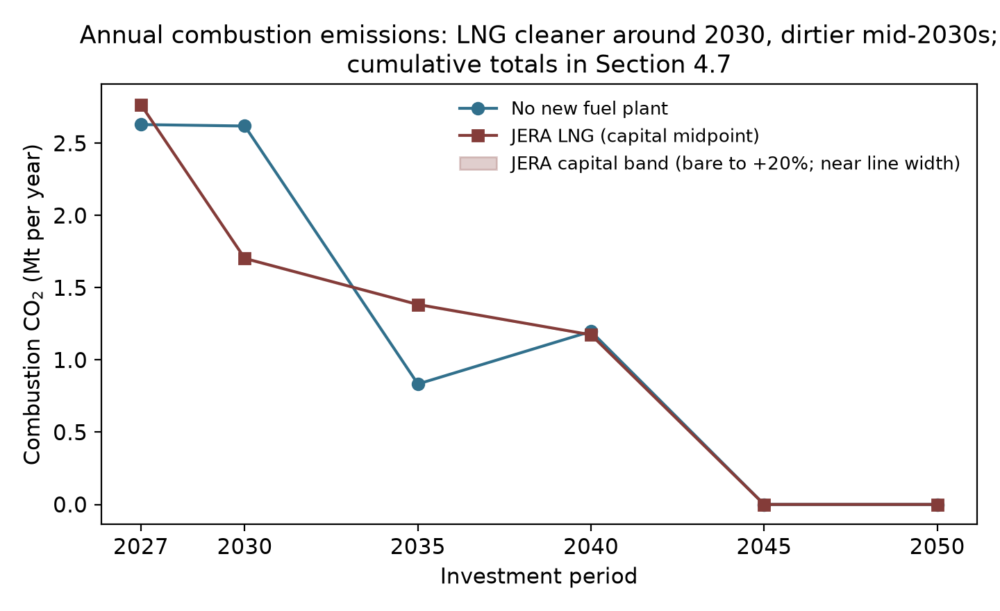

*Figure 4.1 — Annual combustion CO₂ on the no-new-plant and JERA LNG
pathways.* Combustion CO₂ (million tonnes per year) by investment period at
reference oil prices. The JERA line is the capital midpoint; the shaded band
spans bare-EPC to +20 percent capital and is close to line width. Combustion
only; upstream methane is treated in the text. Both paths reach zero by 2045
under the clean-energy mandate.

The clearer difference is the pace of the transition. In 2035 the
no-new-plant path generates 83 percent of Oʻahu's electricity from
renewables; the JERA path, 58 percent — a 25-point gap (by the model's own
renewable-share metric) that narrows through the 2040s. The LNG path defers
roughly a decade of clean-energy deployment, and its cumulative-CO₂ parity
depends on the mandate forcing the same endpoint.

Upstream methane overcomes LNG's combustion edge, by an amount that depends on a
debatable question of incidence. Natural gas is mostly methane, and
some share leaks from wells, gathering, processing, liquefaction, and
shipping. Appendix A.10 carries the calculation: the JERA path imports about
246 million MMBtu of LNG over the horizon, roughly 4.7 million tonnes of
methane throughput. Each percentage point of supply-chain leakage adds about
1.4 Mt CO₂-equivalent at a 100-year warming potential, or about 3.9 Mt at the
20-year potential — against a combustion gap of 0.8–1.3 Mt in LNG's favor. LNG's
greenhouse advantage therefore reverses at leakage above roughly nine-tenths
of one percent (100-year basis) or one-third of one percent (20-year basis) —
thresholds at or below every published measurement of U.S. supply chains
(Sherwin et al. 2024: the lowest basin measured, Appalachia, sits at 0.75
percent and the production-weighted average at 2.95 percent).

How far above depends on whose gas is counted. Counting only the literal
cargoes Hawaiʻi would buy — plausibly sourced from lower-leakage suppliers —
the addition may sit at the modest end; this is the accounting in
HSEO's study, whose scenarios also assume LNG displaces oil and imported
fuels rather than solar. The economically meaningful accounting asks what
production expands when global LNG demand grows by one buyer. U.S. exports are the
growing margin of world LNG supply (EIA projects ~30 percent growth by
2027), drawn from the Haynesville and from Permian associated gas. Measured
U.S. supply-chain leakage is well above the tie-breaking thresholds:
Sherwin et al. (2024, *Nature*), from nearly one million aerial site
measurements, report basin-level loss rates from 0.75 percent (Appalachia)
to 9.6 percent (New Mexico Permian), with a production-weighted average of
2.95 percent across the six regions measured. On the literal accounting the LNG
path's greenhouse effect is somewhat worse than the clean path's; on the
marginal accounting it is much worse. Appendix A.10 tabulates the range
at 1, 3, and 6 percent leakage under both warming potentials.

---

## 5. Reliability under a renewables-dominant grid

The headline findings depend on the system meeting load every hour, including
hours when sun and wind are scarce. The model solves for the cheapest mix
that delivers reliability, timepoint by timepoint.

### 5.1 How reliability is tested

Reliability in the model means three things at once: energy balance at every
timepoint; operating reserves at every timepoint (spinning contingency at 5
percent of load plus half the largest online unit, non-spinning at the same
level, regulation at 1 percent, providable by committed thermal, quick-start
units, and batteries with the required energy margin; solar and wind are
excluded from reserve provision);
and unit commitment (minimum up/down times, ramp limits, minimum loads) on
every thermal unit. A configuration that fails any test at any timepoint is
infeasible. Because solving every hour of 2027–2050 is computationally
prohibitive, each investment period is represented by thirteen sample days at
two-hour resolution, following the Switch-Hawaiʻi design (Fripp 2020; Imelda,
Fripp & Roberts 2024): twelve days chosen by K-means clustering on the
2007–2008 record, plus the single most difficult day of that record —
November 22, 2008, low sun, weak trades, evening peak — found by dispatching
a candidate system against every hour of both years at a $5,000/MWh penalty
on unserved load, and carried at full weight in every scenario thereafter
(Appendix A.5).

### 5.2 The easy day and the hard day

The 2035 annual peak (≈1,271 MW, hot summer evening) is straightforward: hot
days are sunny days, so peak demand and peak solar coincide; batteries charge
through the midday surplus and discharge through the evening. The binding day
is the low-renewable one. On the November 22 profile, solar output falls to
roughly a quarter of the peak day's, wind to a third, and the system carries
the day with the thermal fleet run harder, the new plant (in trajectories
that build one) near-continuous, and storage shifting the reduced midday
solar into the evening. Figure 5.1 shows both days for the no-new-plant base
case.

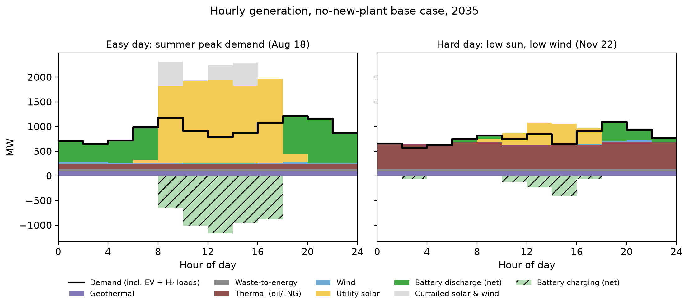

*Figure 5.1 — Hourly dispatch on the two 2035 sample days, no-new-plant base
case.* Stacked generation (MW) by two-hour model timepoint on the summer
peak-demand day (August 18) and the low-sun, low-wind day (November 22),
rendered as in the results explorer. The black step line is demand; the
hatched bars below zero are net battery charging; the gray band is
curtailed solar and wind, potential output above what was dispatched.
Battery flows are shown net: in surplus hours the optimizer may charge and
discharge simultaneously, a costless way to shed surplus, which the net
view removes; the round-trip losses of that disposal are counted as
curtailment. Generation sources stack in the legend's order.

**What firm capacity actually has to cover.** A common claim is that a
renewables-dominant grid needs enough backup thermal capacity to meet peak demand.
The model, and essential facts, show otherwise. What firm generation has to cover is 
closer to the highest *daily-average net load* — demand minus solar and wind, averaged 
over the day — because batteries move energy within the day from surplus hours to
deficit hours. In 2035 the annual peak demand is about 1,271 MW, but the
largest daily-average net load across all sample days is about 610 MW, less
than half of it, and it falls on the low-renewable November day (right panel),
where the existing thermal fleet runs at a nearly flat ~600 MW while storage
and the day's smaller solar output handle the peaks. Three things drive the
gap between peak demand and the net load that sizes firm capacity: batteries
smooth within-day variation, so firm generation follows the daily average
rather than the momentary peak; low-sun, low-wind days tend to be cooler,
lower-demand days (the hard day's peak demand, ~1,040 MW, is the lowest of the
year, not the highest); and even the cloudiest days still deliver meaningful
solar. This metric is conservative for Oʻahu, where storage could in principle
draw on neighboring days, which the sample-day design does not allow (Section
5.4). The build carries ≈2,100 MWh of bulk storage (modern-plant
trajectory) to ≈6,200 MWh (no-new-plant) by 2035, reaching ≈13,700–18,100
MWh by 2050. (Storage totals are loosely pinned: they move
by up to ~40 percent between the 0.25% and 0.1% solutions while total cost
moves under 0.2 percent, so read them as indicative of scale.) Because each
sample day starts from a reset battery state, the configuration meets
back-to-back recurrences of the worst day without inter-day banking.

One offsetting effect appears in the demand data and is worth stating. 
As rooftop systems have grown, grid demand on very low-sun days has begun 
to run above what installed capacity alone would predict — about 11 MW 
at 2021–2024 penetration — because households that self-supply on ordinary 
days draw from the grid on dark ones (Appendix A.11). The effect offsets 
roughly a sixth of the low-sun demand relief described above and grows with 
the distributed fleet; the sample-day tests in this section use net loads 
that carry the full distributed profile, so the mechanism is inside the 
model rather than an unmodeled risk.

### 5.3 What the test does and does not cover

The design enforces feasibility on the historical worst day but does not test
multi-day events more severe than that record, generator or fuel-supply
contingencies, or correlated storm damage; those are follow-on work (Section
8). Two omissions run conservative for the renewable-heavy paths: no inter-day
storage carryover, and no real-time pricing or system-wide demand response —
which prior work finds reduces high-renewable system costs six to twelve
times more than fossil-system costs (Imelda, Fripp & Roberts 2024). We are 
currently building the input data needed to test resiliency over many years.

---

## 6. The Waiau Repower decision

The project is approved (D&O 42411, March 2026); the live question is scope.
Two findings bear on it.

### 6.1 System cost and who pays

Forcing the repower into the build raises system cost by $1.40 billion at
reference oil ($1.38–1.49 across oil paths). The model prices the project at
Hawaiian Electric's stated construction cost ($1.155B; $4,545/kW) — the
resource cost of building it — while the Commission's recoverable-cost cap
(the $847M approved bid, $931.7M absolute ceiling — Section 1.1) determines
who pays: roughly $220–310 million falls to shareholders. The plant runs at 51 percent capacity factor in 2030, falls to 27–32
percent through the late 2030s, and drops below 1 percent from 2045 as
renewables and more efficient units displace it.

### 6.2 The scope alternative

A modern combined-cycle plant on the existing fuel supply would deliver
comparable firm capacity at roughly $2,900/kW on this report's basis
(Section 4.3) — about a third below the repower's $4,545/kW — with a heat
rate near 6,900 Btu/kWh against the repower's simple-cycle ≈9,500. The
system-cost gap tells the same story: no-new-plant beats the repower by
$1.40 billion, and no bundle rescues it — every Waiau-containing
configuration inherits the penalty (Table ES.1).

### 6.3 For the proceeding

Every Waiau-containing bundle is more expensive than its Waiau-free
counterpart by $1.38–1.49 billion (Table ES.1). The substantive question open
to the parties is whether the approved scope remains the least-cost way to
meet the firm-capacity need it was approved to address — and whether the
proceeding remains open enough to substitute a smaller, more efficient
configuration. The recoverable-cost gap and its incidence (Section 4.6,
"utility finances") sharpen the stakes on both sides.

---

## 7. Open questions and indicators worth watching

**Questions the analysis raises for the proceedings.** What in the
procurement, permitting, and interconnection process accounts for the
soft-cost gap, and which parts can Act 266 implementation reach? What would
it take to learn whether Oʻahu's EGS resource lands on the favorable cost
trajectory before the 2034–36 demonstration window closes? Should the plant,
the terminal, and the fuel contract in the JERA proposal be evaluated as
separable decisions (Sections 4.7–4.8 make the case that they are)? Is the
Waiau scope still the least-cost answer to the need it was approved for? And
how should LSFO-contract renewals be evaluated so the current structure — a
requirements contract without volume lock-in (verified against the public
contract text; Section 4.6) — is not surrendered
inadvertently?

**Indicators.** Brent realizations against the reference path; Pacific LNG
contract terminations and renegotiations (the Commonwealth precedent);
delivered costs of gas plants contracted into the current turbine market (a
check on the proposal's quote); Fervo Cape Station's delivered cost and
schedule; Stage-4 RFP pricing against the $0.21–0.23 of the contracts approved
since 2024; Act
266 implementation milestones; and the Pacific spot-LNG-versus-LSFO spread
— as of July 17, 2026 the JKM marker sits at $21/MMBtu, above delivered
LSFO, a war premium worth watching as it unwinds.

---

## 8. Conclusions and perspective

**What the analysis establishes.** On system cost, under current law the JERA
proposal costs modestly more than building no new fuel plant. Taking the
midpoint of JERA's own cost range — their bare-EPC estimate and their +20%
sensitivity, which restores the customs, insurance, design-allowance and
contingency items the estimate itself says it excludes — the JERA bundle is
about $0.75 billion more expensive over twenty-four years, and more expensive
in every oil-price case tested. In other words, it earns back approximately
half its up-front capital expense in fuel savings. In an open, competitive
market (which regulated electricity is not), no firm would make such an
investment. Per kilowatt-hour delivered, the difference is about half a
cent — small against a bill of thirty-plus cents, so compensating benefits
in reduced emissions, energy security, or local economic spillovers might
justify the investment. But on these measures a new combined-cycle plant,
even at JERA's competitive price, looks worse, not better. A case might
remain for LNG paired with retrofits of existing plants. The savings there
are real, but they would be unnoticeable on most customers' bills — maybe a
half-cent per kWh — and the off-model implications are as likely to reduce
the benefits as increase them. Clearer findings from the analysis are that
the Waiau Repower is uneconomic under every oil price tested (+$1.4
billion); if any new plant is built it should be smaller than JERA's 500
MW; solar-and-storage procurement reform is worth several times any fuel
decision; and, under current law, Enhanced Geothermal is in the least-cost
build with meaningful value and a bounded downside, provided the technology
is accepted by the community.

**When the cost gap is small, the decision rests on structure — and the structures are
not symmetric.** The no-new-thermal path is an option-rich position: it commits
to nothing irreversible, its inputs (solar, storage, geothermal) keep getting
cheaper on every documented trajectory, and its "fuel" — procurement reform —
is within the State's own control. The LNG path is an option-poor position: a
two-decade commitment to a single supplier, under a confidential contract, tied
to infrastructure with one use. Its advertised price should be read as a
**floor**: whatever formula the contract carries — indexed to
world oil or to mainland gas — it will be written, as such contracts are, to
insure the supplier's return. The bare-EPC cost quote in JERA's proposal carries the 
same asymmetry: it explicitly excludes contingency, insurance, customs, and 
design allowance, categories that history says run over (three of four electricity 
projects exceed their estimates; Sovacool, Gilbert & Nugent 2014). The asymmetry is
easiest to see in timing: before construction, contract exits are routine and
cheap (JERA's own Commonwealth termination, Section 4.6), while Hawaiʻi,
having built the terminal and unwound its oil
logistics, could not mirror that exit. None of this is 
priced in the model. All of it weighs on one side.

**On emissions, the combustion accounting is neutral — and the tie does
not survive the gas field.** Counting only what is burned on Oʻahu, the LNG
path and the clean-energy path produce similar cumulative CO₂
through 2050: LNG's efficiency and lower carbon intensity displace oil early
(roughly −0.9 Mt/yr around 2030), but the plant also displaces solar and
storage that would otherwise have been built, leaving the island's power about
22 percentage points less renewable through the mid-2030s (+0.55 Mt/yr) — a
decade of deferred clean energy, with the ledger closing only because the RPS
forces both paths to 100 percent by 2045. Combustion, though, is only part
of the ledger. Natural gas is mostly methane, a far
more potent greenhouse gas over the decision-relevant decades, and some of it
leaks — from wells, gathering lines, processing, liquefaction, and shipping. 
How much depends on where the gas comes from, and here the debate splits on a
question of incidence. If one counts only the *literal source* — the specific
cargoes Hawaiʻi would buy, plausibly from relatively low-leakage suppliers —
the upstream penalty may be modest. But the economically meaningful question is
the *marginal source*: when global LNG demand rises by one buyer, which
production expands to meet it? U.S. exports are the growing margin of
world LNG supply, drawn from the Haynesville and from Permian associated gas
(EIA 2026), and measured U.S. leakage rates are far above the tie-breaking
thresholds — 0.75 to 9.6 percent by basin, 2.95 percent production-weighted
(Sherwin et al. 2024, *Nature*, ~1M aerial site measurements). On that incidence, 
the upstream penalty ranges from material to severe. We do not put a single 
number on it; the range is wide and reasonable people will weigh the incidence 
question differently. The direction, though, is clear: any nonzero leakage breaks
the combustion tie against LNG, and the marginal-source reading breaks it
badly.

**The costs the model does not price fall disproportionately on one side.**
Three sit outside the capacity-expansion frame and deserve weight in the
decision. *Local employment.* The clean-energy path is the labor-intensive one:
on the coefficients documented in Appendix A.9, the solar-and-storage buildout
supports on the order of 29,000–43,000 local construction job-years and
500–1,000 permanent positions by 2050, against roughly 1,500–3,000
construction job-years and 50–80 permanent operating positions for the JERA
bundle — international FSRU and gas-trading operations are commonly staffed by
experienced international crews, and how much of JERA's operation would be
hired locally is unresolved in the proposal. *The finances of the utility
itself.* JERA's 500 MW would arrive on a grid that already carries a fleet of
independent generators — Puʻuloa, Kalaeloa, H-Power, and smaller IPPs. Add the
JERA plant and the island's firm-capacity need is met almost entirely by
non-utility plants: Hawaiian Electric's own generation — old units, but
carrying substantial rate base from decades of capitalized upgrades and
refurbishments — would be rendered idle: in the JERA
scenarios HECO's own fleet runs at 0.3 percent capacity factor from 2030
onward, against 26 percent in 2030 falling to 4 percent by 2035 on the
no-new-plant path. Whether the
Commission would continue to allow capital recovery on plants that no longer
run is an open question with no good answer: continued recovery means
customers pay twice — for JERA's contract and for idle HECO steel; disallowance
means a write-off that could be devastating to HECO shareholders, on top of the
Waiau exposure documented in Section 6 — and a utility whose investors have
just absorbed a stranding event pays more for capital on everything it builds
thereafter, including the wires and grid modernization every pathway needs.
The no-new-thermal path retires the same fleet, but gradually, on its
depreciation schedule, with the existing units earning their keep as reserve
capacity through the transition.

**A note on standpoint.** The stranding question looks different depending on
whose welfare is counted. From the standpoint of total cost, disallowed capital
recovery destroys no resources: the plants are built, the money spent;
disallowance changes only who bears a sunk cost. From the standpoint
of Hawaiʻi residents specifically, the distinction matters more: Hawaiian
Electric's shareholders are predominantly institutional and largely
out-of-state (~73 percent institutional per 2025 13F aggregations), so a write-down 
of legacy rate base would function, in substantial part, as a transfer from external 
investors to local ratepayers — one large enough, on some readings, to offset 
much of the new capital the transition requires. We do not advocate that outcome, 
and two considerations weigh against welcoming it: a utility whose investors absorb an
unplanned stranding pays more for capital on everything it builds afterward, a
premium that returns to ratepayers through the wires and grid investment every
pathway needs; and cost recovery on prudently incurred investment is the
regulatory bargain that makes private capital willing to fund public
infrastructure at all. HEI's post-settlement condition sharpens the point.
The wildfire settlement fixed the company's liability at $2 billion, and it
made the first of four payments in April 2026 (HEI Q1 2026 results).
Moody's upgraded the utility on that progress, but only to Ba1 — still
below investment grade — and the stock, though stabilized, remains far
below its pre-fire level. The Legislature has authorized a cap on liability
for future catastrophic wildfires (Act 258 of 2025, applying only to fires
that destroy more than 500 structures, with no cap on liability for death
or injury), but the Public Utilities Commission is still writing the
implementing rules and has so far recommended against a companion recovery
fund (PUC, December 2025 study; June 2026 rulemaking). A company in this
position has little capacity to absorb another shock, whether from a fire
or from stranded capital. The point of raising it is narrower: the
treatment of legacy generation capital is a critical aspect of the LNG
decision, its incidence is contested, and it should be settled
openly and in advance by the Commission, before either party discovers it
holds the loss.
*The refinery.* Displacing Hawaiian Electric's
LSFO demand, which the LNG path does immediately and nearly completely,
changes the slate economics of the State's only refinery, with
consequences for roughly 660 direct jobs (Par Hawaiʻi's stated statewide
workforce), in-state jet-fuel and gasoline
supply, and the Hawaiʻi Renewables joint venture that is one of the few
in-state pathways for the biofuel volumes every 2045 scenario needs
(Section 4.6). None of these three considerations is decisive alone. All three
point the same direction, and because the cost comparison shows no saving on the
LNG side, none of them is offset by one.

**A final observation on the moment this decision arrives in.** The war in
Iran has stress-tested the world's LNG market in real time, and the results
bear directly on how Hawaiʻi should read the offer in front of it. The
closure of the Strait of Hormuz in March 2026 took roughly a fifth of the
world's LNG shipments off the water and damaged the Ras Laffan complex;
loadings from Qatar and the UAE fell 35 billion cubic meters year-on-year
between March and June (IEA, *Gas Market Report Q3-2026*). Spot prices did
what a supply shock does — European TTF up 32 percent year-on-year to about
$16/MMBtu, Asian spot averaging 45 percent higher (IEA), with the JKM
marker at $21/MMBtu on July 17, 2026, up more than 60 percent on the
year. And yet the deeper response ran the other way. Oil peaked near $120 a barrel against wartime
forecasts of $150–200 (Borenstein, Energy Institute, June 2026), and global
gas demand is *falling* in 2026 — by about half a percent, the third annual
decline this decade (IEA). The demand side absorbed the shock, and much of
the absorption looks permanent: Japan's monthly imports slid from 6.2
million tonnes in January to 4.0 in May, 15 percent below a year earlier,
with coal imports up 14 percent (Ministry of Finance data via LNG Prime);
China's demand fell about 4 percent March through June; Europe's 2026
demand is down more than 2 percent — driven, the IEA notes, by renewable
expansion as much as by price; and Asia-Pacific LNG demand is now in its
second consecutive annual decline (278 → 268 → 257 million tonnes,
2024–2026), a retreat Wood Mackenzie characterizes as "structural
responses rather than purely tactical ones." The oil market makes the same
point more sharply. World oil demand is expected to fall by about a million
barrels per day this year, the first decline since 2020 (IEA, July 2026).
In sixty years of data, declines like this have come only in and around
recessions: every prior year of falling world oil demand saw world growth
at or below 2.6 percent, and the deepest declines came with growth near or
below zero. The IMF expects 2026 growth near 3 percent (Figure 8.1).
Rationing without substitutes would have caused a recession, so a decline
this large in a growing economy suggests energy users are finding
alternatives. Where inventory data are public, the LNG decline looks like
reduced consumption rather than delayed purchases: Japan cut imports while
holding stocks above their five-year average. Not all of it will stick.
Europe's decline is mostly deferred buying, and Qatari volumes return when
the Strait reopens. A supply glut within a year of a Hormuz settlement
would not surprise us, though no one knows when that settlement will come.

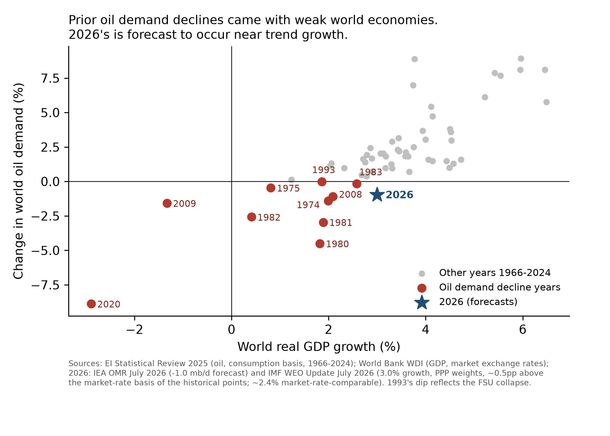

*Figure 8.1 — World oil-demand changes and world GDP growth, 1966–2026.*
Each point is one year: the percent change in world oil demand (vertical)
against world real GDP growth (horizontal). Red points mark the years demand
fell; the star is 2026, combining the IEA's July 2026 demand forecast
(−1.0 mb/d) with the IMF's July 2026 growth projection (about 3 percent).
Demand history is the EI Statistical Review (consumption basis); GDP is
World Bank data. Prior declines cluster at weak or negative growth; 2026's
sits near trend.

Nor is the retreat austerity:
a record 664 GW of solar was installed worldwide in 2025 as the global
fleet passed three terawatts (SolarPower Europe), and the war has
accelerated the substitution where it hurts most — in March 2026,
the war's first full month, China's clean-technology exports doubled to
68 GW, with shipments to Africa up 176 percent month-on-month and 55
countries setting all-time purchase records, while a survey of Philippine
solar installers found weekly installations up 70 percent since the
conflict began (AP, May 13, 2026; Ember trade data via Newser). The
fuel-price shock is driving the very buyers abandoning LNG toward its
substitute. Meanwhile the American
supply wave arrives on schedule regardless — record export months in
spring 2026, with U.S. net gas exports forecast to grow nearly 30 percent
by 2027 as Corpus Christi Stage 3, Golden Pass, Port Arthur, and Rio
Grande ramp (EIA, April 2026) — capacity that is permanent because the
steel is already in the ground. Against that wave, the IEA puts the war's
cumulative supply losses through 2030 at about 140 bcm — roughly 15
percent of the new export capacity expected over the same window. When
the dust settles, the world faces the pre-war arithmetic with fewer
buyers: a record supply expansion meeting demand that fell under stress
and, in its largest markets, shows no sign of returning. Today's high
spot prices are a war premium on a commodity in structural retreat.
That is the context in which a 20-year contract offer at 11.8 percent of
Brent should be read: attractive relative to history for a clear reason —
it is the seller's hedge against the bottom falling out of the market.
None of this decides Hawaiʻi's question by itself. But it sets the
negotiating posture. If the State proceeds with LNG in any form, it is a
buyer in a deepening buyers' market: it should put the terminal out to
competitive bid (Section 4.7), treat the offered slope as an opening bid
rather than a final one, and bargain for terms that share the downside
the seller is hedging.

**The bigger picture is the one this report began with.** The largest economic
lever on Oʻahu's electricity costs is the cost of deploying solar and
storage, which sits roughly $2.1–2.8 billion above what the
fundamentals support for reasons — procurement cycles, interconnection queues,
permitting, land policy — that are within Hawaiʻi's own power to fix. With that
reform delivered, the no-new-thermal path is plausibly
the least-cost path outright, and it comes with insulation from fuel-price
shocks in a world that keeps supplying them. Hawaiʻi imports every barrel and
would import every shipload of LNG; sun and storage are the only energy inputs the
State will ever own. The weather-driven variability of a renewables-dominant
grid, which the model meets hour-by-hour on the hardest day in the historical
record, is by comparison a solved engineering problem. With the right political
will, Hawaiʻi can decarbonize faster and more cheaply than any other state.
Within the error of our tools, the analysis suggests that the cheapest version
of Hawaiʻi's future and the cleanest one are virtually the same.

**What we recommend.** (1) Treat solar-and-storage procurement reform (Act 266
implementation, interconnection throughput, land policy) as the most consequential
energy decision before the Commission and the Legislature. It dominates
everything else in this report; get the pricing mechanism right and it could be 
transformative. (2) It probably doesn't make sense to build a new power plant of
any kind beyond the anticipated 99 MW plant at Puʻuloa, but LNG might be entertained
further in conjunction with conversion of existing plants. The stakes here are 
smaller than some believe, and some of the tradeoffs are subtle. There would be
little downside to collecting competitive bids for leased facilities and the best
possible contract terms, and then making a decision.
(3) Revisit the Waiau Repower scope to whatever extent Docket 2025-0211 allows; it 
is the clearest negative-value item in the analysis. (4) Fund the Enhanced Geothermal 
demonstration pathway; the option is cheap and the payoff asymmetric.

**What would change our minds.** We state these so readers can hold us to
them: (1) sustained delivered-LNG prices well below the contract floor we
model with clear terms that would ensure delivery of contracted fuel 
even under major disruptions to world fuel markets (like today); (2) solar procurement reform 
failing, so that even with simplified PPA terms, streamlined interconnection, and 
universal purchase at real-time avoided cost of any clean energy 
provided to the grid by any customer or third party seller, solar cannot be procured 
in the necessary quantities for prices less than double those typical in other states; 
(3) detailed clarification of which lands are available for solar and which
lands are not, showing the quantity of inventory this report assumes (not
necessarily the specific parcels counted) is overstated. The companion land use
repository is the place to report information about specific parcels or sets
of parcels. 

All code, data, and analysis in the report are public. We invite 
anyone — including those who disagree — to change our minds with 
better evidence, and we commit to publishing whatever the numbers say.

---

## What we will do next, and an invitation

### v1 — this repository

- **Source-vendoring completion**: the Lazard CCGT table, the EGS resource
  screen, the rooftop-potential derivation, the Par contract structure, and
  HEI ownership shares.
- **A solar-premium sweep** presented as a curve (the solved pv15/pv17 LNG
  cells give two points; the curve fills the range).
- **A supplement figure on the LNG demand shift** — pre-war and wartime
  demand paths (IEA, Wood Mackenzie) against the U.S. export-capacity ramp
  (EIA), documenting the buyers'-market context in Section 8's closing
  observation.
  
### v2 — the next, more refined model

- **A zonal model of the Oʻahu grid** — from single-node to multi-zone, to
  price the transmission upgrades a large buildout requires and the
  offsetting value of distributed generation and storage.
- **Slope screening extended and refined** — the Flat/Moderate/Steep cost
  tiers (0–15/15–20/20–30% slope at ×1.00/×1.05/×1.10), which all
  reference-land scenarios already carry, extended to the land-constrained
  inventory and refined to 5-percentage-point slope bins. Refine land
  screens with more detail about specific parcels as information is collected.
- **Solar refinements.** Account for
  aspect and capacity-factor adjustments for more highly sloped parcels.
  Possibly consider alternative agrivoltaic systems (e.g., vertically
  situated double-sided panels, which suit some types of crop production
  and capture early and late sunlight), and fixed
  panels to increase capacity per acre. Allow each parcel to have different
  solar configuration: the present model offers only tracking arrays, so a
  fixed-tilt option, which uses less land but mixes poorly with farming and
  suits smaller sites, is not available to it.
- **Onshore wind re-screened under current Honolulu rules.** The model caps
  total onshore wind at 150 MW — the existing plants (Kahuku, Kawailoa, Nā
  Pua Makani) plus modest headroom — a deliberately blunt stand-in for the
  county setback restrictions that have effectively halted new projects. The
  cap binds: every solved scenario builds to it. v2 replaces the cap with a
  parcel-level wind screen under the current ordinance, parallel to the
  solar screens, so the wind resource is priced rather than assumed away.
- **Land requirement by vintage.** Acres per megawatt is now a single number
  applied to the whole horizon. Panel efficiency is still improving, so a
  project built in 2045 should need less land than one built in 2030. Making
  the requirement vary with install year, alongside the fixed-tilt option
  above, matters mainly in land-constrained cases, where the screen binds and
  the density assumption changes what gets built rather than only what gets
  reported.
- **Multi-day and climate-stress reliability.** Develop synchronized wind, solar,
  and demand data for many years to better assess reliability and optimal
  capacity expansion under extreme or unusual conditions and any needed capacity
  adjustments.
- **Real-time pricing and inter-day storage.** Consider sample weeks instead of
  sample days, or full 8760, and gains from variable pricing under selected
  scenarios.
- **Parking-lot and other canopy structures.** Assess solar potential for
  canopy structures over parking lots, on buildings, and over public and
  private walkways.
  
The model, inputs, code, and every number here are public. We invite
specific, sourced challenges to any input or finding — from Hawaiian
Electric, HSEO, JERA, and every other reader. The findings can be
replicated from the code and data provided, and assumptions adjusted to
run new scenarios. If you lack the computing resources or solver, make a
request here: we will solve any reasonable, feasible scenario and publish
what we find. To be reflected in version 1, comments should arrive by
September 15, 2026 (tentative); later suggestions inform v2.

---

## Appendix A — technical notes

### A.1 Dollar-year and valuation convention

All figures in this report are real 2024 U.S. dollars, discounted to a 2027
present-value date at the 3 percent real social discount rate. Each cost is
rebased to 2024$ from its own source year (ATB 2024 from 2022$; the JERA
proposal from ~2026$; fuel series from their pipeline year), so the model
carries one dollar unit throughout and no post-hoc scaling is applied.
Capital is amortized at the 6 percent regulated cost of capital over asset
life; the resulting payment streams are discounted at 3 percent. These
conventions and every constant behind them are in the repository conventions
file, and `verify_claims.py` re-derives each headline input from the vendored
sources on a bare clone.

**Cents per kilowatt-hour.** Per-kilowatt-hour figures are a present-value
ratio: the present value of the cost difference over the present value of
delivered electricity, both discounted to 2027 at the same 3 percent rate
(discounting only the dollars would understate the per-unit cost).
Delivered energy — served load of about 6.8 TWh per year rising to 7.4 by
2050 — has a present value of 135.6 TWh over 2027–2050 (about 198
undiscounted), so a $1 billion cost difference equals about 0.74 cents per
kilowatt-hour. Numerator and denominator come from the same solved run.

### A.2 Capacity-expansion modeling versus lifecycle cost analysis

A capacity-expansion model solves jointly for what to build and how to
dispatch it, letting resources substitute across classes (solar for gas,
storage for peakers, geothermal for baseload). A lifecycle cost analysis
compares specified configurations within a class, holding the rest fixed.
Both are internally consistent; they answer different questions. HSEO's LCCA
answers "which fuel is cheaper in a given new plant"; this report's framework
answers "whether to build the plant at all." The findings do not contradict
each other.

### A.3 Discount rates: 3 percent social, 6 percent regulated

The 3 percent real social rate values total welfare over the horizon and is
the model's objective-function rate. Section 6 additionally reports
cost-recovery arithmetic at the utility's ~6 percent regulated return (real —
a conventional nominal rate would add expected inflation, about 2 percent,
to this number), because who-pays questions are rate-setting questions. A stream amortized at
6 percent and re-discounted at 3 percent has a present value above its
overnight cost; that is why forcing a project into the build can cost more in
NPV than its capital alone, as we find for the Waiau retrofit.

### A.4 Fuel share of generating cost, year by year

At the final 0.1% solve (no-new-plant, reference oil), fuel is the
following share of total annual system cost: 43 percent (2027 period), 38
percent (2030), 19 percent (2035 and 2040), 5 percent (2045), 4 percent
(2050). These shares use total system cost as the denominator: the fuel bill starts near
two-fifths of costs and nearly vanishes as the mandate binds.

### A.5 Sample-day design and the most difficult day

Each investment period is represented by 13 days at 2-hour resolution.
Twelve are K-means representatives of the 2007–2008 solar/wind/load record,
weighted to reproduce period totals. The thirteenth is the record's most
difficult day, found by a one-time production-cost dispatch of a
candidate system against every hour of 2007–2008 with unserved energy priced
at $5,000/MWh; the day the system came closest to failing — November 22,
2008 — is added at full weight to every subsequent run. The design enforces
feasibility on the historical worst day; it does not test events outside the
record (Section 8). Storage state-of-charge resets between sample days, and
demand-side flexibility (≈10 percent of load reschedulable within-day, plus
partially flexible EV charging) operates within but not between days — both
conservative for the renewable-heavy paths.

### A.6 HSEO workbook mechanics

The decomposition behind Section 4.5, with workbook and page citations: the
$1.32B "Fuel Cost Savings" line (LCCA Calculator, 2030–2044 LNG window); the
$514M "Avoided Hydrogen Capital Costs" credit and its role in Alternative
1A's $651M NPV versus 2A's $137M; the hydrogen/biodiesel scenario assignment
($40.66 vs $63.84/MMBtu in 2050, ~3,100–3,640 vs ~2,930–3,410 GWh/yr from
2045); the ~56/44 efficiency-versus-price split of the fuel saving; the
implied-Brent inconsistency between the LSFO and LNG tracks; and the
Engage-priced full-scenario fuel gap ($8–11B undiscounted, ~70 percent of it
from the post-2044 fuel assignment); all figures are HSEO's own.

### A.7 EGS demonstration arithmetic

A 10 MW demonstration costs about $100M gross at the reference capital
trajectory ($10M/MW), $147M at the high; at a 50 percent federal cost
share, Hawaiʻi's net exposure is about $50M / $74M. At an 85 percent
capacity factor the plant delivers ≈74.5 GWh per year — $5.2M per year at
a conservative $70/MWh, a 30-year present value of $102M at the 3 percent
social rate ($72M at 6 percent, Appendix A.3). That energy value covers
the reference exposure at either rate, and the high exposure fully at 3
percent and mostly at 6. The downside is bounded near zero to modest tens
of millions, against the $0.56–1.0 billion system saving if the resource
proves out (Section 3).

### A.8 JERA capital and infrastructure treatment

The plant is priced from the proposal (p.30: $1,510M/500 MW, exclusions
quoted in Section 4.2; p.29: the +20 percent case) and solved at both bounds;
the $460M import infrastructure is recovered once, through the fuel-supply
tier's fixed charge, verified equivalent to amortizing the infrastructure at
6 percent over the tier life. HECO's 2016 planning figure ($4,050/kW nominal,
152 MW unit) is treated as corroborating context for small-unit costs only.

**Part-load fuel curve.** The plant burns fuel at 6.92 MMBtu/MWh at full
output, an assumption the fleet record confirms; below full output its
average rate rises. The curve is derived from EPA continuous-emissions
monitoring records for 408 mainland combined-cycle combustion turbines in
the F-class capacity band (140–260 MW nameplate, in service 2002 or later),
selected through the EPA–EIA crosswalk and fitted on steady operating hours
over 2022–2024. The fleet's realized full-load heat rate is 6.895
MMBtu/MWh, within 0.4 percent of the figure the model already carried; its
median no-load fuel share is 10 percent and its median minimum stable load
52 percent of maximum. Applied to the model's 125 MW blocks, that gives a
no-load draw of 86.9 MMBtu/h, an incremental rate of 6.225 MMBtu/MWh, and
average rates of 7.62 at minimum load, 7.15 at three-quarters, and 6.92 at
full. Minimum load is set at 50 percent (62.5 MW per block), just below the
fleet median and inside its interquartile range; JERA's proposal states no
block-level turndown figure, and its flexibility claims rest on the
simple-cycle portion of the hybrid, which the four-block commitment
structure already represents. Selection criteria, per-unit fits, and
provenance are in `sources/epa_cems/`.

### A.9 Local-employment coefficients

Construction and O&M job-year ranges per MW by technology, from Wei, Patadia
& Kammen (2010); Rutovitz et al. (2015, 2025 update); NREL JEDI; IRENA annual
reviews; USEER; EPA power-sector methodology — local labor only, with
manufacturing excluded as imported. Utility PV 5–7 construction FTE-yr/MW and
0.10–0.20 permanent FTE/MW; batteries 0.2–0.4 FTE-yr per MWh; CCGT 2–4 and
0.06–0.10; FSRU + terminal 500–1,000 one-time job-years and 20–30 permanent.
Applied to the trajectories these give the ranges in Section 4.6. The bands
are wide by construction; they exclude induced spending (the H-CGE channel of
Coffman et al. 2022).

### A.10 Upstream methane calculation

The JERA path imports ≈246 million MMBtu of LNG over 2027–2050 (model
dispatch). At ≈19.3 kg CH₄ per MMBtu, that is ≈4.74 Mt of methane throughput.
CO₂-equivalent added by supply-chain leakage = throughput × leak rate × GWP:

| Leak rate | GWP₁₀₀ = 30 | GWP₂₀ = 82.5 |
|---|---:|---:|
| 1% | 1.4 Mt | 3.9 Mt |
| 3% | 4.3 Mt | 11.7 Mt |
| 6% | 8.5 Mt | 23.5 Mt |

On the current-law base case the combustion ledger gives LNG a ≈1.3 Mt edge
(30.0 Mt JERA bare-EPC versus 31.3 no-new-plant), implying break-even
leakage of ≈0.9 percent (100-year basis) or ≈0.3 percent (20-year basis) —
at or below every measured U.S. basin, so on the marginal-source reading the
LNG path is behind on total greenhouse effect.

**Break-even leakage depends on the comparator.** A cleaner alternative
leaves LNG a smaller combustion edge to defend, so the threshold falls. Each
row prices the LNG configuration against the no-new-thermal least-cost path
carrying the same Waiau decision, at reference oil on the base rooftop
trajectory (`analysis/assemble_methane_breakeven.py`).

| pathway | imports (M MMBtu) | CH₄ (Mt) | edge (Mt) | 100-yr | 20-yr |
|---|---:|---:|---:|---:|---:|
| JERA 500 MW, bare-EPC | 246 | 4.7 | 1.3 | 0.88% | 0.32% |
| JERA 500 MW, +20% capital | 250 | 4.8 | 0.8 | 0.57% | 0.21% |
| JERA 375 MW, bare-EPC | 213 | 4.1 | 1.1 | 0.88% | 0.32% |
| JERA 375 MW, +20% capital | 214 | 4.1 | 0.9 | 0.75% | 0.27% |
| Conversion, optimized | 195 | 3.8 | 2.3 | 2.06% | 0.75% |
| Conversion, no new plant | 197 | 3.8 | 2.2 | 1.94% | 0.71% |
| Conversion, HECO configuration | 356 | 6.9 | 1.9 | 0.93% | 0.34% |

**The same calculation inside HSEO's own comparison.** HSEO sets its LNG
case against its oil case rather than against a least-cost clean path, and
that oil case burns oil at scale through 2044. LNG's combustion edge over
that comparator is therefore much larger — about 5.7 Mt at every solar
premium, since both plan cells hold their mixes fixed as solar costs move —
and the break-even leak rate correspondingly higher: 3.3 percent on the
100-year basis, essentially flat across the 20, 80, and 104 percent solar
premiums (1.2 percent on the 20-year basis). Measured U.S. supply chains average
2.95 percent, production weighted. So on the comparison most favorable to
it, HSEO's LNG emissions advantage survives average U.S. gas — narrowly,
and only on the century timescale. Against a least-cost clean path the
break-even is 2.5 percent at the study's baseline solar premium — below
the U.S. production-weighted average, so the edge does not survive
average gas there — and clears it only if solar is very expensive (4.7
to 5.8 percent at the 80 and 104 percent premiums). (Plan cells here are the
Section 4.5 pricing cells: mixes pinned to each plan, firm energy
delivered as biodiesel in both cases, so the comparison is free of the
study's hydrogen-price asymmetry.)

Leak-rate measurements: 
Sherwin et al. 2024 (*Nature* 627, 328–334): basin loss rates 0.75% (Appalachia) 
to 9.63% (New Mexico Permian), production-weighted 2.95% across six measured 
regions. GWP values: IPCC AR6 WG1, Table 7.15 (fossil-origin CH₄: GWP₁₀₀ = 29.8, GWP₂₀ = 82.5); the table uses 30/82.5, and the thresholds are insensitive to the rounding.

### A.11 Distributed solar and storage: empirical identification

The distributed-resource assumptions in this report are estimated from three data sources: hourly system demand from FERC Form 714 (Hawaiian Electric planning area, 2006–2024, via the PUDL compilation), hourly solar radiation from the NREL NSRDB (GOES-aggregated v4, island mean over 264 Oʻahu grid cells), and cumulative installed distributed PV and battery capacity compiled from permit and interconnection records (793 MW of PV and roughly 250 MWh of storage at mid-2025; the storage total is a calibration and less certain than the PV total).

A unit-basis caveat applies to every capacity figure here. Neither the permit-record series nor Hawaiian Electric's published totals states a rating basis (DC nameplate versus AC); EIA's utility-level data, which is AC, runs about 12 percent below the matched residential figures — consistent with the reported series being DC nameplate at a typical inverter loading ratio. The ambiguity does not affect the report's projections, because every coefficient is estimated per *reported* megawatt on the same series used to project net load — the basis cancels. It matters only when comparing our megawatts with outside sources, which needs the basis stated on both sides. A pre-battery calibration pins the physical interpretation: on 2013–2019 data, when net metering put essentially all rooftop generation on the meter and batteries were negligible, day-to-day radiation variation identifies a grid-load reduction of 0.79 MW per reported MW at reference irradiance (s.e. 0.03; analysis/18_prebattery_effective_mw.py) — the expected usable AC output of a DC-nameplate megawatt after tilt, aspect, soiling, and inverter conversion. The battery-era 0.61 additionally nets the behind-the-meter wedge and post-net-metering tariffs; the two bracket the tariff regimes.

Two measurement problems come first. The FERC 714 hourly series carries clock misalignments coinciding with its reporting-format changes: 2006–2012 reads one hour early and 2021–2024 one hour late relative to 2013–2020. We detect and correct these on hours distributed technologies cannot affect: the pre-dawn ramp (5–7 am, sun down, batteries at overnight reserve) shifts +0.95 hours in a single step at the 2020–2021 format boundary and stays constant while battery capacity more than doubles — a reporting artifact, removed by a uniform one-hour roll and validated against astronomical solar noon (the midday net-load trough aligns within a few tenths of an hour). Calibrating on battery-inert hours matters: detecting the shift from the evening peak would absorb the real battery reshaping into the correction. Second, 4 am anchors every day: its load carries essentially zero loading on installed PV or batteries (+0.001 MW per MW; −0.05 MW per MWh), so subtracting it removes demand drift (efficiency, EVs, the economy) without touching the distributed signal.

Rooftop PV and battery effects are then identified from weather variation rather than from installation trends, because installed PV, installed storage, and EV adoption all grew together after 2020 and cannot be separated on trend alone. Day-to-day radiation is exogenous and orthogonal to those trends. Contemporaneous radiation interacted with installed PV identifies the PV response: a reduction in grid load of 0.61 MW per MW installed at midday, consistent across two independent estimators. Same-day midday radiation interacted with installed battery capacity, predicting load after sunset (when PV output is zero), identifies the battery: a sunnier midday charges batteries fuller and lowers that evening's grid load (t = −4.9). The estimate implies 0.45 MWh delivered to the evening per installed MWh per day, distributed 19:00–22:00 with peak weight at 20:00. That figure passes the physical bound of 0.62 MWh (round-trip efficiency of 0.86, a 20 percent outage reserve, 90 percent usable capacity), a check the trend-based estimator fails by a factor of five, which is what motivated the weather-based design.

The estimating equation, for load in hour h of day d with the quarter q(d)
carrying the installed stocks:

  L(h,d) − L(4am,d) = δ(h, season) + b(h)·[GHI(h,d) × PV(q)]
                      + c(h)·[GHI(midday,d) × Batt(q)]
                      + f(T(h,d)) + ε(h,d)

where L is metered system load (MW, clock-shift corrected), GHI is
island-mean solar radiation (W/m²), PV(q) and Batt(q) are cumulative
installed rooftop capacity (MW) and battery energy (MWh), δ(h, season) are
hour-by-season fixed effects, and f(T) is a quadratic in temperature. The
PV response is read from b(h) at midday; the battery response from c(h) at
19:00–22:00, where PV output is zero and the only channel from midday
sunshine to evening load is storage. Full derivation, code, and
diagnostics: the repository's analysis/ directory.

The gap between what rooftop systems physically generate (about 4.4 MWh per day per MW) and the grid-load reduction they produce (about 3.4) is 24 percent of generation, stable across 2018–2024. This wedge is demand that exists only behind the meter, consumption induced by the solar itself plus storage losses, and it never crosses the meter in either direction. Island-wide it grew from roughly 180 to 290 GWh per year over 2018–2024. Net-load projections in this report net out only the grid-visible fraction.

One further pattern matters for reliability. On very low-radiation days, grid load now runs about 11 MW above what a linear netting model predicts (2021–2024, within-year estimate), where the same test on 2013–2016 data shows the opposite sign. Households that self-supply most of the time draw from the grid when the sun does not appear, and the effect grows with the installed fleet. This offsets roughly a sixth of the demand relief that low-sun days would otherwise provide and is accounted for in the reliability discussion. Remaining caveats: the storage-capacity series scales all per-MWh results, air-conditioning correlates with radiation despite temperature controls, and no cross-island placebo is possible because FERC 714 covers only Oʻahu.

### A.12 Net-load construction from distributed projections

Projected net load is built from gross load in three steps. First, distributed PV is netted per timepoint using the model's own site-level DistPV capacity factors, so that distributed output, utility-scale solar output, and demand move with the same weather realization in every hour the optimizer sees. This matters for curtailment and firm-capacity sizing: a cloudy timepoint has low rooftop and low utility solar together. A check of whether installs' actual locations change this (weighting the 264 radiation cells by installed MW in each zone) moves the effective capacity factor by under one percent, so the model's island-level profile is used unchanged. Second, the full trajectory is netted at those capacity factors: the pre-2020 stock keeps the PV-only midday shape, and capacity added since carries the battery-reshaped profile. Third, that reshaped profile moves 40 percent of midday output into the evening hours, energy-conserving, a shift calibrated to the reshaping observed in the metered record (A.11's battery estimates identify the same behavior; the 24 percent wedge of A.11 describes where the meter sits relative to generation, and enters the trajectory calibration rather than the netting itself). In the alternative representation used for comparison, distributed PV and batteries are dispatched by the optimizer against gross load, with the fleet's capital charged to the system. The two representations differ in capital accounting as well as behavior, so their raw cost difference does not measure the value of scheduling; the paired experiment of Section 2.7, pinned inside a single representation, does.

Three installed-capacity trajectories are run. The conservative trajectory grows from 800 MW (2027) to 1,000 MW (2050); in gross-build terms this approximately continues the realized 2020–2024 installation rate, because the 2012–2016 build wave retires within the horizon. The trend trajectory reaches 1,560 MW, about 1.5 times the recent realized build rate; we regard it as the most realistic projection absent a policy change to rooftop-solar pricing (Section 2.7). The accelerated trajectory, constructed as twice the trend increment (2,120 MW by 2050), represents the response to unlimited sellback at avoided cost as discussed in the body; its new installs pair 2 MWh of storage per MW of PV, the configuration of a typical 6.5 kW residential system with one 13.5 kWh battery. Federal tax treatment supports the storage-heavy, third-party-owned character of that growth: residential-owned credits ended after 2025 and third-party solar loses eligibility for systems placed in service after 2027, while third-party-owned batteries retain the Section 48E credit through 2033 (Arnold & Porter 2025; RSM 2025).

### A.13 Rooftop adoption versus Hawaiian Electric's forecasts

The trajectories can be placed against the utility's own forecast record. Hawaiian Electric's 2016 Power Supply Improvement Plan projected Oʻahu distributed PV reaching 770 MW in 2034; the installed base reached 765 MW at the end of 2024 — a decade ahead, within eight years of publication. Projected additions over the forecast's first eight years were 27 MW per year against 41 realized; its steady phase (2021–2045) projected 11 MW per year against 42 realized over 2020–2024, with no deceleration in the record. (The digitized PSIP series anchors to the realized 2016 base within 0.7 percent.) The utility's current IGP forecast is closer — a forward rate near 29 MW per year — though still below the realized rate; its published series bundles territories and storage, preventing a clean Oʻahu-only comparison. Against this record, the conservative trajectory's net growth (8.7 MW per year) sits below even the PSIP steady-phase rate that adoption exceeded several times over, and the accelerated trajectory assumes a gross rate twice the recent realized one. Full series and provenance: `analysis/appendix_forecast_vs_actual.csv`, `analysis/APPENDIX_forecast_evidence.md`.

### A.14 Oil-price cases from futures and options

The report uses four oil-price cases (Figure A.14). The reference is the
EIA-anchored path used throughout earlier drafts, kept because readers and
agencies expect it. The market's central expectation, the Brent futures
strip, runs 25 to 50 percent below that reference in every period, and the
strip is the second case.

How much weight the reference deserves is worth stating carefully. Oil
prices are the least accurate quantity EIA publishes. Across its own
retrospective of AEO1994 through AEO2022 Reference cases, the average
absolute error on the constant-dollar imported crude oil price is 45.6
percent, against roughly 9 percent for energy consumption and electricity
prices (EIA 2022). We do not claim a general upward bias, because the sign
of that error follows the price cycle rather than being fixed: EIA ran low
through the 2000s run-up and high afterward (EIA 2009; Alquist, Kilian and
Vigfusson 2013), and past bias has not predicted future bias (Kaack et al.
2017).

The more specific concern is with the far end of the projection. Our
reference path rises in real terms, from about $90 per barrel in 2027 to
about $107 by 2050, while the futures market prices a decline to the low
$50s. A rising real path is what theory once predicted: under the Hotelling
rule, the rent on a depletable resource should grow at the rate of interest.
The evidence for that trend in resource prices is weak. Reviewing 34
empirical studies, Livernois (2009) concludes the data do not strongly
support the rule's predictions. Tests on long price series find them
difference-stationary, meaning they behave like random walks without a
deterministic upward trend, so past prices carry no information that the
level will turn up (Berck and Roberts 1996). Technical progress in
extraction has repeatedly outrun depletion. This bears directly on our own
construction: we hold the market band flat in real terms beyond the last
listed contract for the same reason, and consistency requires saying that
the escalator in the reference path is a modeling convention rather than an
empirical regularity. Three narrower empirical statements point the same
way. The path we carry sits about 15 percent above EIA's own AEO2025
Reference Brent. The AEO2015 through AEO2019 Reference cases over-projected
the real imported crude price in 18 of 25 comparisons at one-to-five-year
horizons. And EIA's long-horizon oil-price forecasts do not beat a simple
no-change benchmark over the two-to-eight-year range where the LNG decisions
sit (Bernard et al. 2018). We therefore treat the reference as a plausible
high-side case rather than a best estimate.

We carry the futures strip not because futures forecast better than EIA
does, but because they are the price at which the market will actually
transact, set by participants with money at risk. The forecasting evidence
is mixed. Alquist, Kilian and Vigfusson (2013) find futures no better than
a no-change forecast at short horizons and clearly inferior at multi-year
ones, while Reeve and Vigfusson (2011) find they beat a random walk by a
considerable margin when spot and futures diverge sharply, which describes
the steeply backwardated curve we observe. What no method reliably beats is
the no-change forecast itself, which is why we hold the band flat in real
terms beyond the last listed contract rather than extending a trend. One
further caveat belongs on the futures path. It is a risk-neutral price, not
a physical expectation, so part of the gap between it and the EIA reference
may be a risk premium rather than a difference in beliefs. Estimates of that
premium disagree on sign and magnitude, and Baumeister and Kilian (2016)
find no statistically significant average premium at any horizon and that
correcting for one worsens real-time forecasts, so we apply no correction
and simply note the distinction. For the band we follow EIA's own practice
of inverting NYMEX option prices for implied volatility, a method also used
by the Federal Reserve Board and the Bank of England (Ryan and Lidderdale
2009). The low and high cases
are the market's 10th and 90th percentiles, computed from the futures strip
and option-implied volatility: each contract's percentile is the futures
price times exp(±1.2816·σ√T), with σ taken from quoted implied volatilities
where they exist and held at 0.30 beyond the last liquid tenor (the one
assumed number in the construction; sensitivities are reported in the
method note). Nominal futures convert to real 2024 dollars using market
inflation expectations, the TIPS breakeven curve, matched to horizon.
Percentiles are fitted smoothly across contract dates, held flat in real
terms beyond the last listed contract (January 2035) on the view that oil
prices are near a driftless random walk at long horizons, and averaged
over each model period.

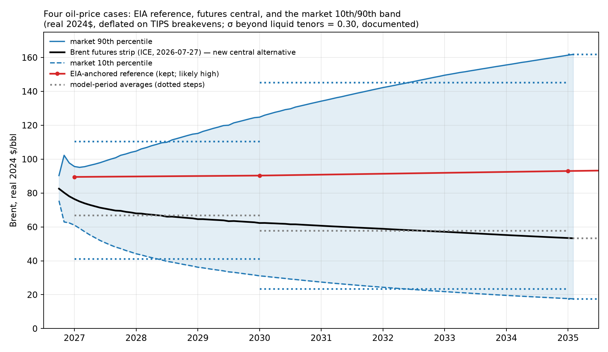

*Figure A.14 — The four Brent price cases used throughout the report.* Real
Brent (2024$ per barrel): the EIA reference (deflated to 2024$), the Brent
futures strip (the central market case), and the market 10th and 90th
percentiles derived from the implied volatility of Brent options, converted
to real dollars with TIPS breakeven inflation and held flat in real terms
beyond the last liquid contracts. The model uses period averages of these
paths, translated to LSFO and LNG prices through the report's fuel-price
linkages. Quote dates, raw data, and calculations are vendored in
build/market_band and sources/market.

Period averages, real 2024 dollars per barrel of Brent: the 10th percentile
runs $41 (2027–29), $23 (2030–34), then $18; the futures path $67, $58,
then $53; the EIA reference $90 to $107; the 90th percentile $110, $145,
then $162. Two properties are worth noting. The band is asymmetric around
the futures path in dollars but symmetric in logs; option markets show a
strong upside (call) skew at short tenors today, but that is war pricing
concentrated in the next several months, and the smile is unobservable at
planning horizons, so we use at-the-money volatilities and say so. And
option-implied distributions are risk-neutral: they embed insurance premia,
so the band is somewhat wider than a pure probability band, which is the
conservative direction for stress-testing. Every market quote used, its
source, and its date (2026-07-27), along with the reconstruction script,
are in the repository (sources/market/, build/market_band/).

Two properties of the fuel mapping deserve note, since Brent itself never
enters the model. Brent shocks pass through the link estimated in the
authors' earlier fuel-price brief, which puts low-sulfur fuel oil at
0.7388 times Brent plus $37.30 per barrel, and prices LNG on the indicative
contract at 11.8 percent of Brent. Those two pass-through rates are nearly
identical in energy terms, about 0.118 dollars per MMBtu for each dollar per
barrel of Brent, so the spread between the two fuels is almost the same in
every oil case: $6.56 per MMBtu at the market 10th percentile in 2027
against $6.61 at the 90th. The per-unit conversion saving, from burning gas
instead of oil in existing plants, therefore barely depends on the oil
price; what moves total conversion savings across oil worlds is the volume
burned and the clean investment cheap gas defers (Section 4.1). What also
changes with the oil price is the value of efficiency,
which is why a new and more efficient plant fares differently across cases.
The second note is a limit on the linear link outside its estimation range.
At the low end of the band the fitted intercept dominates, implying fuel oil
at nearly three times the crude price, which overstates the delivered price
in a crude collapse and so understates how cheap fuel becomes. The contract
formula for LNG, applied literally, likewise carries no price floor, while a
real contract almost certainly would. Both approximations make new gas
capacity look better in the low case than it probably would be. A further
limit applies to holding any contract formula fixed for twenty years.
Agerton (2017) shows that oil-indexed LNG contracts get renegotiated when
the formula price and the prevailing spot price diverge, and that these
revisions appear as statistically identifiable structural breaks in the
pricing relationship. Contract terms are not a physical constant, and the
party with the weaker outside option tends to absorb the adjustment.

Earlier
drafts used the EIA AEO 2025 case spread for the low and high paths; those
inputs and results are archived (*_aeo.csv, aeo_archive/) for comparison.
The AEO-cased fan opened too slowly to represent near-term oil-price risk,
which is concentrated exactly where the LNG decisions live.

### A.15 Plan pricing methodology

The Section 4.5 price tags come from scenarios whose generation is
constrained to each published plan's mix. This appendix documents the
constraint set and its carve-outs.

**Sources and rescaling.** IGP plan mixes come from the November 2023
Supplemental Response Tables 2-3 (the land-constrained plan of record,
which that document labels "preferred") and 2-4 (the base scenario, which
it labels "alternate") — the utility's plan of record rather than its
RESOLVE model output; HSEO mixes from the study's
own results worksheets. Customer-sited solar rows are excluded and each
plan's remaining categories are converted to shares of its grid supply,
then multiplied by the served demand of the rooftop family whose
customer-solar assumptions that plan tracks (land-constrained on
accelerated, base on conservative, HSEO on trend). A plan is thereby held
to its mix, not to its demand forecast.

**The quota set, per planning period 2030–2050.** Utility solar: a
two-sided band at 0.98–1.02 times the plan's level. Wind: the same band
on combined onshore-plus-offshore, with a floor (no ceiling) under
offshore alone — the plans carry 257–287 MW of onshore against the
county-setback screen's 150 MW, so a ceiling on offshore specifically
would forbid the only substitute for onshore the model may not build.
Fossil: a 0.95–1.05 band in 2035 and 2040, a floor only in 2030 (see
carve-outs), nothing from 2045, where the clean-energy requirement binds
instead. Firm clean energy: from 2045, a floor at 0.98 times the plan's
combined biofuel-plus-hydrogen level, counted as hydrogen fuel-cell
output plus generation in the multi-fuel thermal fleet — which at the
100 percent requirement is necessarily renewable fuel. There is no
ceiling on firm energy; it is the one category left open, and cells that
retire thermal capacity late can exceed the plan's level (the IGP cells
run 600–900 GWh of biodiesel above their plans' own 2050 levels for this
reason — the residual our grid cannot place elsewhere surfaces here).
2050 quotas hold each plan's 2045 shares, rescaled to 2050 demand; the
2027–2029 window is unpinned because the plans publish no anchor there.

**Carve-outs.** Kalaeloa is exempt from the fossil quota
(`--plan-quota-fossil-exempt`): the plans close it around 2033 while our
model carries its power-purchase minimum-take as a floor dispatch cannot
go below, so its plant is excluded from the constrained set and its
generation stripped from the IGP fossil targets (KPLP rows). The
refinery cogens are must-run baseload in this framework, identical in
plan and reference cells, and sit outside the quota for the same reason.
Biofuel *quantities* before 2045 are unconstrained.

**What the tag means.** Because the firm floor holds each plan to the
firm clean energy it says it needs, the tag prices the plan as published
— not the cheaper build a model would choose if allowed to substitute
solar for the plan's biofuel. Dispatch, storage sizing, and every
unnamed category remain optimized, so the tag is still generous to the
plan wherever the plan is silent. The design was validated two ways:
an elastic variant of the quota module (slack on every row, minimizing
total violation) proves each quota set feasible before any cell is
solved, and a fidelity audit confirms solved cells reproduce their
plans' pinned categories within the band. Cross-family cells (the Box
4.2 head-to-head) apply one plan's shares to the other plan's rooftop
trajectory, so the two IGP plans can be compared serving the same
demand; a cell read against the wrong trajectory's reference mixes
demands that differ by a quarter and is not a price tag.

**Tolerance.** Plan cells and their least-cost references are all
solved to 0.1 percent MIP gap. Because the quota bands leave the dispatch
some freedom, a cell's cumulative emissions are more sensitive to the
solve tolerance than its cost is; the figures here are from the 0.1 percent
solutions.

## Appendix B — references

Vendored sources carry a sha256 in [`SOURCES.md`](../SOURCES.md); items
marked *(vendored)* are held in `sources/` and hashed there. Paywalled
journal articles are cited with DOI only and are not redistributed.

**Peer-reviewed literature**

- Alquist, R., L. Kilian, and R. Vigfusson (2013). "Forecasting the Price of Oil." In *Handbook of Economic Forecasting*, Vol. 2A. Elsevier.
- Baumeister, C., and L. Kilian (2016). "Forty Years of Oil Price Fluctuations: Why Prices May Be Different This Time." Bank of Canada Staff Working Paper 2016-18.
- Berck, P., and M. Roberts (1996). "Natural Resource Prices: Will They Ever Turn Up?" *Journal of Environmental Economics and Management* 31(1): 65–78.
- Imelda, M. Fripp, and M. J. Roberts (2024). "Real-Time Pricing and the Cost of Clean Power." *American Economic Journal: Economic Policy*. doi:10.1257/pol.20220506.
- Livernois, J. (2009). "On the Empirical Significance of the Hotelling Rule." *Review of Environmental Economics and Policy* 3(1): 22–41.
- Sherwin, E. D., et al. (2024). "US oil and gas system emissions from nearly one million aerial site measurements." *Nature* 627: 328–334. doi:10.1038/s41586-024-07117-5.
- Sovacool, B. K., A. Gilbert, and D. Nugent (2014). "An international comparative assessment of construction cost overruns for electricity infrastructure." *Energy Research & Social Science* 3: 152–160.
- Trauernicht, C., E. Pickett, C. P. Giardina, C. M. Litton, S. Cordell, and A. Beavers (2015). "The Contemporary Scale and Context of Wildfire in Hawaiʻi." *Pacific Science* 69(4): 427–444.
- Yusuf, N., K. Govindan, and T. Al-Ansari (2024). "Energy markets restructure beyond 2022 and its implications on Qatar LNG sales strategy." *Heliyon* 10(7): e27682. doi:10.1016/j.heliyon.2024.e27682.
- Zheng, R., G. Schivley, M. Fripp, and M. J. Roberts (2026). "Optimal transmission expansion modestly reduces decarbonization costs of U.S. electricity." *Applied Energy* 421. <https://www.sciencedirect.com/science/article/abs/pii/S030626192600797X>.

*Additional peer-reviewed citations whose exact locators the authors confirm at
release:* Bernard, Kaack, and Ryan & Lidderdale (oil-price forecast accuracy,
detailed in `analysis/EIA_FORECAST_ACCURACY.md`); Coffman et al. (2022, §A.10);
Fripp (2020) and the Switch-Hawaiʻi design; Grue et al. (2020, HECO distributed-
solar characteristics, archived in this repository); Majer et al. (2012, induced-
seismicity protocol, §3).

**Government, agency, and institutional reports**

- Bond-Smith, S., L. Bremer, K. Burnett, C. Trauernicht, and C. Wada (2023). "Reducing Fire Risk and Restoring Value to Fallow Agricultural Lands." UHERO, October 2023.
- Hawaiian Electric (2023). Integrated Grid Plan (May 2023) and Supplemental Response, PUC Docket 2018-0088 (Nov 14, 2023). *(vendored: `sources/plan_mix/`)*
- Hawaiian Electric (2019, 2022, 2024). Stage 2 Oʻahu RFP (Aug 2019); Stage 3 Hawaiʻi RFP (Nov 2022); IGP RFP Model RDG PPA, Appendix J. *(vendored: `sources/heco_rfp/`)*
- Hawaiʻi Gas (2016). "The Facts About LNG for Hawaiʻi." January 2016. *(vendored)*
- Hawaiʻi State Energy Office (2026). Alternative Fuel, Repowering, and Energy Transition Study (revised May 2026). *(vendored)*
- International Energy Agency (2025). *Gas 2025 — Analysis and Forecasts to 2030*; and *Gas Market Report Q3-2026*.
- IEEFA (2024). *Global LNG Outlook 2024–2028*. *(vendored)*
- JERA (2026). Proposal to the State of Hawaiʻi, March 17, 2026. *(vendored)*
- NREL (2024). Annual Technology Baseline 2024, electricity. *(vendored: `sources/ATBe_2024_v3.0.0_slice.csv`)*
- SolarPower Europe (2025). *Global Market Outlook for Solar Power 2025–2029*.
- U.S. Energy Information Administration. *Annual Energy Outlook 2023*, Table 8 *(vendored: `sources/eia_price_components/`)*; *Annual Energy Outlook 2025* *(vendored)*; *Annual Energy Outlook Retrospective Review* (2022); *Today in Energy*, April 16, 2026.
- Arnold & Porter (2025) and RSM (2025), federal clean-energy tax-credit guidance (48E), §A.13.

**Industry and news**

- Associated Press (2026). "Price shocks from the Iran war power solar sales in energy-hungry Asia." May 13, 2026.
- Borenstein, S. (2026). "Why Hasn't the Iran War Driven Oil Prices Even Higher?" Energy Institute at Haas blog, June 22, 2026.
- Ember / Newser (2026). Record Chinese solar purchases across 55 countries, March 2026.
- LNG Prime (2026). "Japan's LNG imports down 15 percent in May" (Ministry of Finance data).
- Wood Mackenzie (2026). "Asian LNG demand to decline for second consecutive year." Press release, July 2026.
- Engineering News-Record (ENR), *POWER*, *Honolulu Star-Advertiser*, *Utility Dive*, *The Narwhal*, and *Maui Now*, as cited in Sections 4.2 and 4.4 for the public cost record and the 2016 FortisBC contract termination.

**Companion work and data**

- Roberts, M. J. Oʻahu solar-and-wind land-use study. <https://github.com/mikejrob/solar-wind-landuse>.
- Data sources (FERC Form 714 via PUDL; NREL NSRDB; EPA CEMS; permit and interconnection records) are documented in Appendix C and `sources/`.

## Appendix C — data and reproducibility

This report is release pre-v1.02: the single-node (copper-plate) model
with the rebuilt distributed-solar treatment of Appendices A.11–A.12,
issued as a preliminary version open for comment (requested by
September 15, 2026, tentative). After the comment period, responses, and
revisions, the report will be locked as version 1 — the version of record
— and subsequent changes will be limited to documented errata (v1.01,
v1.02, …). Suggestions beyond errata will be directed to v2, the regional
(zonal) grid model described in V2.md. An earlier working paper, since
withdrawn, preceded this series; the changes relative to it are documented
in docs/CORRECTIONS.md.

The model is Switch 2.0.9 with CPLEX, solved on the University of Hawaiʻi's
Koa cluster. The public repository contains the complete inputs, the build
scripts that regenerate them from vendored primary sources, the scenario
definitions, the solve scripts, and `verify_claims.py`, which re-derives
every headline input from the vendored sources and fails loudly on any
mismatch. Scenario results are aggregated in `results/RESULTS_SUMMARY.csv`
(0.1 percent optimization tolerance, with a handful of degenerate cells at
0.15 percent documented in docs/HARD_CELLS.md).
