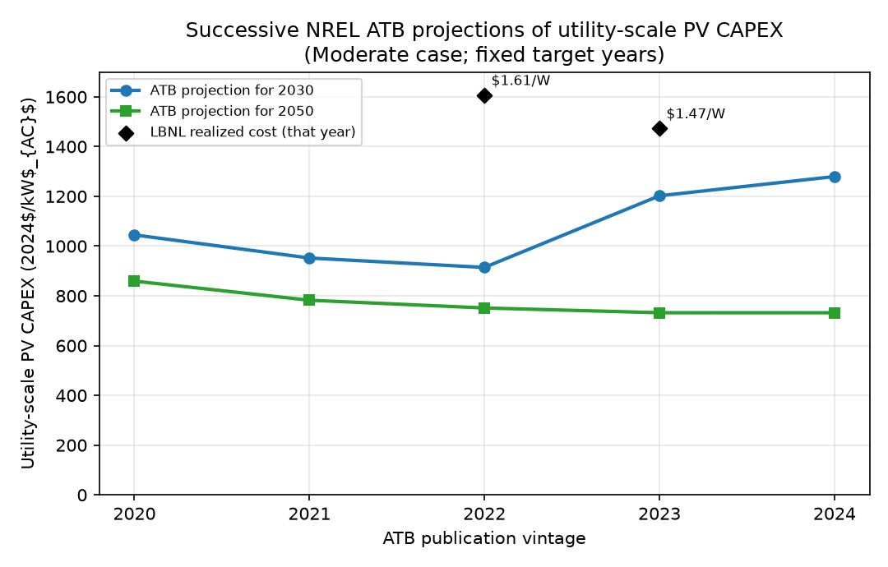
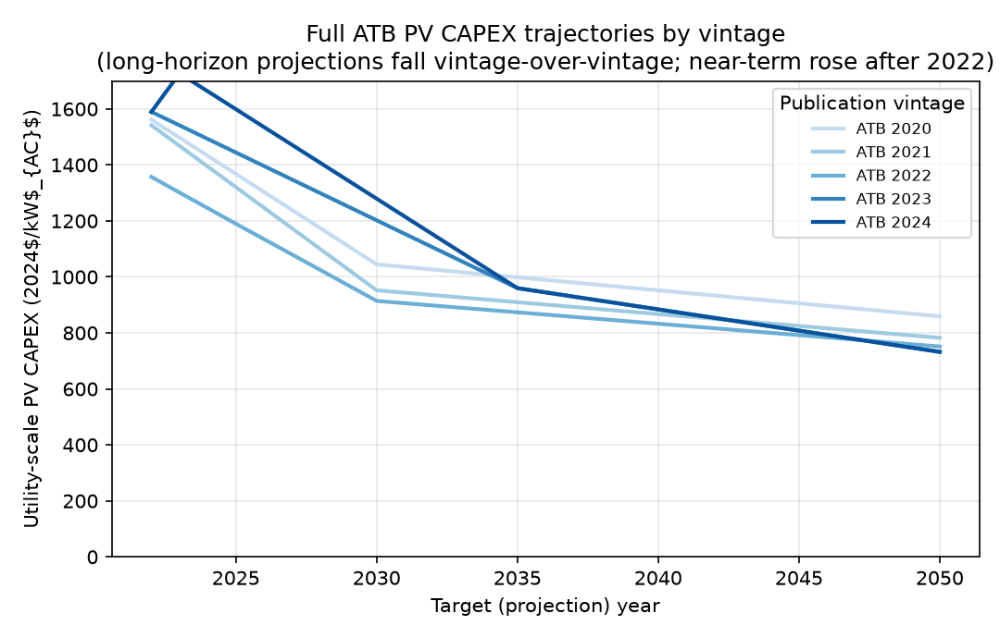
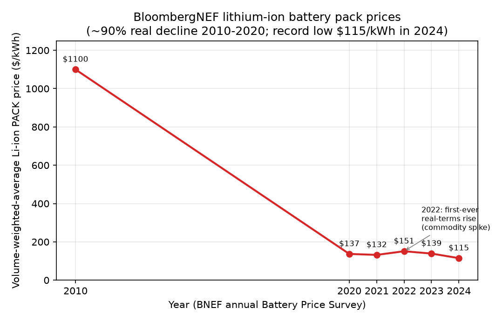
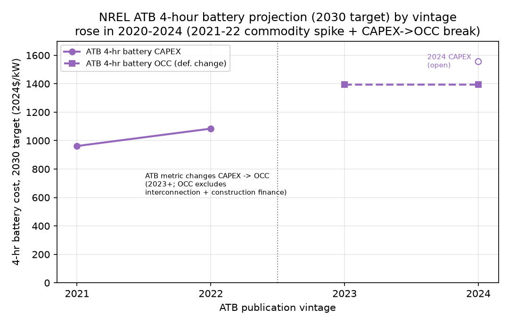

# Have solar and battery cost forecasts been too pessimistic? An evidence review

*Front matter for the "lower-cost solar/battery" sensitivity (NREL ATB Advanced projection).*

## Why this matters for the Oʻahu analysis

Our central case uses the NREL Annual Technology Baseline (ATB) 2024 **Moderate** projection
for utility-scale PV and 4-hour battery capital cost. Because the entire least-cost portfolio
for Oʻahu is sensitive to these two numbers, we also run a **lower-cost sensitivity** using the
ATB **Advanced** projection. The purpose of this note is to document, with fully sourced
evidence, the empirical record on whether expert cost projections for solar and storage have
tended to be **too high** — which would argue that the Advanced (rather than Moderate) path is a
reasonable, not aggressive, alternative. We report the record candidly, including where it does
**not** support a simple "forecasts always fall" narrative.

**The relevant horizon is 2030 and beyond — so it is the long-run trajectory that matters, not
the short-run level.** The decisions this analysis informs — most immediately whether to commit
to the JERA LNG plant and its 20-year import infrastructure — play out over 2030–2050, and 2030
is the earliest the plant and floating regasification unit could realistically be in service. For
a 20-year build decision, what matters is where solar and battery costs are *headed*, not the
price in any single recent year. That distinction is essential to reading the evidence below,
because the 2020–2024 window carried a **transient** cost spike — pandemic supply-chain
disruption, the 2021–2022 commodity and inflation surge, and associated policy turbulence — that
temporarily lifted realized solar and battery prices and even pushed up the *near-term* (2030)
projections in the 2023–2024 ATB vintages. That short-run bump is already unwinding (module and
battery pack prices reached record lows again in 2024); it is not the signal for a 2030+ decision.
The long-run decline is. We keep the two regimes separate throughout, and we do **not** rest the
low-cost sensitivity on anything in the 2020–2024 near-term level.

## 1. The cross-model, multi-decade record: projections have been persistently too high

The strongest and most general evidence comes from ex-post evaluations of the major
energy-economy models. Way, Ives, Mealy & Farmer (2022, *Joule*) assemble 2,905 published
integrated-assessment-model (IAM) projections and the International Energy Agency's (IEA)
World Energy Outlook (WEO) cost projections and show that "past projections of present
renewable energy costs by influential energy-economy models have consistently been much too
high," and that "most energy-economy models have historically underestimated deployment rates
for renewable energy technologies and overestimated their costs" (Way et al. 2022, pp. 1–2 of
the INET working-paper version; published as *Joule* 6(9):2057–2082,
doi:10.1016/j.joule.2022.08.009). The same pattern is documented specifically for the IEA WEO:
successive editions have "revised upwards" their solar and wind growth forecasts nearly
every year (e.g., the IEA raised its wind-and-solar growth forecast "by over 25% from last
year" in a single update), and independent ex-post analyses conclude the WEO "systemically
underestimates solar PV development" (Carbon Brief; pv-magazine; Xiao et al. 2025,
*Renewable & Sustainable Energy Reviews*, doi:10.1016/j.rser.2025.115445). This is the primary
motivation for treating a faster-than-central cost decline as a credible scenario rather than an
optimistic outlier.

## 2. The NREL ATB's own track record (the most directly relevant series)

Because our model uses the ATB, we tested whether the ATB *itself* has revised its projections
for fixed future years. We pulled the structured "ATBe" cost data for every vintage available as
a machine-readable file (2020–2024) directly from NREL's OEDI data lake, extracted utility-scale
PV **CAPEX** (Moderate case, Market financing, on a consistent AC basis for 2020+) and 4-hour
battery cost for the fixed target years **2030** and **2050**, and deflated every vintage to a
common real **2024$** using BLS CPI-U. The result is more nuanced than a monotone decline
(**Figure 1**, **Figure 2**):

- **Long-horizon (2050) PV projections did fall vintage-over-vintage:** the projected 2050 PV
  CAPEX declined from **$859/kW** (ATB 2020) to **$732/kW** (ATB 2024), about **−15%**, with a
  decline in every successive vintage. The full trajectory "fan" (Figure 2) shows newer vintages
  sitting below older ones at the 2035–2050 horizon.
- **Near-term (2030) projections rose after 2022.** The projected 2030 PV CAPEX fell
  from $1,045/kW (2020) to a low of **$914/kW** (ATB 2022), then *rose* to **$1,202/kW** (2023) and
  **$1,279/kW** (2024). This is a documented, transient effect of the 2021–2022 global
  supply-chain and inflation shock: NREL's own benchmark utility-PV overnight cost rose from
  $1.33/W_AC (2022) to $1.56/W_AC (2023), ~17% year-over-year (NREL ATB 2023 documentation). The
  ATB treats this as a near-term anomaly and still projects steep forward declines (the 2024 ATB
  projects Moderate-case PV CAPEX falling ~44% between 2023 and 2035).
- **The 4-hour battery series does not support a "revised down" claim in this window.** Projected
  4-hr battery cost for 2030 *rose* across vintages (≈$962/kW in ATB 2021 to ≈$1,556/kW in ATB
  2024, 2024$), reflecting the 2021–2022 lithium/commodity spike. This series is further
  complicated by a definitional change: ATB 2021–2022 report battery "CAPEX," whereas ATB
  2023–2024 report only "OCC" (overnight capital cost, which excludes grid interconnection and
  construction financing). We treat the ATB battery series candidly (see §4 and Figure 4) and do
  **not** rest the cheaper-battery sensitivity on it.

All monetary values in this note are expressed in real **2024$**, deflated with the **actual BLS
CPI-U** (the correct historical, realized inflation deflator; base = CPI-U 2024 annual average,
313.698). This differs slightly from the ATB model's own *forward* dollar-escalation convention (a
nominal 2.7%/yr input assumption): realized CPI-U inflation over 2022→2024 was ~7.2% cumulative
(~3.5%/yr), about 1.7 percentage points *above* what the 2.7%/yr forward rule would imply (~5.5%).
Because we rebase upward from the ATB 2024 native 2022$ to 2024$ using the (higher) realized CPI-U,
our 2024$ figures are marginally larger than a 2.7%/yr rule would give. The distinction is immaterial
to the qualitative record shown here and is documented only for completeness.

**Interpretation.** The ATB's *long-run* solar projection has been revised steadily downward, and
the broader (IEA/IAM) forecasting record is strongly biased toward over-projecting cost. But the
ATB's *near-term* solar and its battery numbers were pushed up by the 2021–2022 inflation/
commodity shock and do not, over 2020–2024, show a clean release-after-release cut. The
motivation for the Advanced sensitivity is therefore (a) the robust multi-decade tendency of
expert forecasts to overstate renewable cost, and (b) the ATB's own expectation — even after the
2022 bump — of rapid forward declines, of which the Advanced path is the faster realization.

## 3. Reality has tracked the low edge

Realized utility-scale PV costs have kept falling in real terms even through the 2022–2023
inflationary period. LBNL's *Utility-Scale Solar, 2024 Edition* reports the capacity-weighted-mean
installed price fell **in real terms** from **$1.56/W_AC (2022) to $1.43/W_AC (2023)** — down ~75%
since 2010, about 10%/yr — and explicitly notes it has "not observed cost increases in real dollar
terms in recent years, unlike some other industry observers" (LBNL 2024, p. 22; both values stated
by LBNL in real 2023$, per its p. 38 deflation convention). Rebased to 2024$ via CPI-U these are
**$1.61/W_AC (2022)** and **$1.47/W_AC (2023)**; they are overlaid in Figure 1 and sit at or below
even the low (2050) edge of the ATB projection band.

## 4. Batteries: the strong evidence is long-run and external to the ATB window

Storage is at least as decision-critical for Oʻahu as PV, so the battery evidence deserves the same
candor. The two bodies of evidence point in *different directions over different horizons*, and we
keep them clearly separated.

**(a) The strong evidence — BloombergNEF's long-run pack-price decline (Figure 3).** The
best-documented, most-cited storage cost series is BloombergNEF's (BNEF) annual *Battery Price
Survey* of the volume-weighted-average lithium-ion **pack** price. It fell from **above $1,100/kWh
in 2010** to **$137/kWh in 2020** — an **~89% real decline** — then, after the pandemic-era
commodity spike pushed prices *up* for the first time ever to **$151/kWh in 2022** (+7% real), it
resumed falling to a record low **$115/kWh in 2024** (a 20% single-year drop, BNEF's largest since
2017). This decades-long, ~90% decline is the primary quantitative basis for treating a
substantially-cheaper-battery future as credible rather than aggressive. (BNEF's full dataset is
paywalled; the year-by-year headline figures here are each taken from the corresponding BNEF
press release — see SOURCES.md for the per-year citation and verification level. BNEF re-bases its
"real" figures to each survey's own year, so the series mixes base years by a few percent; we use
each year's own-survey headline and do not over-interpret single-year steps.)

There is also peer-reviewed support that battery improvement has been *underestimated*: Ziegler &
Trancik (2021, *Energy & Environmental Science* 14(4):1635–1651, doi:10.1039/D0EE02681F) re-examine
lithium-ion cost/technology trends and find that once energy density is accounted for, historical
improvement and learning rates were **higher than previously reported** (they estimate learning
rates rising into the ~20–30% range), i.e. earlier analyses tended to understate how fast the
technology improved. We cite this as directional support for "storage improved faster than commonly
assumed"; it is *not* a direct forecast-vs-realized-price comparison, and we do not claim it as one.

**(b) The caveat — the ATB 4-hour battery series ROSE in our 2020–2024 window (Figure 4).**
Unlike the BNEF long-run pack series, NREL's ATB projection for 4-hour utility-scale battery cost
did **not** decline over the vintages we can machine-read. The projected 2030 cost rose from
≈$962/kW (ATB 2021) to ≈$1,556/kW (ATB 2024, 2024$). Two things drive this and neither supports a
"batteries got cheaper in the ATB" reading: (i) the 2021–2022 lithium/commodity spike (the same
shock visible in BNEF's 2022 uptick and in near-term PV), and (ii) a **definitional break** — ATB
2021–2022 report battery "CAPEX," while ATB 2023–2024 report only "OCC" (overnight capital cost,
which *excludes* grid interconnection and construction financing), so the 2022→2023 step mixes a
real cost change with a scope change. We therefore present the ATB battery series candidly and do
**not** use it to argue for cheaper batteries.

**Which evidence supports the cheaper-battery sensitivity, and which does not.** The
lower-cost-storage sensitivity is motivated by (a): the multi-decade ~90% BNEF pack-price decline,
the resumption of decline to a 2024 record low after the transient 2022 spike, and the literature
finding that battery improvement was under-, not over-, estimated. It is **not** supported by the
ATB 2020–2024 battery projection series (b), which rose in-window for commodity-cycle and
definitional reasons; we flag it rather than force a decline narrative onto it.

---

### Figure 1

**Figure 1.** NREL ATB utility-scale PV CAPEX projected for the fixed target years 2030 (blue) and
2050 (green), plotted against ATB publication vintage (Moderate case, Market financing, AC basis),
all deflated to real 2024$ via BLS CPI-U. Black diamonds: LBNL realized capacity-weighted-mean installed
price for 2022 and 2023 (LBNL *Utility-Scale Solar 2024*, p. 22; both native real 2023$, rebased
2023$→2024$). The 2050 projection declines across vintages; the 2030 projection dips through 2022 then
rises with the 2022 supply-chain/inflation shock. *Data: NREL OEDI ATBe CSVs 2020–2024 (downloaded);
LBNL 2024 (transcribed, p. 22); CPI-U from BLS/FRED CPIAUCSL (downloaded). See
data/atb_projection_series.csv.*

### Figure 2

**Figure 2.** Full ATB utility-scale PV CAPEX trajectories (2022–2050) by publication vintage,
real 2024$. Newer vintages lie below older ones at the 2035–2050 horizon (long-run projections revised
down), while the near-term (≤2030) end rose after the 2022 cost shock. *Data:
data/atb_pv_trajectories_2024usd.csv, built from NREL OEDI ATBe CSVs 2020–2024.*

### Figure 3

**Figure 3.** BloombergNEF volume-weighted-average lithium-ion battery **pack** price ($/kWh) — the
primary "batteries outpaced expectations" visual. Prices fell ~89% in real terms from above
$1,100/kWh (2010) to $137/kWh (2020), ticked up to $151/kWh in 2022 (first-ever real increase,
commodity spike), then fell to a record low $115/kWh in 2024. *Data: BNEF annual Battery Price
Survey headline figures, each transcribed from the corresponding BNEF press release (per-year
source and verification level in SOURCES.md; primary BNEF pages for 2020, 2022, 2023, 2024
independently fetched in-session). BNEF re-bases its real-dollar figures per survey year, so the
series mixes base years by a few percent. See data/bnef_battery_pack_prices.csv.*

### Figure 4

**Figure 4.** Companion caveat figure, presented candidly: NREL ATB projection of 4-hour
utility-scale battery cost for the fixed 2030 target, by ATB vintage (2024$). The series **rose**
across 2021–2024, driven by the 2021–2022 commodity spike and a metric change (solid = "CAPEX",
ATB 2021–2022; dashed = "OCC", ATB 2023–2024, which excludes grid interconnection and construction
financing). The open circle marks the ATB-2024 CAPEX value, showing the CAPEX-vs-OCC gap in the one
vintage where both are reported. This ATB series does **not** support a battery-cost-decline claim;
the decline evidence is the external BNEF series (Figure 3). *Data:
data/atb_projection_series.csv (Battery_4hr rows), from NREL OEDI ATBe CSVs 2020–2024.*

*See SOURCES.md for the full source manifest, including which data were downloaded directly vs.
transcribed from a document, and which sources could not be accessed.*
